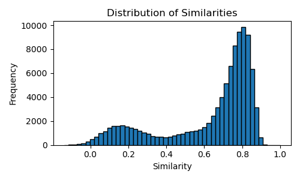

# Similarity Analysis of Geneformer Embeddings

## Distribution Summary

Similarity measure: Cosine similarity

- Mean: 0.629694
- Standard Deviation: 0.246304
- Minimum: -0.216554
- Maximum: 1.000000

## Similarity Distribution Histogram

## Top 1000 Most Similar Pairs

| Gene 1 | Gene 2 | Similarity |
|--------|--------|------------|
| [ENSG00000186814](https://www.proteinatlas.org/ENSG00000186814) | [ENSG00000181894](https://www.proteinatlas.org/ENSG00000181894) | 0.971375 |
| zinc finger and SCAN domain containing 30 [Source:HGNC Symbol;Acc:HGNC:33517] | zinc finger protein 329 [Source:HGNC Symbol;Acc:HGNC:14209] | |
| [ENSG00000197136](https://www.proteinatlas.org/ENSG00000197136) | [ENSG00000156983](https://www.proteinatlas.org/ENSG00000156983) | 0.970948 |
| pecanex 3 [Source:HGNC Symbol;Acc:HGNC:18760] | bromodomain and PHD finger containing 1 [Source:HGNC Symbol;Acc:HGNC:14255] | |
| [ENSG00000170471](https://www.proteinatlas.org/ENSG00000170471) | [ENSG00000130699](https://www.proteinatlas.org/ENSG00000130699) | 0.968370 |
| Ral GTPase activating protein non-catalytic subunit beta [Source:HGNC Symbol;Acc:HGNC:29221] | TATA-box binding protein associated factor 4 [Source:HGNC Symbol;Acc:HGNC:11537] | |
| [ENSG00000143373](https://www.proteinatlas.org/ENSG00000143373) | [ENSG00000196981](https://www.proteinatlas.org/ENSG00000196981) | 0.967927 |
| zinc finger protein 687 [Source:HGNC Symbol;Acc:HGNC:29277] | WD repeat domain 5B [Source:HGNC Symbol;Acc:HGNC:17826] | |
| [ENSG00000125447](https://www.proteinatlas.org/ENSG00000125447) | [ENSG00000082213](https://www.proteinatlas.org/ENSG00000082213) | 0.967151 |
| golgi associated, gamma adaptin ear containing, ARF binding protein 3 [Source:HGNC Symbol;Acc:HGNC:17079] | chromosome 5 open reading frame 22 [Source:HGNC Symbol;Acc:HGNC:25639] | |
| [ENSG00000165689](https://www.proteinatlas.org/ENSG00000165689) | [ENSG00000174013](https://www.proteinatlas.org/ENSG00000174013) | 0.966849 |
| endosome associated trafficking regulator 1 [Source:HGNC Symbol;Acc:HGNC:10667] | F-box protein 45 [Source:HGNC Symbol;Acc:HGNC:29148] | |
| [ENSG00000123815](https://www.proteinatlas.org/ENSG00000123815) | [ENSG00000143373](https://www.proteinatlas.org/ENSG00000143373) | 0.966729 |
| coenzyme Q8B [Source:HGNC Symbol;Acc:HGNC:19041] | zinc finger protein 687 [Source:HGNC Symbol;Acc:HGNC:29277] | |
| [ENSG00000122912](https://www.proteinatlas.org/ENSG00000122912) | [ENSG00000198556](https://www.proteinatlas.org/ENSG00000198556) | 0.966431 |
| solute carrier family 25 member 16 [Source:HGNC Symbol;Acc:HGNC:10986] | zinc finger protein 789 [Source:HGNC Symbol;Acc:HGNC:27801] | |
| [ENSG00000180626](https://www.proteinatlas.org/ENSG00000180626) | [ENSG00000172167](https://www.proteinatlas.org/ENSG00000172167) | 0.966081 |
| zinc finger protein 594 [Source:HGNC Symbol;Acc:HGNC:29392] | MDM2 binding protein [Source:HGNC Symbol;Acc:HGNC:7417] | |
| [ENSG00000085644](https://www.proteinatlas.org/ENSG00000085644) | [ENSG00000169981](https://www.proteinatlas.org/ENSG00000169981) | 0.965969 |
| zinc finger protein 213 [Source:HGNC Symbol;Acc:HGNC:13005] | zinc finger protein 35 [Source:HGNC Symbol;Acc:HGNC:13099] | |
| [ENSG00000106692](https://www.proteinatlas.org/ENSG00000106692) | [ENSG00000120458](https://www.proteinatlas.org/ENSG00000120458) | 0.965513 |
| fukutin [Source:HGNC Symbol;Acc:HGNC:3622] | Myb/SANT DNA binding domain containing 2 [Source:HGNC Symbol;Acc:HGNC:26266] | |
| [ENSG00000115282](https://www.proteinatlas.org/ENSG00000115282) | [ENSG00000185670](https://www.proteinatlas.org/ENSG00000185670) | 0.965230 |
| tetratricopeptide repeat domain 31 [Source:HGNC Symbol;Acc:HGNC:25759] | zinc finger and BTB domain containing 3 [Source:HGNC Symbol;Acc:HGNC:22918] | |
| [ENSG00000138111](https://www.proteinatlas.org/ENSG00000138111) | [ENSG00000167720](https://www.proteinatlas.org/ENSG00000167720) | 0.964972 |
| major facilitator superfamily domain containing 13A [Source:HGNC Symbol;Acc:HGNC:26196] | serine racemase [Source:HGNC Symbol;Acc:HGNC:14398] | |
| [ENSG00000168806](https://www.proteinatlas.org/ENSG00000168806) | [ENSG00000125650](https://www.proteinatlas.org/ENSG00000125650) | 0.964222 |
| leucine carboxyl methyltransferase 2 [Source:HGNC Symbol;Acc:HGNC:17558] | persephin [Source:HGNC Symbol;Acc:HGNC:9579] | |
| [ENSG00000118961](https://www.proteinatlas.org/ENSG00000118961) | [ENSG00000143493](https://www.proteinatlas.org/ENSG00000143493) | 0.963858 |
| lipid droplet associated hydrolase [Source:HGNC Symbol;Acc:HGNC:26145] | integrator complex subunit 7 [Source:HGNC Symbol;Acc:HGNC:24484] | |
| [ENSG00000138018](https://www.proteinatlas.org/ENSG00000138018) | [ENSG00000013503](https://www.proteinatlas.org/ENSG00000013503) | 0.963806 |
| selenoprotein I [Source:HGNC Symbol;Acc:HGNC:29361] | RNA polymerase III subunit B [Source:HGNC Symbol;Acc:HGNC:30348] | |
| [ENSG00000068097](https://www.proteinatlas.org/ENSG00000068097) | [ENSG00000185453](https://www.proteinatlas.org/ENSG00000185453) | 0.963651 |
| HEAT repeat containing 6 [Source:HGNC Symbol;Acc:HGNC:24076] | zinc finger SWIM-type containing 9 [Source:HGNC Symbol;Acc:HGNC:34495] | |
| [ENSG00000138375](https://www.proteinatlas.org/ENSG00000138375) | [ENSG00000157212](https://www.proteinatlas.org/ENSG00000157212) | 0.963620 |
| SWI/SNF related, matrix associated, actin dependent regulator of chromatin, subfamily a like 1 [Source:HGNC Symbol;Acc:HGNC:11102] | PAX interacting protein 1 [Source:HGNC Symbol;Acc:HGNC:8624] | |
| [ENSG00000185220](https://www.proteinatlas.org/ENSG00000185220) | [ENSG00000179886](https://www.proteinatlas.org/ENSG00000179886) | 0.963387 |
| piggyBac transposable element derived 2 [Source:HGNC Symbol;Acc:HGNC:19399] | tigger transposable element derived 5 [Source:HGNC Symbol;Acc:HGNC:18336] | |
| [ENSG00000269743](https://www.proteinatlas.org/ENSG00000269743) | [ENSG00000196387](https://www.proteinatlas.org/ENSG00000196387) | 0.962942 |
| solute carrier family 25 member 53 [Source:HGNC Symbol;Acc:HGNC:31894] | zinc finger protein 140 [Source:HGNC Symbol;Acc:HGNC:12925] | |
| [ENSG00000160917](https://www.proteinatlas.org/ENSG00000160917) | [ENSG00000165526](https://www.proteinatlas.org/ENSG00000165526) | 0.962823 |
| cleavage and polyadenylation specific factor 4 [Source:HGNC Symbol;Acc:HGNC:2327] | RNA pseudouridine synthase D4 [Source:HGNC Symbol;Acc:HGNC:25898] | |
| [ENSG00000227345](https://www.proteinatlas.org/ENSG00000227345) | [ENSG00000196505](https://www.proteinatlas.org/ENSG00000196505) | 0.962686 |
| poly(ADP-ribose) glycohydrolase [Source:HGNC Symbol;Acc:HGNC:8605] | ganglioside induced differentiation associated protein 2 [Source:HGNC Symbol;Acc:HGNC:18010] | |
| [ENSG00000127580](https://www.proteinatlas.org/ENSG00000127580) | [ENSG00000158156](https://www.proteinatlas.org/ENSG00000158156) | 0.962568 |
| WD repeat domain 24 [Source:HGNC Symbol;Acc:HGNC:20852] | XK related 8 [Source:HGNC Symbol;Acc:HGNC:25508] | |
| [ENSG00000160055](https://www.proteinatlas.org/ENSG00000160055) | [ENSG00000143578](https://www.proteinatlas.org/ENSG00000143578) | 0.962463 |
| transmembrane protein 234 [Source:HGNC Symbol;Acc:HGNC:28837] | cAMP responsive element binding protein 3 like 4 [Source:HGNC Symbol;Acc:HGNC:18854] | |
| [ENSG00000119041](https://www.proteinatlas.org/ENSG00000119041) | [ENSG00000148843](https://www.proteinatlas.org/ENSG00000148843) | 0.962434 |
| general transcription factor IIIC subunit 3 [Source:HGNC Symbol;Acc:HGNC:4666] | programmed cell death 11 [Source:HGNC Symbol;Acc:HGNC:13408] | |
| [ENSG00000170471](https://www.proteinatlas.org/ENSG00000170471) | [ENSG00000164180](https://www.proteinatlas.org/ENSG00000164180) | 0.962422 |
| Ral GTPase activating protein non-catalytic subunit beta [Source:HGNC Symbol;Acc:HGNC:29221] | transmembrane protein 161B [Source:HGNC Symbol;Acc:HGNC:28483] | |
| [ENSG00000105072](https://www.proteinatlas.org/ENSG00000105072) | [ENSG00000121903](https://www.proteinatlas.org/ENSG00000121903) | 0.962305 |
| chromosome 19 open reading frame 44 [Source:HGNC Symbol;Acc:HGNC:26141] | zinc finger and SCAN domain containing 20 [Source:HGNC Symbol;Acc:HGNC:13093] | |
| [ENSG00000156958](https://www.proteinatlas.org/ENSG00000156958) | [ENSG00000149262](https://www.proteinatlas.org/ENSG00000149262) | 0.962185 |
| galactokinase 2 [Source:HGNC Symbol;Acc:HGNC:4119] | integrator complex subunit 4 [Source:HGNC Symbol;Acc:HGNC:25048] | |
| [ENSG00000197037](https://www.proteinatlas.org/ENSG00000197037) | [ENSG00000251369](https://www.proteinatlas.org/ENSG00000251369) | 0.962135 |
| zinc finger and SCAN domain containing 25 [Source:HGNC Symbol;Acc:HGNC:21961] | zinc finger protein 550 [Source:HGNC Symbol;Acc:HGNC:28643] | |
| [ENSG00000117010](https://www.proteinatlas.org/ENSG00000117010) | [ENSG00000140265](https://www.proteinatlas.org/ENSG00000140265) | 0.961929 |
| zinc finger protein 684 [Source:HGNC Symbol;Acc:HGNC:28418] | zinc finger and SCAN domain containing 29 [Source:HGNC Symbol;Acc:HGNC:26673] | |
| [ENSG00000234444](https://www.proteinatlas.org/ENSG00000234444) | [ENSG00000096070](https://www.proteinatlas.org/ENSG00000096070) | 0.961835 |
| zinc finger protein 736 [Source:HGNC Symbol;Acc:HGNC:32467] | bromodomain and PHD finger containing 3 [Source:HGNC Symbol;Acc:HGNC:14256] | |
| [ENSG00000184166](https://www.proteinatlas.org/ENSG00000184166) | [ENSG00000172320](https://www.proteinatlas.org/ENSG00000172320) | 0.961828 |
| olfactory receptor family 1 subfamily D member 2 [Source:HGNC Symbol;Acc:HGNC:8183] | olfactory receptor family 5 subfamily A member 1 [Source:HGNC Symbol;Acc:HGNC:8319] | |
| [ENSG00000189042](https://www.proteinatlas.org/ENSG00000189042) | [ENSG00000120662](https://www.proteinatlas.org/ENSG00000120662) | 0.961787 |
| zinc finger protein 567 [Source:HGNC Symbol;Acc:HGNC:28696] | mitochondrial translation release factor 1 [Source:HGNC Symbol;Acc:HGNC:7469] | |
| [ENSG00000171574](https://www.proteinatlas.org/ENSG00000171574) | [ENSG00000119574](https://www.proteinatlas.org/ENSG00000119574) | 0.961752 |
| zinc finger protein 584 [Source:HGNC Symbol;Acc:HGNC:27318] | zinc finger and BTB domain containing 45 [Source:HGNC Symbol;Acc:HGNC:23715] | |
| [ENSG00000101407](https://www.proteinatlas.org/ENSG00000101407) | [ENSG00000140006](https://www.proteinatlas.org/ENSG00000140006) | 0.961704 |
| TELO2 interacting protein 1 [Source:HGNC Symbol;Acc:HGNC:29029] | WD repeat domain 89 [Source:HGNC Symbol;Acc:HGNC:20489] | |
| [ENSG00000162999](https://www.proteinatlas.org/ENSG00000162999) | [ENSG00000163026](https://www.proteinatlas.org/ENSG00000163026) | 0.961659 |
| dual specificity phosphatase 19 [Source:HGNC Symbol;Acc:HGNC:18894] | WD repeat and coiled coil containing [Source:HGNC Symbol;Acc:HGNC:26157] | |
| [ENSG00000176473](https://www.proteinatlas.org/ENSG00000176473) | [ENSG00000068354](https://www.proteinatlas.org/ENSG00000068354) | 0.961292 |
| WD repeat domain 25 [Source:HGNC Symbol;Acc:HGNC:21064] | TBC1 domain family member 25 [Source:HGNC Symbol;Acc:HGNC:8092] | |
| [ENSG00000151093](https://www.proteinatlas.org/ENSG00000151093) | [ENSG00000101844](https://www.proteinatlas.org/ENSG00000101844) | 0.961234 |
| 3-oxoacyl-ACP synthase, mitochondrial [Source:HGNC Symbol;Acc:HGNC:26063] | autophagy related 4A cysteine peptidase [Source:HGNC Symbol;Acc:HGNC:16489] | |
| [ENSG00000204149](https://www.proteinatlas.org/ENSG00000204149) | [ENSG00000022976](https://www.proteinatlas.org/ENSG00000022976) | 0.961194 |
| ArfGAP with GTPase domain, ankyrin repeat and PH domain 6 [Source:HGNC Symbol;Acc:HGNC:23466] | zinc finger protein 839 [Source:HGNC Symbol;Acc:HGNC:20345] | |
| [ENSG00000188807](https://www.proteinatlas.org/ENSG00000188807) | [ENSG00000198298](https://www.proteinatlas.org/ENSG00000198298) | 0.961070 |
| transmembrane protein 201 [Source:HGNC Symbol;Acc:HGNC:33719] | zinc finger protein 485 [Source:HGNC Symbol;Acc:HGNC:23440] | |
| [ENSG00000171574](https://www.proteinatlas.org/ENSG00000171574) | [ENSG00000112877](https://www.proteinatlas.org/ENSG00000112877) | 0.961053 |
| zinc finger protein 584 [Source:HGNC Symbol;Acc:HGNC:27318] | centrosomal protein 72 [Source:HGNC Symbol;Acc:HGNC:25547] | |
| [ENSG00000143971](https://www.proteinatlas.org/ENSG00000143971) | [ENSG00000116903](https://www.proteinatlas.org/ENSG00000116903) | 0.960957 |
| ETAA1 activator of ATR kinase [Source:HGNC Symbol;Acc:HGNC:24648] | exocyst complex component 8 [Source:HGNC Symbol;Acc:HGNC:24659] | |
| [ENSG00000104884](https://www.proteinatlas.org/ENSG00000104884) | [ENSG00000138231](https://www.proteinatlas.org/ENSG00000138231) | 0.960695 |
| ERCC excision repair 2, TFIIH core complex helicase subunit [Source:HGNC Symbol;Acc:HGNC:3434] | debranching RNA lariats 1 [Source:HGNC Symbol;Acc:HGNC:15594] | |
| [ENSG00000134490](https://www.proteinatlas.org/ENSG00000134490) | [ENSG00000170325](https://www.proteinatlas.org/ENSG00000170325) | 0.960628 |
| transmembrane protein 241 [Source:HGNC Symbol;Acc:HGNC:31723] | PR/SET domain 10 [Source:HGNC Symbol;Acc:HGNC:13995] | |
| [ENSG00000001497](https://www.proteinatlas.org/ENSG00000001497) | [ENSG00000148719](https://www.proteinatlas.org/ENSG00000148719) | 0.960586 |
| LAS1 like ribosome biogenesis factor [Source:HGNC Symbol;Acc:HGNC:25726] | DnaJ heat shock protein family (Hsp40) member B12 [Source:HGNC Symbol;Acc:HGNC:14891] | |
| [ENSG00000147789](https://www.proteinatlas.org/ENSG00000147789) | [ENSG00000170631](https://www.proteinatlas.org/ENSG00000170631) | 0.960567 |
| zinc finger protein 7 [Source:HGNC Symbol;Acc:HGNC:13139] | zinc finger protein 16 [Source:HGNC Symbol;Acc:HGNC:12947] | |
| [ENSG00000103168](https://www.proteinatlas.org/ENSG00000103168) | [ENSG00000135801](https://www.proteinatlas.org/ENSG00000135801) | 0.960536 |
| TATA-box binding protein associated factor, RNA polymerase I subunit C [Source:HGNC Symbol;Acc:HGNC:11534] | TATA-box binding protein associated factor 5 like [Source:HGNC Symbol;Acc:HGNC:17304] | |
| [ENSG00000147164](https://www.proteinatlas.org/ENSG00000147164) | [ENSG00000127580](https://www.proteinatlas.org/ENSG00000127580) | 0.960491 |
| sorting nexin 12 [Source:HGNC Symbol;Acc:HGNC:14976] | WD repeat domain 24 [Source:HGNC Symbol;Acc:HGNC:20852] | |
| [ENSG00000146833](https://www.proteinatlas.org/ENSG00000146833) | [ENSG00000167384](https://www.proteinatlas.org/ENSG00000167384) | 0.960472 |
| tripartite motif containing 4 [Source:HGNC Symbol;Acc:HGNC:16275] | zinc finger protein 180 [Source:HGNC Symbol;Acc:HGNC:12970] | |
| [ENSG00000006194](https://www.proteinatlas.org/ENSG00000006194) | [ENSG00000115282](https://www.proteinatlas.org/ENSG00000115282) | 0.960458 |
| zinc finger protein 263 [Source:HGNC Symbol;Acc:HGNC:13056] | tetratricopeptide repeat domain 31 [Source:HGNC Symbol;Acc:HGNC:25759] | |
| [ENSG00000164941](https://www.proteinatlas.org/ENSG00000164941) | [ENSG00000185024](https://www.proteinatlas.org/ENSG00000185024) | 0.960451 |
| integrator complex subunit 8 [Source:HGNC Symbol;Acc:HGNC:26048] | BRF1 RNA polymerase III transcription initiation factor subunit [Source:HGNC Symbol;Acc:HGNC:11551] | |
| [ENSG00000175970](https://www.proteinatlas.org/ENSG00000175970) | [ENSG00000175137](https://www.proteinatlas.org/ENSG00000175137) | 0.960435 |
| unc-119 lipid binding chaperone B [Source:HGNC Symbol;Acc:HGNC:16488] | SH3 binding domain protein 5 like [Source:HGNC Symbol;Acc:HGNC:29360] | |
| [ENSG00000157911](https://www.proteinatlas.org/ENSG00000157911) | [ENSG00000104524](https://www.proteinatlas.org/ENSG00000104524) | 0.960416 |
| peroxisomal biogenesis factor 10 [Source:HGNC Symbol;Acc:HGNC:8851] | pyrroline-5-carboxylate reductase 3 [Source:HGNC Symbol;Acc:HGNC:25846] | |
| [ENSG00000083838](https://www.proteinatlas.org/ENSG00000083838) | [ENSG00000185670](https://www.proteinatlas.org/ENSG00000185670) | 0.960371 |
| zinc finger protein 446 [Source:HGNC Symbol;Acc:HGNC:21036] | zinc finger and BTB domain containing 3 [Source:HGNC Symbol;Acc:HGNC:22918] | |
| [ENSG00000129696](https://www.proteinatlas.org/ENSG00000129696) | [ENSG00000142556](https://www.proteinatlas.org/ENSG00000142556) | 0.960367 |
| TELO2 interacting protein 2 [Source:HGNC Symbol;Acc:HGNC:26262] | zinc finger protein 614 [Source:HGNC Symbol;Acc:HGNC:24722] | |
| [ENSG00000153214](https://www.proteinatlas.org/ENSG00000153214) | [ENSG00000143093](https://www.proteinatlas.org/ENSG00000143093) | 0.960345 |
| transmembrane protein 87B [Source:HGNC Symbol;Acc:HGNC:25913] | striatin interacting protein 1 [Source:HGNC Symbol;Acc:HGNC:25916] | |
| [ENSG00000148835](https://www.proteinatlas.org/ENSG00000148835) | [ENSG00000153767](https://www.proteinatlas.org/ENSG00000153767) | 0.960243 |
| TATA-box binding protein associated factor 5 [Source:HGNC Symbol;Acc:HGNC:11539] | general transcription factor IIE subunit 1 [Source:HGNC Symbol;Acc:HGNC:4650] | |
| [ENSG00000162065](https://www.proteinatlas.org/ENSG00000162065) | [ENSG00000126001](https://www.proteinatlas.org/ENSG00000126001) | 0.960168 |
| TBC1 domain family member 24 [Source:HGNC Symbol;Acc:HGNC:29203] | centrosomal protein 250 [Source:HGNC Symbol;Acc:HGNC:1859] | |
| [ENSG00000167130](https://www.proteinatlas.org/ENSG00000167130) | [ENSG00000198890](https://www.proteinatlas.org/ENSG00000198890) | 0.960166 |
| dolichyldiphosphatase 1 [Source:HGNC Symbol;Acc:HGNC:29565] | protein arginine methyltransferase 6 [Source:HGNC Symbol;Acc:HGNC:18241] | |
| [ENSG00000124786](https://www.proteinatlas.org/ENSG00000124786) | [ENSG00000111737](https://www.proteinatlas.org/ENSG00000111737) | 0.960136 |
| solute carrier family 35 member B3 [Source:HGNC Symbol;Acc:HGNC:21601] | RAB35, member RAS oncogene family [Source:HGNC Symbol;Acc:HGNC:9774] | |
| [ENSG00000140043](https://www.proteinatlas.org/ENSG00000140043) | [ENSG00000103932](https://www.proteinatlas.org/ENSG00000103932) | 0.960082 |
| prostaglandin reductase 2 [Source:HGNC Symbol;Acc:HGNC:20149] | RNA polymerase II associated protein 1 [Source:HGNC Symbol;Acc:HGNC:24567] | |
| [ENSG00000158941](https://www.proteinatlas.org/ENSG00000158941) | [ENSG00000125484](https://www.proteinatlas.org/ENSG00000125484) | 0.960075 |
| cell cycle and apoptosis regulator 2 [Source:HGNC Symbol;Acc:HGNC:23360] | general transcription factor IIIC subunit 4 [Source:HGNC Symbol;Acc:HGNC:4667] | |
| [ENSG00000179152](https://www.proteinatlas.org/ENSG00000179152) | [ENSG00000166439](https://www.proteinatlas.org/ENSG00000166439) | 0.960050 |
| T cell activation inhibitor, mitochondrial [Source:HGNC Symbol;Acc:HGNC:25241] | ring finger protein 169 [Source:HGNC Symbol;Acc:HGNC:26961] | |
| [ENSG00000047188](https://www.proteinatlas.org/ENSG00000047188) | [ENSG00000174106](https://www.proteinatlas.org/ENSG00000174106) | 0.960034 |
| YTH N6-methyladenosine RNA binding protein C2 [Source:HGNC Symbol;Acc:HGNC:24721] | LEM domain containing 3 [Source:HGNC Symbol;Acc:HGNC:28887] | |
| [ENSG00000177150](https://www.proteinatlas.org/ENSG00000177150) | [ENSG00000111737](https://www.proteinatlas.org/ENSG00000111737) | 0.959995 |
| family with sequence similarity 210 member A [Source:HGNC Symbol;Acc:HGNC:28346] | RAB35, member RAS oncogene family [Source:HGNC Symbol;Acc:HGNC:9774] | |
| [ENSG00000155256](https://www.proteinatlas.org/ENSG00000155256) | [ENSG00000115459](https://www.proteinatlas.org/ENSG00000115459) | 0.959965 |
| zinc finger FYVE-type containing 27 [Source:HGNC Symbol;Acc:HGNC:26559] | ELMO domain containing 3 [Source:HGNC Symbol;Acc:HGNC:26158] | |
| [ENSG00000013503](https://www.proteinatlas.org/ENSG00000013503) | [ENSG00000184083](https://www.proteinatlas.org/ENSG00000184083) | 0.959836 |
| RNA polymerase III subunit B [Source:HGNC Symbol;Acc:HGNC:30348] | family with sequence similarity 120 member C [Source:HGNC Symbol;Acc:HGNC:16949] | |
| [ENSG00000185238](https://www.proteinatlas.org/ENSG00000185238) | [ENSG00000128513](https://www.proteinatlas.org/ENSG00000128513) | 0.959810 |
| protein arginine methyltransferase 3 [Source:HGNC Symbol;Acc:HGNC:30163] | protection of telomeres 1 [Source:HGNC Symbol;Acc:HGNC:17284] | |
| [ENSG00000187626](https://www.proteinatlas.org/ENSG00000187626) | [ENSG00000164296](https://www.proteinatlas.org/ENSG00000164296) | 0.959809 |
| zinc finger with KRAB and SCAN domains 4 [Source:HGNC Symbol;Acc:HGNC:13854] | tigger transposable element derived 6 [Source:HGNC Symbol;Acc:HGNC:18332] | |
| [ENSG00000177728](https://www.proteinatlas.org/ENSG00000177728) | [ENSG00000156599](https://www.proteinatlas.org/ENSG00000156599) | 0.959805 |
| transmembrane protein 94 [Source:HGNC Symbol;Acc:HGNC:28983] | zinc finger DHHC-type palmitoyltransferase 5 [Source:HGNC Symbol;Acc:HGNC:18472] | |
| [ENSG00000113194](https://www.proteinatlas.org/ENSG00000113194) | [ENSG00000148606](https://www.proteinatlas.org/ENSG00000148606) | 0.959790 |
| Fas associated factor family member 2 [Source:HGNC Symbol;Acc:HGNC:24666] | RNA polymerase III subunit A [Source:HGNC Symbol;Acc:HGNC:30074] | |
| [ENSG00000151445](https://www.proteinatlas.org/ENSG00000151445) | [ENSG00000205765](https://www.proteinatlas.org/ENSG00000205765) | 0.959756 |
| VPS33B interacting protein, apical-basolateral polarity regulator, spe-39 homolog [Source:HGNC Symbol;Acc:HGNC:20347] | RAB7A interacting MON1-CCZ1 complex subunit 1 [Source:HGNC Symbol;Acc:HGNC:27750] | |
| [ENSG00000113838](https://www.proteinatlas.org/ENSG00000113838) | [ENSG00000167182](https://www.proteinatlas.org/ENSG00000167182) | 0.959729 |
| TBCC domain containing 1 [Source:HGNC Symbol;Acc:HGNC:25546] | Sp2 transcription factor [Source:HGNC Symbol;Acc:HGNC:11207] | |
| [ENSG00000148606](https://www.proteinatlas.org/ENSG00000148606) | [ENSG00000104365](https://www.proteinatlas.org/ENSG00000104365) | 0.959706 |
| RNA polymerase III subunit A [Source:HGNC Symbol;Acc:HGNC:30074] | inhibitor of nuclear factor kappa B kinase subunit beta [Source:HGNC Symbol;Acc:HGNC:5960] | |
| [ENSG00000148153](https://www.proteinatlas.org/ENSG00000148153) | [ENSG00000104756](https://www.proteinatlas.org/ENSG00000104756) | 0.959667 |
| INTS3 and NABP interacting protein [Source:HGNC Symbol;Acc:HGNC:24994] | potassium channel tetramerization domain containing 9 [Source:HGNC Symbol;Acc:HGNC:22401] | |
| [ENSG00000189007](https://www.proteinatlas.org/ENSG00000189007) | [ENSG00000116273](https://www.proteinatlas.org/ENSG00000116273) | 0.959638 |
| adenosine deaminase tRNA specific 2 [Source:HGNC Symbol;Acc:HGNC:21172] | PHD finger protein 13 [Source:HGNC Symbol;Acc:HGNC:22983] | |
| [ENSG00000112877](https://www.proteinatlas.org/ENSG00000112877) | [ENSG00000119574](https://www.proteinatlas.org/ENSG00000119574) | 0.959518 |
| centrosomal protein 72 [Source:HGNC Symbol;Acc:HGNC:25547] | zinc finger and BTB domain containing 45 [Source:HGNC Symbol;Acc:HGNC:23715] | |
| [ENSG00000172830](https://www.proteinatlas.org/ENSG00000172830) | [ENSG00000225697](https://www.proteinatlas.org/ENSG00000225697) | 0.959500 |
| slingshot protein phosphatase 3 [Source:HGNC Symbol;Acc:HGNC:30581] | solute carrier family 26 member 6 [Source:HGNC Symbol;Acc:HGNC:14472] | |
| [ENSG00000117597](https://www.proteinatlas.org/ENSG00000117597) | [ENSG00000116809](https://www.proteinatlas.org/ENSG00000116809) | 0.959406 |
| UTP25 small subunit processome component [Source:HGNC Symbol;Acc:HGNC:28440] | zinc finger and BTB domain containing 17 [Source:HGNC Symbol;Acc:HGNC:12936] | |
| [ENSG00000062370](https://www.proteinatlas.org/ENSG00000062370) | [ENSG00000156172](https://www.proteinatlas.org/ENSG00000156172) | 0.959405 |
| zinc finger protein 112 [Source:HGNC Symbol;Acc:HGNC:12892] | cilia and flagella associated protein 418 [Source:HGNC Symbol;Acc:HGNC:27232] | |
| [ENSG00000136715](https://www.proteinatlas.org/ENSG00000136715) | [ENSG00000185973](https://www.proteinatlas.org/ENSG00000185973) | 0.959385 |
| Sin3A associated protein 130 [Source:HGNC Symbol;Acc:HGNC:29813] | trimethyllysine hydroxylase, epsilon [Source:HGNC Symbol;Acc:HGNC:18308] | |
| [ENSG00000067369](https://www.proteinatlas.org/ENSG00000067369) | [ENSG00000198799](https://www.proteinatlas.org/ENSG00000198799) | 0.959385 |
| tumor protein p53 binding protein 1 [Source:HGNC Symbol;Acc:HGNC:11999] | leucine rich repeats and immunoglobulin like domains 2 [Source:HGNC Symbol;Acc:HGNC:20889] | |
| [ENSG00000168538](https://www.proteinatlas.org/ENSG00000168538) | [ENSG00000112367](https://www.proteinatlas.org/ENSG00000112367) | 0.959314 |
| trafficking protein particle complex subunit 11 [Source:HGNC Symbol;Acc:HGNC:25751] | FIG4 phosphoinositide 5-phosphatase [Source:HGNC Symbol;Acc:HGNC:16873] | |
| [ENSG00000125484](https://www.proteinatlas.org/ENSG00000125484) | [ENSG00000197951](https://www.proteinatlas.org/ENSG00000197951) | 0.959286 |
| general transcription factor IIIC subunit 4 [Source:HGNC Symbol;Acc:HGNC:4667] | zinc finger protein 71 [Source:HGNC Symbol;Acc:HGNC:13141] | |
| [ENSG00000162227](https://www.proteinatlas.org/ENSG00000162227) | [ENSG00000011132](https://www.proteinatlas.org/ENSG00000011132) | 0.959262 |
| TATA-box binding protein associated factor 6 like [Source:HGNC Symbol;Acc:HGNC:17305] | amyloid beta precursor protein binding family A member 3 [Source:HGNC Symbol;Acc:HGNC:580] | |
| [ENSG00000124786](https://www.proteinatlas.org/ENSG00000124786) | [ENSG00000177150](https://www.proteinatlas.org/ENSG00000177150) | 0.959257 |
| solute carrier family 35 member B3 [Source:HGNC Symbol;Acc:HGNC:21601] | family with sequence similarity 210 member A [Source:HGNC Symbol;Acc:HGNC:28346] | |
| [ENSG00000221909](https://www.proteinatlas.org/ENSG00000221909) | [ENSG00000089050](https://www.proteinatlas.org/ENSG00000089050) | 0.959230 |
| family with sequence similarity 200 member A [Source:HGNC Symbol;Acc:HGNC:25401] | RB binding protein 9, serine hydrolase [Source:HGNC Symbol;Acc:HGNC:9892] | |
| [ENSG00000150756](https://www.proteinatlas.org/ENSG00000150756) | [ENSG00000165832](https://www.proteinatlas.org/ENSG00000165832) | 0.959071 |
| ATP synthase c subunit lysine N-methyltransferase [Source:HGNC Symbol;Acc:HGNC:27029] | TruB pseudouridine synthase family member 1 [Source:HGNC Symbol;Acc:HGNC:16060] | |
| [ENSG00000119328](https://www.proteinatlas.org/ENSG00000119328) | [ENSG00000121775](https://www.proteinatlas.org/ENSG00000121775) | 0.959058 |
| actin binding transcription modulator [Source:HGNC Symbol;Acc:HGNC:1364] | transmembrane protein 39B [Source:HGNC Symbol;Acc:HGNC:25510] | |
| [ENSG00000167971](https://www.proteinatlas.org/ENSG00000167971) | [ENSG00000109927](https://www.proteinatlas.org/ENSG00000109927) | 0.959055 |
| CASK interacting protein 1 [Source:HGNC Symbol;Acc:HGNC:20879] | tectorin alpha [Source:HGNC Symbol;Acc:HGNC:11720] | |
| [ENSG00000100151](https://www.proteinatlas.org/ENSG00000100151) | [ENSG00000110906](https://www.proteinatlas.org/ENSG00000110906) | 0.959045 |
| protein interacting with PRKCA 1 [Source:HGNC Symbol;Acc:HGNC:9394] | potassium channel tetramerization domain containing 10 [Source:HGNC Symbol;Acc:HGNC:23236] | |
| [ENSG00000176142](https://www.proteinatlas.org/ENSG00000176142) | [ENSG00000131043](https://www.proteinatlas.org/ENSG00000131043) | 0.958995 |
| transmembrane protein 39A [Source:HGNC Symbol;Acc:HGNC:25600] | AAR2 splicing factor [Source:HGNC Symbol;Acc:HGNC:15886] | |
| [ENSG00000196670](https://www.proteinatlas.org/ENSG00000196670) | [ENSG00000139651](https://www.proteinatlas.org/ENSG00000139651) | 0.958967 |
| ZFP62 zinc finger protein [Source:HGNC Symbol;Acc:HGNC:23241] | zinc finger protein 740 [Source:HGNC Symbol;Acc:HGNC:27465] | |
| [ENSG00000151498](https://www.proteinatlas.org/ENSG00000151498) | [ENSG00000112855](https://www.proteinatlas.org/ENSG00000112855) | 0.958889 |
| acyl-CoA dehydrogenase family member 8 [Source:HGNC Symbol;Acc:HGNC:87] | histidyl-tRNA synthetase 2, mitochondrial [Source:HGNC Symbol;Acc:HGNC:4817] | |
| [ENSG00000040199](https://www.proteinatlas.org/ENSG00000040199) | [ENSG00000138286](https://www.proteinatlas.org/ENSG00000138286) | 0.958761 |
| PH domain and leucine rich repeat protein phosphatase 2 [Source:HGNC Symbol;Acc:HGNC:29149] | family with sequence similarity 149 member B1 [Source:HGNC Symbol;Acc:HGNC:29162] | |
| [ENSG00000254004](https://www.proteinatlas.org/ENSG00000254004) | [ENSG00000076650](https://www.proteinatlas.org/ENSG00000076650) | 0.958731 |
| zinc finger protein 260 [Source:HGNC Symbol;Acc:HGNC:13499] | G-patch domain containing 1 [Source:HGNC Symbol;Acc:HGNC:24658] | |
| [ENSG00000155256](https://www.proteinatlas.org/ENSG00000155256) | [ENSG00000101337](https://www.proteinatlas.org/ENSG00000101337) | 0.958720 |
| zinc finger FYVE-type containing 27 [Source:HGNC Symbol;Acc:HGNC:26559] | transmembrane 9 superfamily member 4 [Source:HGNC Symbol;Acc:HGNC:30797] | |
| [ENSG00000083635](https://www.proteinatlas.org/ENSG00000083635) | [ENSG00000213762](https://www.proteinatlas.org/ENSG00000213762) | 0.958703 |
| nuclear FMR1 interacting protein 1 [Source:HGNC Symbol;Acc:HGNC:8057] | zinc finger protein 134 [Source:HGNC Symbol;Acc:HGNC:12918] | |
| [ENSG00000104983](https://www.proteinatlas.org/ENSG00000104983) | [ENSG00000168806](https://www.proteinatlas.org/ENSG00000168806) | 0.958613 |
| coiled-coil domain containing 61 [Source:HGNC Symbol;Acc:HGNC:33629] | leucine carboxyl methyltransferase 2 [Source:HGNC Symbol;Acc:HGNC:17558] | |
| [ENSG00000104365](https://www.proteinatlas.org/ENSG00000104365) | [ENSG00000099949](https://www.proteinatlas.org/ENSG00000099949) | 0.958596 |
| inhibitor of nuclear factor kappa B kinase subunit beta [Source:HGNC Symbol;Acc:HGNC:5960] | leucine zipper like post translational regulator 1 [Source:HGNC Symbol;Acc:HGNC:6742] | |
| [ENSG00000085978](https://www.proteinatlas.org/ENSG00000085978) | [ENSG00000172888](https://www.proteinatlas.org/ENSG00000172888) | 0.958580 |
| autophagy related 16 like 1 [Source:HGNC Symbol;Acc:HGNC:21498] | zinc finger protein 621 [Source:HGNC Symbol;Acc:HGNC:24787] | |
| [ENSG00000160703](https://www.proteinatlas.org/ENSG00000160703) | [ENSG00000105321](https://www.proteinatlas.org/ENSG00000105321) | 0.958537 |
| NLR family member X1 [Source:HGNC Symbol;Acc:HGNC:29890] | coiled-coil domain containing 9 [Source:HGNC Symbol;Acc:HGNC:24560] | |
| [ENSG00000133895](https://www.proteinatlas.org/ENSG00000133895) | [ENSG00000104221](https://www.proteinatlas.org/ENSG00000104221) | 0.958527 |
| menin 1 [Source:HGNC Symbol;Acc:HGNC:7010] | BRF2 RNA polymerase III transcription initiation factor subunit [Source:HGNC Symbol;Acc:HGNC:17298] | |
| [ENSG00000198105](https://www.proteinatlas.org/ENSG00000198105) | [ENSG00000003393](https://www.proteinatlas.org/ENSG00000003393) | 0.958502 |
| zinc finger protein 248 [Source:HGNC Symbol;Acc:HGNC:13041] | alsin Rho guanine nucleotide exchange factor ALS2 [Source:HGNC Symbol;Acc:HGNC:443] | |
| [ENSG00000205765](https://www.proteinatlas.org/ENSG00000205765) | [ENSG00000042445](https://www.proteinatlas.org/ENSG00000042445) | 0.958484 |
| RAB7A interacting MON1-CCZ1 complex subunit 1 [Source:HGNC Symbol;Acc:HGNC:27750] | retinol saturase [Source:HGNC Symbol;Acc:HGNC:25991] | |
| [ENSG00000166716](https://www.proteinatlas.org/ENSG00000166716) | [ENSG00000198482](https://www.proteinatlas.org/ENSG00000198482) | 0.958477 |
| zinc finger protein 592 [Source:HGNC Symbol;Acc:HGNC:28986] | zinc finger protein 808 [Source:HGNC Symbol;Acc:HGNC:33230] | |
| [ENSG00000156858](https://www.proteinatlas.org/ENSG00000156858) | [ENSG00000076924](https://www.proteinatlas.org/ENSG00000076924) | 0.958412 |
| proline rich 14 [Source:HGNC Symbol;Acc:HGNC:28458] | XPA binding protein 2 [Source:HGNC Symbol;Acc:HGNC:14089] | |
| [ENSG00000174013](https://www.proteinatlas.org/ENSG00000174013) | [ENSG00000188428](https://www.proteinatlas.org/ENSG00000188428) | 0.958392 |
| F-box protein 45 [Source:HGNC Symbol;Acc:HGNC:29148] | biogenesis of lysosomal organelles complex 1 subunit 5 [Source:HGNC Symbol;Acc:HGNC:18561] | |
| [ENSG00000113716](https://www.proteinatlas.org/ENSG00000113716) | [ENSG00000172046](https://www.proteinatlas.org/ENSG00000172046) | 0.958331 |
| HMG-box containing 3 [Source:HGNC Symbol;Acc:HGNC:28982] | ubiquitin specific peptidase 19 [Source:HGNC Symbol;Acc:HGNC:12617] | |
| [ENSG00000137492](https://www.proteinatlas.org/ENSG00000137492) | [ENSG00000198081](https://www.proteinatlas.org/ENSG00000198081) | 0.958324 |
| THAP domain containing 12 [Source:HGNC Symbol;Acc:HGNC:9440] | zinc finger and BTB domain containing 14 [Source:HGNC Symbol;Acc:HGNC:12860] | |
| [ENSG00000188321](https://www.proteinatlas.org/ENSG00000188321) | [ENSG00000197013](https://www.proteinatlas.org/ENSG00000197013) | 0.958319 |
| zinc finger protein 559 [Source:HGNC Symbol;Acc:HGNC:28197] | zinc finger protein 429 [Source:HGNC Symbol;Acc:HGNC:20817] | |
| [ENSG00000176473](https://www.proteinatlas.org/ENSG00000176473) | [ENSG00000197375](https://www.proteinatlas.org/ENSG00000197375) | 0.958304 |
| WD repeat domain 25 [Source:HGNC Symbol;Acc:HGNC:21064] | solute carrier family 22 member 5 [Source:HGNC Symbol;Acc:HGNC:10969] | |
| [ENSG00000235106](https://www.proteinatlas.org/ENSG00000235106) | [ENSG00000196812](https://www.proteinatlas.org/ENSG00000196812) | 0.958303 |
| BRD3 opposite strand [Source:HGNC Symbol;Acc:HGNC:24742] | zinc finger and SCAN domain containing 16 [Source:HGNC Symbol;Acc:HGNC:20813] | |
| [ENSG00000117682](https://www.proteinatlas.org/ENSG00000117682) | [ENSG00000079432](https://www.proteinatlas.org/ENSG00000079432) | 0.958252 |
| dehydrodolichyl diphosphate synthase subunit [Source:HGNC Symbol;Acc:HGNC:20603] | capicua transcriptional repressor [Source:HGNC Symbol;Acc:HGNC:14214] | |
| [ENSG00000171160](https://www.proteinatlas.org/ENSG00000171160) | [ENSG00000162714](https://www.proteinatlas.org/ENSG00000162714) | 0.958223 |
| MORN repeat containing 4 [Source:HGNC Symbol;Acc:HGNC:24001] | zinc finger protein 496 [Source:HGNC Symbol;Acc:HGNC:23713] | |
| [ENSG00000196505](https://www.proteinatlas.org/ENSG00000196505) | [ENSG00000099326](https://www.proteinatlas.org/ENSG00000099326) | 0.958208 |
| ganglioside induced differentiation associated protein 2 [Source:HGNC Symbol;Acc:HGNC:18010] | myeloid zinc finger 1 [Source:HGNC Symbol;Acc:HGNC:13108] | |
| [ENSG00000165533](https://www.proteinatlas.org/ENSG00000165533) | [ENSG00000181027](https://www.proteinatlas.org/ENSG00000181027) | 0.958185 |
| tetratricopeptide repeat domain 8 [Source:HGNC Symbol;Acc:HGNC:20087] | fukutin related protein [Source:HGNC Symbol;Acc:HGNC:17997] | |
| [ENSG00000168813](https://www.proteinatlas.org/ENSG00000168813) | [ENSG00000121940](https://www.proteinatlas.org/ENSG00000121940) | 0.958180 |
| zinc finger protein 507 [Source:HGNC Symbol;Acc:HGNC:23783] | chloride channel CLIC like 1 [Source:HGNC Symbol;Acc:HGNC:29675] | |
| [ENSG00000184083](https://www.proteinatlas.org/ENSG00000184083) | [ENSG00000258405](https://www.proteinatlas.org/ENSG00000258405) | 0.958150 |
| family with sequence similarity 120 member C [Source:HGNC Symbol;Acc:HGNC:16949] | zinc finger protein 578 [Source:HGNC Symbol;Acc:HGNC:26449] | |
| [ENSG00000186020](https://www.proteinatlas.org/ENSG00000186020) | [ENSG00000140326](https://www.proteinatlas.org/ENSG00000140326) | 0.958116 |
| zinc finger protein 529 [Source:HGNC Symbol;Acc:HGNC:29328] | codanin 1 [Source:HGNC Symbol;Acc:HGNC:1713] | |
| [ENSG00000187049](https://www.proteinatlas.org/ENSG00000187049) | [ENSG00000141577](https://www.proteinatlas.org/ENSG00000141577) | 0.958034 |
| transmembrane protein 216 [Source:HGNC Symbol;Acc:HGNC:25018] | centrosomal protein 131 [Source:HGNC Symbol;Acc:HGNC:29511] | |
| [ENSG00000118096](https://www.proteinatlas.org/ENSG00000118096) | [ENSG00000198855](https://www.proteinatlas.org/ENSG00000198855) | 0.958031 |
| intraflagellar transport 46 [Source:HGNC Symbol;Acc:HGNC:26146] | FIC domain protein adenylyltransferase [Source:HGNC Symbol;Acc:HGNC:18416] | |
| [ENSG00000124786](https://www.proteinatlas.org/ENSG00000124786) | [ENSG00000055147](https://www.proteinatlas.org/ENSG00000055147) | 0.957959 |
| solute carrier family 35 member B3 [Source:HGNC Symbol;Acc:HGNC:21601] | family with sequence similarity 114 member A2 [Source:HGNC Symbol;Acc:HGNC:1333] | |
| [ENSG00000196387](https://www.proteinatlas.org/ENSG00000196387) | [ENSG00000131043](https://www.proteinatlas.org/ENSG00000131043) | 0.957949 |
| zinc finger protein 140 [Source:HGNC Symbol;Acc:HGNC:12925] | AAR2 splicing factor [Source:HGNC Symbol;Acc:HGNC:15886] | |
| [ENSG00000135249](https://www.proteinatlas.org/ENSG00000135249) | [ENSG00000164306](https://www.proteinatlas.org/ENSG00000164306) | 0.957943 |
| RAD50 interactor 1 [Source:HGNC Symbol;Acc:HGNC:21876] | primase and DNA directed polymerase [Source:HGNC Symbol;Acc:HGNC:26575] | |
| [ENSG00000115145](https://www.proteinatlas.org/ENSG00000115145) | [ENSG00000068784](https://www.proteinatlas.org/ENSG00000068784) | 0.957873 |
| signal transducing adaptor molecule 2 [Source:HGNC Symbol;Acc:HGNC:11358] | S1 RNA binding domain 1 [Source:HGNC Symbol;Acc:HGNC:25521] | |
| [ENSG00000166004](https://www.proteinatlas.org/ENSG00000166004) | [ENSG00000108506](https://www.proteinatlas.org/ENSG00000108506) | 0.957847 |
| centrosomal protein 295 [Source:HGNC Symbol;Acc:HGNC:29366] | integrator complex subunit 2 [Source:HGNC Symbol;Acc:HGNC:29241] | |
| [ENSG00000197798](https://www.proteinatlas.org/ENSG00000197798) | [ENSG00000132017](https://www.proteinatlas.org/ENSG00000132017) | 0.957786 |
| family with sequence similarity 118 member B [Source:HGNC Symbol;Acc:HGNC:26110] | DDB1 and CUL4 associated factor 15 [Source:HGNC Symbol;Acc:HGNC:25095] | |
| [ENSG00000115207](https://www.proteinatlas.org/ENSG00000115207) | [ENSG00000189042](https://www.proteinatlas.org/ENSG00000189042) | 0.957757 |
| general transcription factor IIIC subunit 2 [Source:HGNC Symbol;Acc:HGNC:4665] | zinc finger protein 567 [Source:HGNC Symbol;Acc:HGNC:28696] | |
| [ENSG00000131697](https://www.proteinatlas.org/ENSG00000131697) | [ENSG00000118965](https://www.proteinatlas.org/ENSG00000118965) | 0.957735 |
| nephrocystin 4 [Source:HGNC Symbol;Acc:HGNC:19104] | WD repeat domain 35 [Source:HGNC Symbol;Acc:HGNC:29250] | |
| [ENSG00000164180](https://www.proteinatlas.org/ENSG00000164180) | [ENSG00000130699](https://www.proteinatlas.org/ENSG00000130699) | 0.957723 |
| transmembrane protein 161B [Source:HGNC Symbol;Acc:HGNC:28483] | TATA-box binding protein associated factor 4 [Source:HGNC Symbol;Acc:HGNC:11537] | |
| [ENSG00000146574](https://www.proteinatlas.org/ENSG00000146574) | [ENSG00000018610](https://www.proteinatlas.org/ENSG00000018610) | 0.957719 |
| CCZ1 homolog B, vacuolar protein trafficking and biogenesis associated [Source:HGNC Symbol;Acc:HGNC:21717] | STING1 ER exit protein 1 [Source:HGNC Symbol;Acc:HGNC:26239] | |
| [ENSG00000167333](https://www.proteinatlas.org/ENSG00000167333) | [ENSG00000125650](https://www.proteinatlas.org/ENSG00000125650) | 0.957683 |
| tripartite motif containing 68 [Source:HGNC Symbol;Acc:HGNC:21161] | persephin [Source:HGNC Symbol;Acc:HGNC:9579] | |
| [ENSG00000057468](https://www.proteinatlas.org/ENSG00000057468) | [ENSG00000131379](https://www.proteinatlas.org/ENSG00000131379) | 0.957673 |
| mutS homolog 4 [Source:HGNC Symbol;Acc:HGNC:7327] | chromosome 3 open reading frame 20 [Source:HGNC Symbol;Acc:HGNC:25320] | |
| [ENSG00000174996](https://www.proteinatlas.org/ENSG00000174996) | [ENSG00000152382](https://www.proteinatlas.org/ENSG00000152382) | 0.957663 |
| kinesin light chain 2 [Source:HGNC Symbol;Acc:HGNC:20716] | transcriptional adaptor 1 [Source:HGNC Symbol;Acc:HGNC:30631] | |
| [ENSG00000119041](https://www.proteinatlas.org/ENSG00000119041) | [ENSG00000244462](https://www.proteinatlas.org/ENSG00000244462) | 0.957653 |
| general transcription factor IIIC subunit 3 [Source:HGNC Symbol;Acc:HGNC:4666] | RNA binding motif protein 12 [Source:HGNC Symbol;Acc:HGNC:9898] | |
| [ENSG00000251192](https://www.proteinatlas.org/ENSG00000251192) | [ENSG00000197056](https://www.proteinatlas.org/ENSG00000197056) | 0.957560 |
| zinc finger protein 674 [Source:HGNC Symbol;Acc:HGNC:17625] | zinc finger MYM-type containing 1 [Source:HGNC Symbol;Acc:HGNC:26253] | |
| [ENSG00000176396](https://www.proteinatlas.org/ENSG00000176396) | [ENSG00000164011](https://www.proteinatlas.org/ENSG00000164011) | 0.957535 |
| EP300 interacting inhibitor of differentiation 2 [Source:HGNC Symbol;Acc:HGNC:28292] | zinc finger protein 691 [Source:HGNC Symbol;Acc:HGNC:28028] | |
| [ENSG00000127720](https://www.proteinatlas.org/ENSG00000127720) | [ENSG00000145332](https://www.proteinatlas.org/ENSG00000145332) | 0.957476 |
| methyltransferase like 25 [Source:HGNC Symbol;Acc:HGNC:26228] | kelch like family member 8 [Source:HGNC Symbol;Acc:HGNC:18644] | |
| [ENSG00000151470](https://www.proteinatlas.org/ENSG00000151470) | [ENSG00000150990](https://www.proteinatlas.org/ENSG00000150990) | 0.957448 |
| chromosome 4 open reading frame 33 [Source:HGNC Symbol;Acc:HGNC:27025] | DEAH-box helicase 37 [Source:HGNC Symbol;Acc:HGNC:17210] | |
| [ENSG00000175182](https://www.proteinatlas.org/ENSG00000175182) | [ENSG00000177646](https://www.proteinatlas.org/ENSG00000177646) | 0.957439 |
| family with sequence similarity 131 member A [Source:HGNC Symbol;Acc:HGNC:28308] | acyl-CoA dehydrogenase family member 9 [Source:HGNC Symbol;Acc:HGNC:21497] | |
| [ENSG00000006744](https://www.proteinatlas.org/ENSG00000006744) | [ENSG00000162302](https://www.proteinatlas.org/ENSG00000162302) | 0.957437 |
| elaC ribonuclease Z 2 [Source:HGNC Symbol;Acc:HGNC:14198] | ribosomal protein S6 kinase A4 [Source:HGNC Symbol;Acc:HGNC:10433] | |
| [ENSG00000092847](https://www.proteinatlas.org/ENSG00000092847) | [ENSG00000168795](https://www.proteinatlas.org/ENSG00000168795) | 0.957426 |
| argonaute RISC component 1 [Source:HGNC Symbol;Acc:HGNC:3262] | zinc finger and BTB domain containing 5 [Source:HGNC Symbol;Acc:HGNC:23836] | |
| [ENSG00000214655](https://www.proteinatlas.org/ENSG00000214655) | [ENSG00000148606](https://www.proteinatlas.org/ENSG00000148606) | 0.957405 |
| zinc finger SWIM-type containing 8 [Source:HGNC Symbol;Acc:HGNC:23528] | RNA polymerase III subunit A [Source:HGNC Symbol;Acc:HGNC:30074] | |
| [ENSG00000088451](https://www.proteinatlas.org/ENSG00000088451) | [ENSG00000104142](https://www.proteinatlas.org/ENSG00000104142) | 0.957399 |
| TDP-glucose 4,6-dehydratase [Source:HGNC Symbol;Acc:HGNC:20324] | VPS18 core subunit of CORVET and HOPS complexes [Source:HGNC Symbol;Acc:HGNC:15972] | |
| [ENSG00000124279](https://www.proteinatlas.org/ENSG00000124279) | [ENSG00000196943](https://www.proteinatlas.org/ENSG00000196943) | 0.957353 |
| FAST kinase domains 3 [Source:HGNC Symbol;Acc:HGNC:28758] | NOP9 nucleolar protein [Source:HGNC Symbol;Acc:HGNC:19826] | |
| [ENSG00000046647](https://www.proteinatlas.org/ENSG00000046647) | [ENSG00000101844](https://www.proteinatlas.org/ENSG00000101844) | 0.957310 |
| gem nuclear organelle associated protein 8 [Source:HGNC Symbol;Acc:HGNC:26044] | autophagy related 4A cysteine peptidase [Source:HGNC Symbol;Acc:HGNC:16489] | |
| [ENSG00000119760](https://www.proteinatlas.org/ENSG00000119760) | [ENSG00000105732](https://www.proteinatlas.org/ENSG00000105732) | 0.957266 |
| SPT7 like, STAGA complex subunit gamma [Source:HGNC Symbol;Acc:HGNC:30632] | zinc finger protein 574 [Source:HGNC Symbol;Acc:HGNC:26166] | |
| [ENSG00000171827](https://www.proteinatlas.org/ENSG00000171827) | [ENSG00000134253](https://www.proteinatlas.org/ENSG00000134253) | 0.957248 |
| zinc finger protein 570 [Source:HGNC Symbol;Acc:HGNC:26416] | tripartite motif containing 45 [Source:HGNC Symbol;Acc:HGNC:19018] | |
| [ENSG00000239382](https://www.proteinatlas.org/ENSG00000239382) | [ENSG00000205808](https://www.proteinatlas.org/ENSG00000205808) | 0.957188 |
| alkB homolog 6 [Source:HGNC Symbol;Acc:HGNC:28243] | phospholipid phosphatase 6 [Source:HGNC Symbol;Acc:HGNC:23682] | |
| [ENSG00000183495](https://www.proteinatlas.org/ENSG00000183495) | [ENSG00000183808](https://www.proteinatlas.org/ENSG00000183808) | 0.957181 |
| E1A binding protein p400 [Source:HGNC Symbol;Acc:HGNC:11958] | RNA binding motif protein 12B [Source:HGNC Symbol;Acc:HGNC:32310] | |
| [ENSG00000147164](https://www.proteinatlas.org/ENSG00000147164) | [ENSG00000074582](https://www.proteinatlas.org/ENSG00000074582) | 0.957163 |
| sorting nexin 12 [Source:HGNC Symbol;Acc:HGNC:14976] | BCS1 homolog, ubiquinol-cytochrome c reductase complex chaperone [Source:HGNC Symbol;Acc:HGNC:1020] | |
| [ENSG00000123815](https://www.proteinatlas.org/ENSG00000123815) | [ENSG00000196981](https://www.proteinatlas.org/ENSG00000196981) | 0.957153 |
| coenzyme Q8B [Source:HGNC Symbol;Acc:HGNC:19041] | WD repeat domain 5B [Source:HGNC Symbol;Acc:HGNC:17826] | |
| [ENSG00000140987](https://www.proteinatlas.org/ENSG00000140987) | [ENSG00000011132](https://www.proteinatlas.org/ENSG00000011132) | 0.957098 |
| zinc finger and SCAN domain containing 32 [Source:HGNC Symbol;Acc:HGNC:20812] | amyloid beta precursor protein binding family A member 3 [Source:HGNC Symbol;Acc:HGNC:580] | |
| [ENSG00000135953](https://www.proteinatlas.org/ENSG00000135953) | [ENSG00000188997](https://www.proteinatlas.org/ENSG00000188997) | 0.957087 |
| major facilitator superfamily domain containing 9 [Source:HGNC Symbol;Acc:HGNC:28158] | potassium channel tetramerization domain containing 21 [Source:HGNC Symbol;Acc:HGNC:27452] | |
| [ENSG00000163348](https://www.proteinatlas.org/ENSG00000163348) | [ENSG00000116273](https://www.proteinatlas.org/ENSG00000116273) | 0.957053 |
| pygopus family PHD finger 2 [Source:HGNC Symbol;Acc:HGNC:30257] | PHD finger protein 13 [Source:HGNC Symbol;Acc:HGNC:22983] | |
| [ENSG00000137656](https://www.proteinatlas.org/ENSG00000137656) | [ENSG00000172687](https://www.proteinatlas.org/ENSG00000172687) | 0.956966 |
| BUD13 homolog [Source:HGNC Symbol;Acc:HGNC:28199] | zinc finger protein 738 [Source:HGNC Symbol;Acc:HGNC:32469] | |
| [ENSG00000135801](https://www.proteinatlas.org/ENSG00000135801) | [ENSG00000109618](https://www.proteinatlas.org/ENSG00000109618) | 0.956958 |
| TATA-box binding protein associated factor 5 like [Source:HGNC Symbol;Acc:HGNC:17304] | Sep (O-phosphoserine) tRNA:Sec (selenocysteine) tRNA synthase [Source:HGNC Symbol;Acc:HGNC:30605] | |
| [ENSG00000115207](https://www.proteinatlas.org/ENSG00000115207) | [ENSG00000120662](https://www.proteinatlas.org/ENSG00000120662) | 0.956921 |
| general transcription factor IIIC subunit 2 [Source:HGNC Symbol;Acc:HGNC:4665] | mitochondrial translation release factor 1 [Source:HGNC Symbol;Acc:HGNC:7469] | |
| [ENSG00000124786](https://www.proteinatlas.org/ENSG00000124786) | [ENSG00000103326](https://www.proteinatlas.org/ENSG00000103326) | 0.956906 |
| solute carrier family 35 member B3 [Source:HGNC Symbol;Acc:HGNC:21601] | calpain 15 [Source:HGNC Symbol;Acc:HGNC:11182] | |
| [ENSG00000085449](https://www.proteinatlas.org/ENSG00000085449) | [ENSG00000169375](https://www.proteinatlas.org/ENSG00000169375) | 0.956886 |
| WD repeat and FYVE domain containing 1 [Source:HGNC Symbol;Acc:HGNC:20451] | SIN3 transcription regulator family member A [Source:HGNC Symbol;Acc:HGNC:19353] | |
| [ENSG00000162972](https://www.proteinatlas.org/ENSG00000162972) | [ENSG00000124688](https://www.proteinatlas.org/ENSG00000124688) | 0.956884 |
| matrix AAA peptidase interacting protein 1 [Source:HGNC Symbol;Acc:HGNC:26198] | MAD2L1 binding protein [Source:HGNC Symbol;Acc:HGNC:21059] | |
| [ENSG00000166479](https://www.proteinatlas.org/ENSG00000166479) | [ENSG00000007202](https://www.proteinatlas.org/ENSG00000007202) | 0.956859 |
| thioredoxin related transmembrane protein 3 [Source:HGNC Symbol;Acc:HGNC:24718] | bridge-like lipid transfer protein family member 2 [Source:HGNC Symbol;Acc:HGNC:28960] | |
| [ENSG00000198042](https://www.proteinatlas.org/ENSG00000198042) | [ENSG00000132275](https://www.proteinatlas.org/ENSG00000132275) | 0.956842 |
| MAK16 homolog [Source:HGNC Symbol;Acc:HGNC:13703] | ribosomal RNA processing 8 [Source:HGNC Symbol;Acc:HGNC:29030] | |
| [ENSG00000001167](https://www.proteinatlas.org/ENSG00000001167) | [ENSG00000188997](https://www.proteinatlas.org/ENSG00000188997) | 0.956837 |
| nuclear transcription factor Y subunit alpha [Source:HGNC Symbol;Acc:HGNC:7804] | potassium channel tetramerization domain containing 21 [Source:HGNC Symbol;Acc:HGNC:27452] | |
| [ENSG00000049883](https://www.proteinatlas.org/ENSG00000049883) | [ENSG00000163026](https://www.proteinatlas.org/ENSG00000163026) | 0.956793 |
| pentatricopeptide repeat domain 2 [Source:HGNC Symbol;Acc:HGNC:25734] | WD repeat and coiled coil containing [Source:HGNC Symbol;Acc:HGNC:26157] | |
| [ENSG00000177150](https://www.proteinatlas.org/ENSG00000177150) | [ENSG00000103326](https://www.proteinatlas.org/ENSG00000103326) | 0.956790 |
| family with sequence similarity 210 member A [Source:HGNC Symbol;Acc:HGNC:28346] | calpain 15 [Source:HGNC Symbol;Acc:HGNC:11182] | |
| [ENSG00000174206](https://www.proteinatlas.org/ENSG00000174206) | [ENSG00000186026](https://www.proteinatlas.org/ENSG00000186026) | 0.956778 |
| KICSTOR subunit 2 [Source:HGNC Symbol;Acc:HGNC:26517] | zinc finger protein 284 [Source:HGNC Symbol;Acc:HGNC:13078] | |
| [ENSG00000169016](https://www.proteinatlas.org/ENSG00000169016) | [ENSG00000130299](https://www.proteinatlas.org/ENSG00000130299) | 0.956754 |
| E2F transcription factor 6 [Source:HGNC Symbol;Acc:HGNC:3120] | GTP binding protein 3, mitochondrial [Source:HGNC Symbol;Acc:HGNC:14880] | |
| [ENSG00000247077](https://www.proteinatlas.org/ENSG00000247077) | [ENSG00000131944](https://www.proteinatlas.org/ENSG00000131944) | 0.956719 |
| PGAM family member 5, mitochondrial serine/threonine protein phosphatase [Source:HGNC Symbol;Acc:HGNC:28763] | FA core complex associated protein 24 [Source:HGNC Symbol;Acc:HGNC:28467] | |
| [ENSG00000127720](https://www.proteinatlas.org/ENSG00000127720) | [ENSG00000099889](https://www.proteinatlas.org/ENSG00000099889) | 0.956715 |
| methyltransferase like 25 [Source:HGNC Symbol;Acc:HGNC:26228] | ARVCF delta catenin family member [Source:HGNC Symbol;Acc:HGNC:728] | |
| [ENSG00000158161](https://www.proteinatlas.org/ENSG00000158161) | [ENSG00000143748](https://www.proteinatlas.org/ENSG00000143748) | 0.956708 |
| EYA transcriptional coactivator and phosphatase 3 [Source:HGNC Symbol;Acc:HGNC:3521] | nuclear VCP like [Source:HGNC Symbol;Acc:HGNC:8070] | |
| [ENSG00000171302](https://www.proteinatlas.org/ENSG00000171302) | [ENSG00000041988](https://www.proteinatlas.org/ENSG00000041988) | 0.956701 |
| calcium activated nucleotidase 1 [Source:HGNC Symbol;Acc:HGNC:19721] | THAP domain containing 3 [Source:HGNC Symbol;Acc:HGNC:20855] | |
| [ENSG00000151806](https://www.proteinatlas.org/ENSG00000151806) | [ENSG00000186416](https://www.proteinatlas.org/ENSG00000186416) | 0.956700 |
| GTP binding elongation factor GUF1 [Source:HGNC Symbol;Acc:HGNC:25799] | NFKB repressing factor [Source:HGNC Symbol;Acc:HGNC:19374] | |
| [ENSG00000102078](https://www.proteinatlas.org/ENSG00000102078) | [ENSG00000166788](https://www.proteinatlas.org/ENSG00000166788) | 0.956694 |
| solute carrier family 25 member 14 [Source:HGNC Symbol;Acc:HGNC:10984] | serum amyloid A like 1 [Source:HGNC Symbol;Acc:HGNC:25158] | |
| [ENSG00000174928](https://www.proteinatlas.org/ENSG00000174928) | [ENSG00000167528](https://www.proteinatlas.org/ENSG00000167528) | 0.956660 |
| chromosome 3 open reading frame 33 [Source:HGNC Symbol;Acc:HGNC:26434] | zinc finger protein 641 [Source:HGNC Symbol;Acc:HGNC:31834] | |
| [ENSG00000186020](https://www.proteinatlas.org/ENSG00000186020) | [ENSG00000138617](https://www.proteinatlas.org/ENSG00000138617) | 0.956654 |
| zinc finger protein 529 [Source:HGNC Symbol;Acc:HGNC:29328] | poly(ADP-ribose) polymerase family member 16 [Source:HGNC Symbol;Acc:HGNC:26040] | |
| [ENSG00000141569](https://www.proteinatlas.org/ENSG00000141569) | [ENSG00000198894](https://www.proteinatlas.org/ENSG00000198894) | 0.956650 |
| tripartite motif containing 65 [Source:HGNC Symbol;Acc:HGNC:27316] | CLOCK interacting pacemaker [Source:HGNC Symbol;Acc:HGNC:20365] | |
| [ENSG00000138617](https://www.proteinatlas.org/ENSG00000138617) | [ENSG00000140326](https://www.proteinatlas.org/ENSG00000140326) | 0.956640 |
| poly(ADP-ribose) polymerase family member 16 [Source:HGNC Symbol;Acc:HGNC:26040] | codanin 1 [Source:HGNC Symbol;Acc:HGNC:1713] | |
| [ENSG00000002919](https://www.proteinatlas.org/ENSG00000002919) | [ENSG00000108592](https://www.proteinatlas.org/ENSG00000108592) | 0.956622 |
| sorting nexin 11 [Source:HGNC Symbol;Acc:HGNC:14975] | FtsJ RNA 2'-O-methyltransferase 3 [Source:HGNC Symbol;Acc:HGNC:17136] | |
| [ENSG00000073050](https://www.proteinatlas.org/ENSG00000073050) | [ENSG00000102796](https://www.proteinatlas.org/ENSG00000102796) | 0.956621 |
| X-ray repair cross complementing 1 [Source:HGNC Symbol;Acc:HGNC:12828] | dehydrogenase/reductase 12 [Source:HGNC Symbol;Acc:HGNC:25832] | |
| [ENSG00000143748](https://www.proteinatlas.org/ENSG00000143748) | [ENSG00000256771](https://www.proteinatlas.org/ENSG00000256771) | 0.956611 |
| nuclear VCP like [Source:HGNC Symbol;Acc:HGNC:8070] | zinc finger protein 253 [Source:HGNC Symbol;Acc:HGNC:13497] | |
| [ENSG00000167987](https://www.proteinatlas.org/ENSG00000167987) | [ENSG00000130669](https://www.proteinatlas.org/ENSG00000130669) | 0.956563 |
| VPS37C subunit of ESCRT-I [Source:HGNC Symbol;Acc:HGNC:26097] | p21 (RAC1) activated kinase 4 [Source:HGNC Symbol;Acc:HGNC:16059] | |
| [ENSG00000103037](https://www.proteinatlas.org/ENSG00000103037) | [ENSG00000171827](https://www.proteinatlas.org/ENSG00000171827) | 0.956547 |
| SET domain containing 6, protein lysine methyltransferase [Source:HGNC Symbol;Acc:HGNC:26116] | zinc finger protein 570 [Source:HGNC Symbol;Acc:HGNC:26416] | |
| [ENSG00000087152](https://www.proteinatlas.org/ENSG00000087152) | [ENSG00000103248](https://www.proteinatlas.org/ENSG00000103248) | 0.956518 |
| ataxin 7 like 3 [Source:HGNC Symbol;Acc:HGNC:25416] | methenyltetrahydrofolate synthetase domain containing [Source:HGNC Symbol;Acc:HGNC:25778] | |
| [ENSG00000099364](https://www.proteinatlas.org/ENSG00000099364) | [ENSG00000197016](https://www.proteinatlas.org/ENSG00000197016) | 0.956498 |
| F-box and leucine rich repeat protein 19 [Source:HGNC Symbol;Acc:HGNC:25300] | zinc finger protein 470 [Source:HGNC Symbol;Acc:HGNC:22220] | |
| [ENSG00000198860](https://www.proteinatlas.org/ENSG00000198860) | [ENSG00000119760](https://www.proteinatlas.org/ENSG00000119760) | 0.956492 |
| tRNA splicing endonuclease subunit 15 [Source:HGNC Symbol;Acc:HGNC:16791] | SPT7 like, STAGA complex subunit gamma [Source:HGNC Symbol;Acc:HGNC:30632] | |
| [ENSG00000160993](https://www.proteinatlas.org/ENSG00000160993) | [ENSG00000184635](https://www.proteinatlas.org/ENSG00000184635) | 0.956475 |
| alkB homolog 4, lysine demethylase [Source:HGNC Symbol;Acc:HGNC:21900] | zinc finger protein 93 [Source:HGNC Symbol;Acc:HGNC:13169] | |
| [ENSG00000170502](https://www.proteinatlas.org/ENSG00000170502) | [ENSG00000147475](https://www.proteinatlas.org/ENSG00000147475) | 0.956448 |
| nudix hydrolase 9 [Source:HGNC Symbol;Acc:HGNC:8056] | ER lipid raft associated 2 [Source:HGNC Symbol;Acc:HGNC:1356] | |
| [ENSG00000170322](https://www.proteinatlas.org/ENSG00000170322) | [ENSG00000167562](https://www.proteinatlas.org/ENSG00000167562) | 0.956438 |
| nuclear factor related to kappaB binding protein [Source:HGNC Symbol;Acc:HGNC:7802] | zinc finger protein 701 [Source:HGNC Symbol;Acc:HGNC:25597] | |
| [ENSG00000175787](https://www.proteinatlas.org/ENSG00000175787) | [ENSG00000115568](https://www.proteinatlas.org/ENSG00000115568) | 0.956438 |
| zinc finger protein 169 [Source:HGNC Symbol;Acc:HGNC:12957] | zinc finger protein 142 [Source:HGNC Symbol;Acc:HGNC:12927] | |
| [ENSG00000164944](https://www.proteinatlas.org/ENSG00000164944) | [ENSG00000122965](https://www.proteinatlas.org/ENSG00000122965) | 0.956410 |
| vir like m6A methyltransferase associated [Source:HGNC Symbol;Acc:HGNC:24500] | RNA binding motif protein 19 [Source:HGNC Symbol;Acc:HGNC:29098] | |
| [ENSG00000095261](https://www.proteinatlas.org/ENSG00000095261) | [ENSG00000171984](https://www.proteinatlas.org/ENSG00000171984) | 0.956408 |
| proteasome 26S subunit, non-ATPase 5 [Source:HGNC Symbol;Acc:HGNC:9563] | shieldin complex subunit 1 [Source:HGNC Symbol;Acc:HGNC:26318] | |
| [ENSG00000196378](https://www.proteinatlas.org/ENSG00000196378) | [ENSG00000186130](https://www.proteinatlas.org/ENSG00000186130) | 0.956392 |
| zinc finger protein 34 [Source:HGNC Symbol;Acc:HGNC:13098] | zinc finger and BTB domain containing 6 [Source:HGNC Symbol;Acc:HGNC:16764] | |
| [ENSG00000185946](https://www.proteinatlas.org/ENSG00000185946) | [ENSG00000196865](https://www.proteinatlas.org/ENSG00000196865) | 0.956374 |
| RNA binding region (RNP1, RRM) containing 3 [Source:HGNC Symbol;Acc:HGNC:18666] | NHL repeat containing 2 [Source:HGNC Symbol;Acc:HGNC:24731] | |
| [ENSG00000112855](https://www.proteinatlas.org/ENSG00000112855) | [ENSG00000125962](https://www.proteinatlas.org/ENSG00000125962) | 0.956352 |
| histidyl-tRNA synthetase 2, mitochondrial [Source:HGNC Symbol;Acc:HGNC:4817] | armadillo repeat containing X-linked 5 [Source:HGNC Symbol;Acc:HGNC:25772] | |
| [ENSG00000204351](https://www.proteinatlas.org/ENSG00000204351) | [ENSG00000137656](https://www.proteinatlas.org/ENSG00000137656) | 0.956247 |
| SKI2 subunit of superkiller complex [Source:HGNC Symbol;Acc:HGNC:10898] | BUD13 homolog [Source:HGNC Symbol;Acc:HGNC:28199] | |
| [ENSG00000069248](https://www.proteinatlas.org/ENSG00000069248) | [ENSG00000132912](https://www.proteinatlas.org/ENSG00000132912) | 0.956242 |
| nucleoporin 133 [Source:HGNC Symbol;Acc:HGNC:18016] | dynactin subunit 4 [Source:HGNC Symbol;Acc:HGNC:15518] | |
| [ENSG00000151665](https://www.proteinatlas.org/ENSG00000151665) | [ENSG00000125450](https://www.proteinatlas.org/ENSG00000125450) | 0.956224 |
| phosphatidylinositol glycan anchor biosynthesis class F [Source:HGNC Symbol;Acc:HGNC:8962] | nucleoporin 85 [Source:HGNC Symbol;Acc:HGNC:8734] | |
| [ENSG00000124279](https://www.proteinatlas.org/ENSG00000124279) | [ENSG00000126003](https://www.proteinatlas.org/ENSG00000126003) | 0.956219 |
| FAST kinase domains 3 [Source:HGNC Symbol;Acc:HGNC:28758] | PLAG1 like zinc finger 2 [Source:HGNC Symbol;Acc:HGNC:9047] | |
| [ENSG00000214021](https://www.proteinatlas.org/ENSG00000214021) | [ENSG00000044090](https://www.proteinatlas.org/ENSG00000044090) | 0.956211 |
| tubulin tyrosine ligase like 3 [Source:HGNC Symbol;Acc:HGNC:24483] | cullin 7 [Source:HGNC Symbol;Acc:HGNC:21024] | |
| [ENSG00000204104](https://www.proteinatlas.org/ENSG00000204104) | [ENSG00000114554](https://www.proteinatlas.org/ENSG00000114554) | 0.956207 |
| TRAF3 interacting protein 1 [Source:HGNC Symbol;Acc:HGNC:17861] | plexin A1 [Source:HGNC Symbol;Acc:HGNC:9099] | |
| [ENSG00000125124](https://www.proteinatlas.org/ENSG00000125124) | [ENSG00000111271](https://www.proteinatlas.org/ENSG00000111271) | 0.956206 |
| Bardet-Biedl syndrome 2 [Source:HGNC Symbol;Acc:HGNC:967] | acyl-CoA dehydrogenase family member 10 [Source:HGNC Symbol;Acc:HGNC:21597] | |
| [ENSG00000168806](https://www.proteinatlas.org/ENSG00000168806) | [ENSG00000167333](https://www.proteinatlas.org/ENSG00000167333) | 0.956167 |
| leucine carboxyl methyltransferase 2 [Source:HGNC Symbol;Acc:HGNC:17558] | tripartite motif containing 68 [Source:HGNC Symbol;Acc:HGNC:21161] | |
| [ENSG00000172167](https://www.proteinatlas.org/ENSG00000172167) | [ENSG00000130997](https://www.proteinatlas.org/ENSG00000130997) | 0.956152 |
| MDM2 binding protein [Source:HGNC Symbol;Acc:HGNC:7417] | DNA polymerase nu [Source:HGNC Symbol;Acc:HGNC:18870] | |
| [ENSG00000237172](https://www.proteinatlas.org/ENSG00000237172) | [ENSG00000123427](https://www.proteinatlas.org/ENSG00000123427) | 0.956148 |
| UDP-GlcNAc:betaGal beta-1,3-N-acetylglucosaminyltransferase 9 [Source:HGNC Symbol;Acc:HGNC:28714] | EEF1A lysine methyltransferase 3 [Source:HGNC Symbol;Acc:HGNC:24936] | |
| [ENSG00000164818](https://www.proteinatlas.org/ENSG00000164818) | [ENSG00000223501](https://www.proteinatlas.org/ENSG00000223501) | 0.956059 |
| dynein axonemal assembly factor 5 [Source:HGNC Symbol;Acc:HGNC:26013] | VPS52 subunit of GARP complex [Source:HGNC Symbol;Acc:HGNC:10518] | |
| [ENSG00000180773](https://www.proteinatlas.org/ENSG00000180773) | [ENSG00000144228](https://www.proteinatlas.org/ENSG00000144228) | 0.956046 |
| solute carrier family 36 member 4 [Source:HGNC Symbol;Acc:HGNC:19660] | speckle type BTB/POZ protein like [Source:HGNC Symbol;Acc:HGNC:27934] | |
| [ENSG00000113595](https://www.proteinatlas.org/ENSG00000113595) | [ENSG00000197362](https://www.proteinatlas.org/ENSG00000197362) | 0.956038 |
| tripartite motif containing 23 [Source:HGNC Symbol;Acc:HGNC:660] | zinc finger protein 786 [Source:HGNC Symbol;Acc:HGNC:21806] | |
| [ENSG00000165271](https://www.proteinatlas.org/ENSG00000165271) | [ENSG00000165282](https://www.proteinatlas.org/ENSG00000165282) | 0.955998 |
| nucleolar protein 6 [Source:HGNC Symbol;Acc:HGNC:19910] | phosphatidylinositol glycan anchor biosynthesis class O [Source:HGNC Symbol;Acc:HGNC:23215] | |
| [ENSG00000134444](https://www.proteinatlas.org/ENSG00000134444) | [ENSG00000165359](https://www.proteinatlas.org/ENSG00000165359) | 0.955986 |
| RAB11 binding and LisH domain, coiled-coil and HEAT repeat containing [Source:HGNC Symbol;Acc:HGNC:29289] | integrator complex subunit 6 like [Source:HGNC Symbol;Acc:HGNC:27334] | |
| [ENSG00000059573](https://www.proteinatlas.org/ENSG00000059573) | [ENSG00000176142](https://www.proteinatlas.org/ENSG00000176142) | 0.955941 |
| aldehyde dehydrogenase 18 family member A1 [Source:HGNC Symbol;Acc:HGNC:9722] | transmembrane protein 39A [Source:HGNC Symbol;Acc:HGNC:25600] | |
| [ENSG00000204104](https://www.proteinatlas.org/ENSG00000204104) | [ENSG00000128513](https://www.proteinatlas.org/ENSG00000128513) | 0.955888 |
| TRAF3 interacting protein 1 [Source:HGNC Symbol;Acc:HGNC:17861] | protection of telomeres 1 [Source:HGNC Symbol;Acc:HGNC:17284] | |
| [ENSG00000151445](https://www.proteinatlas.org/ENSG00000151445) | [ENSG00000042445](https://www.proteinatlas.org/ENSG00000042445) | 0.955876 |
| VPS33B interacting protein, apical-basolateral polarity regulator, spe-39 homolog [Source:HGNC Symbol;Acc:HGNC:20347] | retinol saturase [Source:HGNC Symbol;Acc:HGNC:25991] | |
| [ENSG00000119777](https://www.proteinatlas.org/ENSG00000119777) | [ENSG00000105298](https://www.proteinatlas.org/ENSG00000105298) | 0.955873 |
| transmembrane protein 214 [Source:HGNC Symbol;Acc:HGNC:25983] | cactin, spliceosome C complex subunit [Source:HGNC Symbol;Acc:HGNC:29938] | |
| [ENSG00000103707](https://www.proteinatlas.org/ENSG00000103707) | [ENSG00000125149](https://www.proteinatlas.org/ENSG00000125149) | 0.955755 |
| mitochondrial methionyl-tRNA formyltransferase [Source:HGNC Symbol;Acc:HGNC:29666] | phagosome assembly factor 1 [Source:HGNC Symbol;Acc:HGNC:29564] | |
| [ENSG00000100580](https://www.proteinatlas.org/ENSG00000100580) | [ENSG00000154359](https://www.proteinatlas.org/ENSG00000154359) | 0.955743 |
| transmembrane p24 trafficking protein family member 8 [Source:HGNC Symbol;Acc:HGNC:18633] | LON peptidase N-terminal domain and ring finger 1 [Source:HGNC Symbol;Acc:HGNC:26302] | |
| [ENSG00000104983](https://www.proteinatlas.org/ENSG00000104983) | [ENSG00000167333](https://www.proteinatlas.org/ENSG00000167333) | 0.955734 |
| coiled-coil domain containing 61 [Source:HGNC Symbol;Acc:HGNC:33629] | tripartite motif containing 68 [Source:HGNC Symbol;Acc:HGNC:21161] | |
| [ENSG00000131845](https://www.proteinatlas.org/ENSG00000131845) | [ENSG00000123444](https://www.proteinatlas.org/ENSG00000123444) | 0.955719 |
| zinc finger protein 304 [Source:HGNC Symbol;Acc:HGNC:13505] | kelch repeat and BTB domain containing 4 [Source:HGNC Symbol;Acc:HGNC:23761] | |
| [ENSG00000144647](https://www.proteinatlas.org/ENSG00000144647) | [ENSG00000125449](https://www.proteinatlas.org/ENSG00000125449) | 0.955696 |
| protein O-linked mannose N-acetylglucosaminyltransferase 2 (beta 1,4-) [Source:HGNC Symbol;Acc:HGNC:25902] | armadillo repeat containing 7 [Source:HGNC Symbol;Acc:HGNC:26168] | |
| [ENSG00000138942](https://www.proteinatlas.org/ENSG00000138942) | [ENSG00000167182](https://www.proteinatlas.org/ENSG00000167182) | 0.955693 |
| ring finger protein 185 [Source:HGNC Symbol;Acc:HGNC:26783] | Sp2 transcription factor [Source:HGNC Symbol;Acc:HGNC:11207] | |
| [ENSG00000004766](https://www.proteinatlas.org/ENSG00000004766) | [ENSG00000106692](https://www.proteinatlas.org/ENSG00000106692) | 0.955693 |
| VPS50 subunit of EARP/GARPII complex [Source:HGNC Symbol;Acc:HGNC:25956] | fukutin [Source:HGNC Symbol;Acc:HGNC:3622] | |
| [ENSG00000059573](https://www.proteinatlas.org/ENSG00000059573) | [ENSG00000189007](https://www.proteinatlas.org/ENSG00000189007) | 0.955681 |
| aldehyde dehydrogenase 18 family member A1 [Source:HGNC Symbol;Acc:HGNC:9722] | adenosine deaminase tRNA specific 2 [Source:HGNC Symbol;Acc:HGNC:21172] | |
| [ENSG00000158863](https://www.proteinatlas.org/ENSG00000158863) | [ENSG00000126461](https://www.proteinatlas.org/ENSG00000126461) | 0.955676 |
| FHF complex subunit HOOK interacting protein 2B [Source:HGNC Symbol;Acc:HGNC:16492] | SR-related CTD associated factor 1 [Source:HGNC Symbol;Acc:HGNC:30403] | |
| [ENSG00000066739](https://www.proteinatlas.org/ENSG00000066739) | [ENSG00000105576](https://www.proteinatlas.org/ENSG00000105576) | 0.955641 |
| autophagy related 2B [Source:HGNC Symbol;Acc:HGNC:20187] | transportin 2 [Source:HGNC Symbol;Acc:HGNC:19998] | |
| [ENSG00000070269](https://www.proteinatlas.org/ENSG00000070269) | [ENSG00000172992](https://www.proteinatlas.org/ENSG00000172992) | 0.955629 |
| transmembrane protein 260 [Source:HGNC Symbol;Acc:HGNC:20185] | dephospho-CoA kinase domain containing [Source:HGNC Symbol;Acc:HGNC:26238] | |
| [ENSG00000189007](https://www.proteinatlas.org/ENSG00000189007) | [ENSG00000176142](https://www.proteinatlas.org/ENSG00000176142) | 0.955627 |
| adenosine deaminase tRNA specific 2 [Source:HGNC Symbol;Acc:HGNC:21172] | transmembrane protein 39A [Source:HGNC Symbol;Acc:HGNC:25600] | |
| [ENSG00000159792](https://www.proteinatlas.org/ENSG00000159792) | [ENSG00000155666](https://www.proteinatlas.org/ENSG00000155666) | 0.955621 |
| protein serine kinase H1 [Source:HGNC Symbol;Acc:HGNC:9529] | lysine demethylase 8 [Source:HGNC Symbol;Acc:HGNC:25840] | |
| [ENSG00000135966](https://www.proteinatlas.org/ENSG00000135966) | [ENSG00000112365](https://www.proteinatlas.org/ENSG00000112365) | 0.955583 |
| transforming growth factor beta receptor associated protein 1 [Source:HGNC Symbol;Acc:HGNC:16836] | zinc finger and BTB domain containing 24 [Source:HGNC Symbol;Acc:HGNC:21143] | |
| [ENSG00000140521](https://www.proteinatlas.org/ENSG00000140521) | [ENSG00000176715](https://www.proteinatlas.org/ENSG00000176715) | 0.955582 |
| DNA polymerase gamma, catalytic subunit [Source:HGNC Symbol;Acc:HGNC:9179] | acyl-CoA synthetase family member 3 [Source:HGNC Symbol;Acc:HGNC:27288] | |
| [ENSG00000185252](https://www.proteinatlas.org/ENSG00000185252) | [ENSG00000147144](https://www.proteinatlas.org/ENSG00000147144) | 0.955561 |
| zinc finger protein 74 [Source:HGNC Symbol;Acc:HGNC:13144] | coiled-coil domain containing 120 [Source:HGNC Symbol;Acc:HGNC:28910] | |
| [ENSG00000127804](https://www.proteinatlas.org/ENSG00000127804) | [ENSG00000161021](https://www.proteinatlas.org/ENSG00000161021) | 0.955559 |
| methyltransferase 16, RNA N6-adenosine [Source:HGNC Symbol;Acc:HGNC:28484] | mastermind like transcriptional coactivator 1 [Source:HGNC Symbol;Acc:HGNC:13632] | |
| [ENSG00000103549](https://www.proteinatlas.org/ENSG00000103549) | [ENSG00000116809](https://www.proteinatlas.org/ENSG00000116809) | 0.955547 |
| ring finger protein 40 [Source:HGNC Symbol;Acc:HGNC:16867] | zinc finger and BTB domain containing 17 [Source:HGNC Symbol;Acc:HGNC:12936] | |
| [ENSG00000136870](https://www.proteinatlas.org/ENSG00000136870) | [ENSG00000101452](https://www.proteinatlas.org/ENSG00000101452) | 0.955547 |
| zinc finger protein 189 [Source:HGNC Symbol;Acc:HGNC:12980] | DEAH-box helicase 35 [Source:HGNC Symbol;Acc:HGNC:15861] | |
| [ENSG00000150433](https://www.proteinatlas.org/ENSG00000150433) | [ENSG00000141642](https://www.proteinatlas.org/ENSG00000141642) | 0.955543 |
| transmembrane protein 218 [Source:HGNC Symbol;Acc:HGNC:27344] | elaC ribonuclease Z 1 [Source:HGNC Symbol;Acc:HGNC:14197] | |
| [ENSG00000156983](https://www.proteinatlas.org/ENSG00000156983) | [ENSG00000143373](https://www.proteinatlas.org/ENSG00000143373) | 0.955543 |
| bromodomain and PHD finger containing 1 [Source:HGNC Symbol;Acc:HGNC:14255] | zinc finger protein 687 [Source:HGNC Symbol;Acc:HGNC:29277] | |
| [ENSG00000185504](https://www.proteinatlas.org/ENSG00000185504) | [ENSG00000158796](https://www.proteinatlas.org/ENSG00000158796) | 0.955536 |
| FA core complex associated protein 100 [Source:HGNC Symbol;Acc:HGNC:26171] | death effector domain containing [Source:HGNC Symbol;Acc:HGNC:2755] | |
| [ENSG00000172273](https://www.proteinatlas.org/ENSG00000172273) | [ENSG00000113838](https://www.proteinatlas.org/ENSG00000113838) | 0.955533 |
| histone H4 transcription factor [Source:HGNC Symbol;Acc:HGNC:17850] | TBCC domain containing 1 [Source:HGNC Symbol;Acc:HGNC:25546] | |
| [ENSG00000082213](https://www.proteinatlas.org/ENSG00000082213) | [ENSG00000147118](https://www.proteinatlas.org/ENSG00000147118) | 0.955506 |
| chromosome 5 open reading frame 22 [Source:HGNC Symbol;Acc:HGNC:25639] | zinc finger protein 182 [Source:HGNC Symbol;Acc:HGNC:13001] | |
| [ENSG00000137656](https://www.proteinatlas.org/ENSG00000137656) | [ENSG00000198093](https://www.proteinatlas.org/ENSG00000198093) | 0.955505 |
| BUD13 homolog [Source:HGNC Symbol;Acc:HGNC:28199] | zinc finger protein 649 [Source:HGNC Symbol;Acc:HGNC:25741] | |
| [ENSG00000145868](https://www.proteinatlas.org/ENSG00000145868) | [ENSG00000107614](https://www.proteinatlas.org/ENSG00000107614) | 0.955485 |
| F-box protein 38 [Source:HGNC Symbol;Acc:HGNC:28844] | tRNA aspartic acid methyltransferase 1 [Source:HGNC Symbol;Acc:HGNC:2977] | |
| [ENSG00000164244](https://www.proteinatlas.org/ENSG00000164244) | [ENSG00000158941](https://www.proteinatlas.org/ENSG00000158941) | 0.955483 |
| proline rich coiled-coil 1 [Source:HGNC Symbol;Acc:HGNC:28164] | cell cycle and apoptosis regulator 2 [Source:HGNC Symbol;Acc:HGNC:23360] | |
| [ENSG00000090372](https://www.proteinatlas.org/ENSG00000090372) | [ENSG00000107443](https://www.proteinatlas.org/ENSG00000107443) | 0.955404 |
| striatin 4 [Source:HGNC Symbol;Acc:HGNC:15721] | cyclin J [Source:HGNC Symbol;Acc:HGNC:23434] | |
| [ENSG00000168818](https://www.proteinatlas.org/ENSG00000168818) | [ENSG00000095261](https://www.proteinatlas.org/ENSG00000095261) | 0.955403 |
| syntaxin 18 [Source:HGNC Symbol;Acc:HGNC:15942] | proteasome 26S subunit, non-ATPase 5 [Source:HGNC Symbol;Acc:HGNC:9563] | |
| [ENSG00000188493](https://www.proteinatlas.org/ENSG00000188493) | [ENSG00000131944](https://www.proteinatlas.org/ENSG00000131944) | 0.955383 |
| actin maturation protease [Source:HGNC Symbol;Acc:HGNC:24758] | FA core complex associated protein 24 [Source:HGNC Symbol;Acc:HGNC:28467] | |
| [ENSG00000064313](https://www.proteinatlas.org/ENSG00000064313) | [ENSG00000189308](https://www.proteinatlas.org/ENSG00000189308) | 0.955369 |
| TATA-box binding protein associated factor 2 [Source:HGNC Symbol;Acc:HGNC:11536] | lin-54 DREAM MuvB core complex component [Source:HGNC Symbol;Acc:HGNC:25397] | |
| [ENSG00000163795](https://www.proteinatlas.org/ENSG00000163795) | [ENSG00000188636](https://www.proteinatlas.org/ENSG00000188636) | 0.955366 |
| zinc finger protein 513 [Source:HGNC Symbol;Acc:HGNC:26498] | retrotransposon Gag like 6 [Source:HGNC Symbol;Acc:HGNC:13343] | |
| [ENSG00000131043](https://www.proteinatlas.org/ENSG00000131043) | [ENSG00000116273](https://www.proteinatlas.org/ENSG00000116273) | 0.955345 |
| AAR2 splicing factor [Source:HGNC Symbol;Acc:HGNC:15886] | PHD finger protein 13 [Source:HGNC Symbol;Acc:HGNC:22983] | |
| [ENSG00000240038](https://www.proteinatlas.org/ENSG00000240038) | [ENSG00000197162](https://www.proteinatlas.org/ENSG00000197162) | 0.955342 |
| amylase alpha 2B [Source:HGNC Symbol;Acc:HGNC:478] | zinc finger protein 785 [Source:HGNC Symbol;Acc:HGNC:26496] | |
| [ENSG00000004766](https://www.proteinatlas.org/ENSG00000004766) | [ENSG00000120458](https://www.proteinatlas.org/ENSG00000120458) | 0.955332 |
| VPS50 subunit of EARP/GARPII complex [Source:HGNC Symbol;Acc:HGNC:25956] | Myb/SANT DNA binding domain containing 2 [Source:HGNC Symbol;Acc:HGNC:26266] | |
| [ENSG00000104756](https://www.proteinatlas.org/ENSG00000104756) | [ENSG00000136932](https://www.proteinatlas.org/ENSG00000136932) | 0.955281 |
| potassium channel tetramerization domain containing 9 [Source:HGNC Symbol;Acc:HGNC:22401] | tRNA methyltransferase O [Source:HGNC Symbol;Acc:HGNC:30967] | |
| [ENSG00000155827](https://www.proteinatlas.org/ENSG00000155827) | [ENSG00000175467](https://www.proteinatlas.org/ENSG00000175467) | 0.955275 |
| ring finger protein 20 [Source:HGNC Symbol;Acc:HGNC:10062] | spliceosome associated factor 1, recruiter of U4/U6.U5 tri-snRNP [Source:HGNC Symbol;Acc:HGNC:10538] | |
| [ENSG00000022976](https://www.proteinatlas.org/ENSG00000022976) | [ENSG00000105072](https://www.proteinatlas.org/ENSG00000105072) | 0.955265 |
| zinc finger protein 839 [Source:HGNC Symbol;Acc:HGNC:20345] | chromosome 19 open reading frame 44 [Source:HGNC Symbol;Acc:HGNC:26141] | |
| [ENSG00000136169](https://www.proteinatlas.org/ENSG00000136169) | [ENSG00000166938](https://www.proteinatlas.org/ENSG00000166938) | 0.955242 |
| SET domain bifurcated histone lysine methyltransferase 2 [Source:HGNC Symbol;Acc:HGNC:20263] | DIS3 like exosome 3'-5' exoribonuclease [Source:HGNC Symbol;Acc:HGNC:28698] | |
| [ENSG00000139133](https://www.proteinatlas.org/ENSG00000139133) | [ENSG00000170468](https://www.proteinatlas.org/ENSG00000170468) | 0.955237 |
| ALG10 alpha-1,2-glucosyltransferase [Source:HGNC Symbol;Acc:HGNC:23162] | ribosomal oxygenase 1 [Source:HGNC Symbol;Acc:HGNC:20968] | |
| [ENSG00000107443](https://www.proteinatlas.org/ENSG00000107443) | [ENSG00000167395](https://www.proteinatlas.org/ENSG00000167395) | 0.955225 |
| cyclin J [Source:HGNC Symbol;Acc:HGNC:23434] | zinc finger protein 646 [Source:HGNC Symbol;Acc:HGNC:29004] | |
| [ENSG00000101310](https://www.proteinatlas.org/ENSG00000101310) | [ENSG00000139826](https://www.proteinatlas.org/ENSG00000139826) | 0.955222 |
| SEC23 homolog B, COPII coat complex component [Source:HGNC Symbol;Acc:HGNC:10702] | abhydrolase domain containing 13 [Source:HGNC Symbol;Acc:HGNC:20293] | |
| [ENSG00000215440](https://www.proteinatlas.org/ENSG00000215440) | [ENSG00000139719](https://www.proteinatlas.org/ENSG00000139719) | 0.955199 |
| aminopeptidase like 1 [Source:HGNC Symbol;Acc:HGNC:16244] | VPS33A core subunit of CORVET and HOPS complexes [Source:HGNC Symbol;Acc:HGNC:18179] | |
| [ENSG00000005175](https://www.proteinatlas.org/ENSG00000005175) | [ENSG00000198000](https://www.proteinatlas.org/ENSG00000198000) | 0.955175 |
| RNA polymerase II associated protein 3 [Source:HGNC Symbol;Acc:HGNC:26151] | nucleolar protein 8 [Source:HGNC Symbol;Acc:HGNC:23387] | |
| [ENSG00000143740](https://www.proteinatlas.org/ENSG00000143740) | [ENSG00000073050](https://www.proteinatlas.org/ENSG00000073050) | 0.955162 |
| synaptosome associated protein 47 [Source:HGNC Symbol;Acc:HGNC:30669] | X-ray repair cross complementing 1 [Source:HGNC Symbol;Acc:HGNC:12828] | |
| [ENSG00000101247](https://www.proteinatlas.org/ENSG00000101247) | [ENSG00000114388](https://www.proteinatlas.org/ENSG00000114388) | 0.955130 |
| NADH:ubiquinone oxidoreductase complex assembly factor 5 [Source:HGNC Symbol;Acc:HGNC:15899] | NPR2 like, GATOR1 complex subunit [Source:HGNC Symbol;Acc:HGNC:24969] | |
| [ENSG00000226479](https://www.proteinatlas.org/ENSG00000226479) | [ENSG00000164296](https://www.proteinatlas.org/ENSG00000164296) | 0.955125 |
| transmembrane protein 185B [Source:HGNC Symbol;Acc:HGNC:18896] | tigger transposable element derived 6 [Source:HGNC Symbol;Acc:HGNC:18332] | |
| [ENSG00000092098](https://www.proteinatlas.org/ENSG00000092098) | [ENSG00000080603](https://www.proteinatlas.org/ENSG00000080603) | 0.955089 |
| ring finger protein 31 [Source:HGNC Symbol;Acc:HGNC:16031] | Snf2 related CREBBP activator protein [Source:HGNC Symbol;Acc:HGNC:16974] | |
| [ENSG00000197857](https://www.proteinatlas.org/ENSG00000197857) | [ENSG00000196693](https://www.proteinatlas.org/ENSG00000196693) | 0.955087 |
| zinc finger protein 44 [Source:HGNC Symbol;Acc:HGNC:13110] | zinc finger protein 33B [Source:HGNC Symbol;Acc:HGNC:13097] | |
| [ENSG00000160917](https://www.proteinatlas.org/ENSG00000160917) | [ENSG00000181830](https://www.proteinatlas.org/ENSG00000181830) | 0.955080 |
| cleavage and polyadenylation specific factor 4 [Source:HGNC Symbol;Acc:HGNC:2327] | solute carrier family 35 member C1 [Source:HGNC Symbol;Acc:HGNC:20197] | |
| [ENSG00000116984](https://www.proteinatlas.org/ENSG00000116984) | [ENSG00000186020](https://www.proteinatlas.org/ENSG00000186020) | 0.955068 |
| 5-methyltetrahydrofolate-homocysteine methyltransferase [Source:HGNC Symbol;Acc:HGNC:7468] | zinc finger protein 529 [Source:HGNC Symbol;Acc:HGNC:29328] | |
| [ENSG00000184575](https://www.proteinatlas.org/ENSG00000184575) | [ENSG00000155906](https://www.proteinatlas.org/ENSG00000155906) | 0.955058 |
| exportin for tRNA [Source:HGNC Symbol;Acc:HGNC:12826] | required for meiotic nuclear division 1 homolog [Source:HGNC Symbol;Acc:HGNC:21176] | |
| [ENSG00000103061](https://www.proteinatlas.org/ENSG00000103061) | [ENSG00000129480](https://www.proteinatlas.org/ENSG00000129480) | 0.955038 |
| solute carrier family 7 member 6 opposite strand [Source:HGNC Symbol;Acc:HGNC:25807] | D-aminoacyl-tRNA deacylase 2 [Source:HGNC Symbol;Acc:HGNC:20277] | |
| [ENSG00000083838](https://www.proteinatlas.org/ENSG00000083838) | [ENSG00000115282](https://www.proteinatlas.org/ENSG00000115282) | 0.955036 |
| zinc finger protein 446 [Source:HGNC Symbol;Acc:HGNC:21036] | tetratricopeptide repeat domain 31 [Source:HGNC Symbol;Acc:HGNC:25759] | |
| [ENSG00000069943](https://www.proteinatlas.org/ENSG00000069943) | [ENSG00000062598](https://www.proteinatlas.org/ENSG00000062598) | 0.955028 |
| phosphatidylinositol glycan anchor biosynthesis class B [Source:HGNC Symbol;Acc:HGNC:8959] | engulfment and cell motility 2 [Source:HGNC Symbol;Acc:HGNC:17233] | |
| [ENSG00000085382](https://www.proteinatlas.org/ENSG00000085382) | [ENSG00000158636](https://www.proteinatlas.org/ENSG00000158636) | 0.954995 |
| HECT domain and ankyrin repeat containing E3 ubiquitin protein ligase 1 [Source:HGNC Symbol;Acc:HGNC:21033] | EMSY transcriptional repressor, BRCA2 interacting [Source:HGNC Symbol;Acc:HGNC:18071] | |
| [ENSG00000179562](https://www.proteinatlas.org/ENSG00000179562) | [ENSG00000183647](https://www.proteinatlas.org/ENSG00000183647) | 0.954989 |
| GRIP and coiled-coil domain containing 1 [Source:HGNC Symbol;Acc:HGNC:19095] | zinc finger protein 530 [Source:HGNC Symbol;Acc:HGNC:29297] | |
| [ENSG00000113734](https://www.proteinatlas.org/ENSG00000113734) | [ENSG00000156384](https://www.proteinatlas.org/ENSG00000156384) | 0.954988 |
| BCL2 interacting protein 1 [Source:HGNC Symbol;Acc:HGNC:1082] | SWI5 dependent homologous recombination repair protein 1 [Source:HGNC Symbol;Acc:HGNC:29574] | |
| [ENSG00000180626](https://www.proteinatlas.org/ENSG00000180626) | [ENSG00000130997](https://www.proteinatlas.org/ENSG00000130997) | 0.954983 |
| zinc finger protein 594 [Source:HGNC Symbol;Acc:HGNC:29392] | DNA polymerase nu [Source:HGNC Symbol;Acc:HGNC:18870] | |
| [ENSG00000147164](https://www.proteinatlas.org/ENSG00000147164) | [ENSG00000158156](https://www.proteinatlas.org/ENSG00000158156) | 0.954960 |
| sorting nexin 12 [Source:HGNC Symbol;Acc:HGNC:14976] | XK related 8 [Source:HGNC Symbol;Acc:HGNC:25508] | |
| [ENSG00000058799](https://www.proteinatlas.org/ENSG00000058799) | [ENSG00000091947](https://www.proteinatlas.org/ENSG00000091947) | 0.954959 |
| Yip1 domain family member 1 [Source:HGNC Symbol;Acc:HGNC:25231] | transmembrane protein 101 [Source:HGNC Symbol;Acc:HGNC:28653] | |
| [ENSG00000212916](https://www.proteinatlas.org/ENSG00000212916) | [ENSG00000196659](https://www.proteinatlas.org/ENSG00000196659) | 0.954954 |
| microtubule associated protein 10 [Source:HGNC Symbol;Acc:HGNC:29265] | intraflagellar transport 70B [Source:HGNC Symbol;Acc:HGNC:26425] | |
| [ENSG00000222011](https://www.proteinatlas.org/ENSG00000222011) | [ENSG00000197818](https://www.proteinatlas.org/ENSG00000197818) | 0.954903 |
| family with sequence similarity 185 member A [Source:HGNC Symbol;Acc:HGNC:22412] | solute carrier family 9 member A8 [Source:HGNC Symbol;Acc:HGNC:20728] | |
| [ENSG00000131375](https://www.proteinatlas.org/ENSG00000131375) | [ENSG00000143398](https://www.proteinatlas.org/ENSG00000143398) | 0.954886 |
| calpain 7 [Source:HGNC Symbol;Acc:HGNC:1484] | phosphatidylinositol-4-phosphate 5-kinase type 1 alpha [Source:HGNC Symbol;Acc:HGNC:8994] | |
| [ENSG00000120451](https://www.proteinatlas.org/ENSG00000120451) | [ENSG00000100271](https://www.proteinatlas.org/ENSG00000100271) | 0.954862 |
| sorting nexin 19 [Source:HGNC Symbol;Acc:HGNC:21532] | TTL family tubulin polyglutamylase complex subunit L1 [Source:HGNC Symbol;Acc:HGNC:1312] | |
| [ENSG00000164144](https://www.proteinatlas.org/ENSG00000164144) | [ENSG00000165675](https://www.proteinatlas.org/ENSG00000165675) | 0.954843 |
| ADP ribosylation factor interacting protein 1 [Source:HGNC Symbol;Acc:HGNC:21496] | ecto-NOX disulfide-thiol exchanger 2 [Source:HGNC Symbol;Acc:HGNC:2259] | |
| [ENSG00000103326](https://www.proteinatlas.org/ENSG00000103326) | [ENSG00000111737](https://www.proteinatlas.org/ENSG00000111737) | 0.954842 |
| calpain 15 [Source:HGNC Symbol;Acc:HGNC:11182] | RAB35, member RAS oncogene family [Source:HGNC Symbol;Acc:HGNC:9774] | |
| [ENSG00000173950](https://www.proteinatlas.org/ENSG00000173950) | [ENSG00000164306](https://www.proteinatlas.org/ENSG00000164306) | 0.954816 |
| xyloside xylosyltransferase 1 [Source:HGNC Symbol;Acc:HGNC:26639] | primase and DNA directed polymerase [Source:HGNC Symbol;Acc:HGNC:26575] | |
| [ENSG00000102901](https://www.proteinatlas.org/ENSG00000102901) | [ENSG00000106009](https://www.proteinatlas.org/ENSG00000106009) | 0.954775 |
| centromere protein T [Source:HGNC Symbol;Acc:HGNC:25787] | BRCA1 associated ATM activator 1 [Source:HGNC Symbol;Acc:HGNC:21701] | |
| [ENSG00000115275](https://www.proteinatlas.org/ENSG00000115275) | [ENSG00000176022](https://www.proteinatlas.org/ENSG00000176022) | 0.954749 |
| mannosyl-oligosaccharide glucosidase [Source:HGNC Symbol;Acc:HGNC:24862] | beta-1,3-galactosyltransferase 6 [Source:HGNC Symbol;Acc:HGNC:17978] | |
| [ENSG00000103707](https://www.proteinatlas.org/ENSG00000103707) | [ENSG00000166526](https://www.proteinatlas.org/ENSG00000166526) | 0.954711 |
| mitochondrial methionyl-tRNA formyltransferase [Source:HGNC Symbol;Acc:HGNC:29666] | zinc finger protein 3 [Source:HGNC Symbol;Acc:HGNC:13089] | |
| [ENSG00000076201](https://www.proteinatlas.org/ENSG00000076201) | [ENSG00000118197](https://www.proteinatlas.org/ENSG00000118197) | 0.954696 |
| protein tyrosine phosphatase non-receptor type 23 [Source:HGNC Symbol;Acc:HGNC:14406] | DEAD-box helicase 59 [Source:HGNC Symbol;Acc:HGNC:25360] | |
| [ENSG00000139437](https://www.proteinatlas.org/ENSG00000139437) | [ENSG00000106009](https://www.proteinatlas.org/ENSG00000106009) | 0.954691 |
| trichoplein keratin filament binding [Source:HGNC Symbol;Acc:HGNC:28135] | BRCA1 associated ATM activator 1 [Source:HGNC Symbol;Acc:HGNC:21701] | |
| [ENSG00000117153](https://www.proteinatlas.org/ENSG00000117153) | [ENSG00000144182](https://www.proteinatlas.org/ENSG00000144182) | 0.954681 |
| kelch like family member 12 [Source:HGNC Symbol;Acc:HGNC:19360] | lipoyltransferase 1 [Source:HGNC Symbol;Acc:HGNC:29569] | |
| [ENSG00000118246](https://www.proteinatlas.org/ENSG00000118246) | [ENSG00000101442](https://www.proteinatlas.org/ENSG00000101442) | 0.954679 |
| FAST kinase domains 2 [Source:HGNC Symbol;Acc:HGNC:29160] | actin related protein 5 [Source:HGNC Symbol;Acc:HGNC:14671] | |
| [ENSG00000046647](https://www.proteinatlas.org/ENSG00000046647) | [ENSG00000151093](https://www.proteinatlas.org/ENSG00000151093) | 0.954664 |
| gem nuclear organelle associated protein 8 [Source:HGNC Symbol;Acc:HGNC:26044] | 3-oxoacyl-ACP synthase, mitochondrial [Source:HGNC Symbol;Acc:HGNC:26063] | |
| [ENSG00000244005](https://www.proteinatlas.org/ENSG00000244005) | [ENSG00000110060](https://www.proteinatlas.org/ENSG00000110060) | 0.954655 |
| NFS1 cysteine desulfurase [Source:HGNC Symbol;Acc:HGNC:15910] | pseudouridine synthase 3 [Source:HGNC Symbol;Acc:HGNC:25461] | |
| [ENSG00000110435](https://www.proteinatlas.org/ENSG00000110435) | [ENSG00000066422](https://www.proteinatlas.org/ENSG00000066422) | 0.954616 |
| pyruvate dehydrogenase complex component X [Source:HGNC Symbol;Acc:HGNC:21350] | zinc finger and BTB domain containing 11 [Source:HGNC Symbol;Acc:HGNC:16740] | |
| [ENSG00000165355](https://www.proteinatlas.org/ENSG00000165355) | [ENSG00000122696](https://www.proteinatlas.org/ENSG00000122696) | 0.954614 |
| F-box protein 33 [Source:HGNC Symbol;Acc:HGNC:19833] | solute carrier family 25 member 51 [Source:HGNC Symbol;Acc:HGNC:23323] | |
| [ENSG00000058729](https://www.proteinatlas.org/ENSG00000058729) | [ENSG00000135632](https://www.proteinatlas.org/ENSG00000135632) | 0.954562 |
| RIO kinase 2 [Source:HGNC Symbol;Acc:HGNC:18999] | SMYD family member 5 [Source:HGNC Symbol;Acc:HGNC:16258] | |
| [ENSG00000140104](https://www.proteinatlas.org/ENSG00000140104) | [ENSG00000261221](https://www.proteinatlas.org/ENSG00000261221) | 0.954549 |
| clathrin binding box of aftiphilin containing 1 [Source:HGNC Symbol;Acc:HGNC:20126] | zinc finger protein 865 [Source:HGNC Symbol;Acc:HGNC:38705] | |
| [ENSG00000139437](https://www.proteinatlas.org/ENSG00000139437) | [ENSG00000113716](https://www.proteinatlas.org/ENSG00000113716) | 0.954547 |
| trichoplein keratin filament binding [Source:HGNC Symbol;Acc:HGNC:28135] | HMG-box containing 3 [Source:HGNC Symbol;Acc:HGNC:28982] | |
| [ENSG00000169221](https://www.proteinatlas.org/ENSG00000169221) | [ENSG00000244005](https://www.proteinatlas.org/ENSG00000244005) | 0.954524 |
| TBC1 domain family member 10B [Source:HGNC Symbol;Acc:HGNC:24510] | NFS1 cysteine desulfurase [Source:HGNC Symbol;Acc:HGNC:15910] | |
| [ENSG00000183495](https://www.proteinatlas.org/ENSG00000183495) | [ENSG00000056586](https://www.proteinatlas.org/ENSG00000056586) | 0.954522 |
| E1A binding protein p400 [Source:HGNC Symbol;Acc:HGNC:11958] | ring finger and CCCH-type domains 2 [Source:HGNC Symbol;Acc:HGNC:21461] | |
| [ENSG00000151806](https://www.proteinatlas.org/ENSG00000151806) | [ENSG00000198783](https://www.proteinatlas.org/ENSG00000198783) | 0.954490 |
| GTP binding elongation factor GUF1 [Source:HGNC Symbol;Acc:HGNC:25799] | zinc finger protein 830 [Source:HGNC Symbol;Acc:HGNC:28291] | |
| [ENSG00000139531](https://www.proteinatlas.org/ENSG00000139531) | [ENSG00000173928](https://www.proteinatlas.org/ENSG00000173928) | 0.954455 |
| sulfite oxidase [Source:HGNC Symbol;Acc:HGNC:11460] | SWIM-type zinc finger 7 associated protein 1 [Source:HGNC Symbol;Acc:HGNC:26638] | |
| [ENSG00000059573](https://www.proteinatlas.org/ENSG00000059573) | [ENSG00000116273](https://www.proteinatlas.org/ENSG00000116273) | 0.954451 |
| aldehyde dehydrogenase 18 family member A1 [Source:HGNC Symbol;Acc:HGNC:9722] | PHD finger protein 13 [Source:HGNC Symbol;Acc:HGNC:22983] | |
| [ENSG00000100478](https://www.proteinatlas.org/ENSG00000100478) | [ENSG00000138660](https://www.proteinatlas.org/ENSG00000138660) | 0.954443 |
| adaptor related protein complex 4 subunit sigma 1 [Source:HGNC Symbol;Acc:HGNC:575] | adaptor related protein complex 1 associated regulatory protein [Source:HGNC Symbol;Acc:HGNC:28808] | |
| [ENSG00000227345](https://www.proteinatlas.org/ENSG00000227345) | [ENSG00000099326](https://www.proteinatlas.org/ENSG00000099326) | 0.954416 |
| poly(ADP-ribose) glycohydrolase [Source:HGNC Symbol;Acc:HGNC:8605] | myeloid zinc finger 1 [Source:HGNC Symbol;Acc:HGNC:13108] | |
| [ENSG00000105397](https://www.proteinatlas.org/ENSG00000105397) | [ENSG00000188315](https://www.proteinatlas.org/ENSG00000188315) | 0.954410 |
| tyrosine kinase 2 [Source:HGNC Symbol;Acc:HGNC:12440] | chromosome 3 open reading frame 62 [Source:HGNC Symbol;Acc:HGNC:24771] | |
| [ENSG00000081791](https://www.proteinatlas.org/ENSG00000081791) | [ENSG00000105726](https://www.proteinatlas.org/ENSG00000105726) | 0.954370 |
| DAP3 binding cell death enhancer 1 [Source:HGNC Symbol;Acc:HGNC:28969] | ATPase 13A1 [Source:HGNC Symbol;Acc:HGNC:24215] | |
| [ENSG00000105447](https://www.proteinatlas.org/ENSG00000105447) | [ENSG00000226479](https://www.proteinatlas.org/ENSG00000226479) | 0.954355 |
| glutamate rich WD repeat containing 1 [Source:HGNC Symbol;Acc:HGNC:21270] | transmembrane protein 185B [Source:HGNC Symbol;Acc:HGNC:18896] | |
| [ENSG00000014164](https://www.proteinatlas.org/ENSG00000014164) | [ENSG00000172432](https://www.proteinatlas.org/ENSG00000172432) | 0.954350 |
| zinc finger CCCH-type containing 3 [Source:HGNC Symbol;Acc:HGNC:28972] | GTP binding protein 2 [Source:HGNC Symbol;Acc:HGNC:4670] | |
| [ENSG00000144589](https://www.proteinatlas.org/ENSG00000144589) | [ENSG00000176024](https://www.proteinatlas.org/ENSG00000176024) | 0.954329 |
| serine/threonine kinase 11 interacting protein [Source:HGNC Symbol;Acc:HGNC:19184] | zinc finger protein 613 [Source:HGNC Symbol;Acc:HGNC:25827] | |
| [ENSG00000102977](https://www.proteinatlas.org/ENSG00000102977) | [ENSG00000038002](https://www.proteinatlas.org/ENSG00000038002) | 0.954325 |
| ACD shelterin complex subunit and telomerase recruitment factor [Source:HGNC Symbol;Acc:HGNC:25070] | aspartylglucosaminidase [Source:HGNC Symbol;Acc:HGNC:318] | |
| [ENSG00000143740](https://www.proteinatlas.org/ENSG00000143740) | [ENSG00000224470](https://www.proteinatlas.org/ENSG00000224470) | 0.954324 |
| synaptosome associated protein 47 [Source:HGNC Symbol;Acc:HGNC:30669] | ataxin 1 like [Source:HGNC Symbol;Acc:HGNC:33279] | |
| [ENSG00000136866](https://www.proteinatlas.org/ENSG00000136866) | [ENSG00000145700](https://www.proteinatlas.org/ENSG00000145700) | 0.954323 |
| ZFP37 zinc finger protein [Source:HGNC Symbol;Acc:HGNC:12863] | ankyrin repeat domain 31 [Source:HGNC Symbol;Acc:HGNC:26853] | |
| [ENSG00000119523](https://www.proteinatlas.org/ENSG00000119523) | [ENSG00000100949](https://www.proteinatlas.org/ENSG00000100949) | 0.954311 |
| ALG2 alpha-1,3/1,6-mannosyltransferase [Source:HGNC Symbol;Acc:HGNC:23159] | Rab geranylgeranyltransferase subunit alpha [Source:HGNC Symbol;Acc:HGNC:9795] | |
| [ENSG00000040199](https://www.proteinatlas.org/ENSG00000040199) | [ENSG00000176148](https://www.proteinatlas.org/ENSG00000176148) | 0.954284 |
| PH domain and leucine rich repeat protein phosphatase 2 [Source:HGNC Symbol;Acc:HGNC:29149] | t-complex 11 like 1 [Source:HGNC Symbol;Acc:HGNC:25655] | |
| [ENSG00000166199](https://www.proteinatlas.org/ENSG00000166199) | [ENSG00000167685](https://www.proteinatlas.org/ENSG00000167685) | 0.954269 |
| alkB homolog 3, alpha-ketoglutarate dependent dioxygenase [Source:HGNC Symbol;Acc:HGNC:30141] | zinc finger protein 444 [Source:HGNC Symbol;Acc:HGNC:16052] | |
| [ENSG00000142082](https://www.proteinatlas.org/ENSG00000142082) | [ENSG00000111364](https://www.proteinatlas.org/ENSG00000111364) | 0.954266 |
| sirtuin 3 [Source:HGNC Symbol;Acc:HGNC:14931] | DEAD-box helicase 55 [Source:HGNC Symbol;Acc:HGNC:20085] | |
| [ENSG00000169446](https://www.proteinatlas.org/ENSG00000169446) | [ENSG00000011132](https://www.proteinatlas.org/ENSG00000011132) | 0.954265 |
| membrane magnesium transporter 1 [Source:HGNC Symbol;Acc:HGNC:28100] | amyloid beta precursor protein binding family A member 3 [Source:HGNC Symbol;Acc:HGNC:580] | |
| [ENSG00000148606](https://www.proteinatlas.org/ENSG00000148606) | [ENSG00000099949](https://www.proteinatlas.org/ENSG00000099949) | 0.954229 |
| RNA polymerase III subunit A [Source:HGNC Symbol;Acc:HGNC:30074] | leucine zipper like post translational regulator 1 [Source:HGNC Symbol;Acc:HGNC:6742] | |
| [ENSG00000012817](https://www.proteinatlas.org/ENSG00000012817) | [ENSG00000197016](https://www.proteinatlas.org/ENSG00000197016) | 0.954221 |
| lysine demethylase 5D [Source:HGNC Symbol;Acc:HGNC:11115] | zinc finger protein 470 [Source:HGNC Symbol;Acc:HGNC:22220] | |
| [ENSG00000170949](https://www.proteinatlas.org/ENSG00000170949) | [ENSG00000256087](https://www.proteinatlas.org/ENSG00000256087) | 0.954208 |
| zinc finger protein 160 [Source:HGNC Symbol;Acc:HGNC:12948] | zinc finger protein 432 [Source:HGNC Symbol;Acc:HGNC:20810] | |
| [ENSG00000162775](https://www.proteinatlas.org/ENSG00000162775) | [ENSG00000135828](https://www.proteinatlas.org/ENSG00000135828) | 0.954175 |
| RNA binding motif protein 15 [Source:HGNC Symbol;Acc:HGNC:14959] | ribonuclease L [Source:HGNC Symbol;Acc:HGNC:10050] | |
| [ENSG00000105497](https://www.proteinatlas.org/ENSG00000105497) | [ENSG00000230510](https://www.proteinatlas.org/ENSG00000230510) | 0.954172 |
| zinc finger protein 175 [Source:HGNC Symbol;Acc:HGNC:12964] | PPP5 tetratricopeptide repeat domain containing 1, pseudogene [Source:HGNC Symbol;Acc:HGNC:44209] | |
| [ENSG00000155100](https://www.proteinatlas.org/ENSG00000155100) | [ENSG00000144589](https://www.proteinatlas.org/ENSG00000144589) | 0.954161 |
| OTU deubiquitinase 6B [Source:HGNC Symbol;Acc:HGNC:24281] | serine/threonine kinase 11 interacting protein [Source:HGNC Symbol;Acc:HGNC:19184] | |
| [ENSG00000103326](https://www.proteinatlas.org/ENSG00000103326) | [ENSG00000186272](https://www.proteinatlas.org/ENSG00000186272) | 0.954158 |
| calpain 15 [Source:HGNC Symbol;Acc:HGNC:11182] | zinc finger protein 17 [Source:HGNC Symbol;Acc:HGNC:12958] | |
| [ENSG00000116903](https://www.proteinatlas.org/ENSG00000116903) | [ENSG00000180257](https://www.proteinatlas.org/ENSG00000180257) | 0.954137 |
| exocyst complex component 8 [Source:HGNC Symbol;Acc:HGNC:24659] | zinc finger protein 816 [Source:HGNC Symbol;Acc:HGNC:26995] | |
| [ENSG00000261221](https://www.proteinatlas.org/ENSG00000261221) | [ENSG00000180884](https://www.proteinatlas.org/ENSG00000180884) | 0.954111 |
| zinc finger protein 865 [Source:HGNC Symbol;Acc:HGNC:38705] | zinc finger protein 792 [Source:HGNC Symbol;Acc:HGNC:24751] | |
| [ENSG00000105676](https://www.proteinatlas.org/ENSG00000105676) | [ENSG00000124279](https://www.proteinatlas.org/ENSG00000124279) | 0.954106 |
| armadillo repeat containing 6 [Source:HGNC Symbol;Acc:HGNC:25049] | FAST kinase domains 3 [Source:HGNC Symbol;Acc:HGNC:28758] | |
| [ENSG00000149016](https://www.proteinatlas.org/ENSG00000149016) | [ENSG00000196812](https://www.proteinatlas.org/ENSG00000196812) | 0.954095 |
| terminal uridylyl transferase 1, U6 snRNA-specific [Source:HGNC Symbol;Acc:HGNC:26184] | zinc finger and SCAN domain containing 16 [Source:HGNC Symbol;Acc:HGNC:20813] | |
| [ENSG00000059122](https://www.proteinatlas.org/ENSG00000059122) | [ENSG00000137275](https://www.proteinatlas.org/ENSG00000137275) | 0.954081 |
| FLYWCH-type zinc finger 1 [Source:HGNC Symbol;Acc:HGNC:25404] | receptor interacting serine/threonine kinase 1 [Source:HGNC Symbol;Acc:HGNC:10019] | |
| [ENSG00000163795](https://www.proteinatlas.org/ENSG00000163795) | [ENSG00000167394](https://www.proteinatlas.org/ENSG00000167394) | 0.954055 |
| zinc finger protein 513 [Source:HGNC Symbol;Acc:HGNC:26498] | zinc finger protein 668 [Source:HGNC Symbol;Acc:HGNC:25821] | |
| [ENSG00000119723](https://www.proteinatlas.org/ENSG00000119723) | [ENSG00000205808](https://www.proteinatlas.org/ENSG00000205808) | 0.954044 |
| coenzyme Q6, monooxygenase [Source:HGNC Symbol;Acc:HGNC:20233] | phospholipid phosphatase 6 [Source:HGNC Symbol;Acc:HGNC:23682] | |
| [ENSG00000238227](https://www.proteinatlas.org/ENSG00000238227) | [ENSG00000171428](https://www.proteinatlas.org/ENSG00000171428) | 0.954024 |
| transmembrane protein 250 [Source:HGNC Symbol;Acc:HGNC:31009] | N-acetyltransferase 1 [Source:HGNC Symbol;Acc:HGNC:7645] | |
| [ENSG00000114904](https://www.proteinatlas.org/ENSG00000114904) | [ENSG00000115137](https://www.proteinatlas.org/ENSG00000115137) | 0.954022 |
| NIMA related kinase 4 [Source:HGNC Symbol;Acc:HGNC:11399] | DnaJ heat shock protein family (Hsp40) member C27 [Source:HGNC Symbol;Acc:HGNC:30290] | |
| [ENSG00000163608](https://www.proteinatlas.org/ENSG00000163608) | [ENSG00000140992](https://www.proteinatlas.org/ENSG00000140992) | 0.954015 |
| nucleolus and neural progenitor protein [Source:HGNC Symbol;Acc:HGNC:24496] | 3-phosphoinositide dependent protein kinase 1 [Source:HGNC Symbol;Acc:HGNC:8816] | |
| [ENSG00000085511](https://www.proteinatlas.org/ENSG00000085511) | [ENSG00000197050](https://www.proteinatlas.org/ENSG00000197050) | 0.954014 |
| mitogen-activated protein kinase kinase kinase 4 [Source:HGNC Symbol;Acc:HGNC:6856] | zinc finger protein 420 [Source:HGNC Symbol;Acc:HGNC:20649] | |
| [ENSG00000131381](https://www.proteinatlas.org/ENSG00000131381) | [ENSG00000110583](https://www.proteinatlas.org/ENSG00000110583) | 0.954011 |
| rabenosyn, RAB effector [Source:HGNC Symbol;Acc:HGNC:20759] | N-alpha-acetyltransferase 40, NatD catalytic subunit [Source:HGNC Symbol;Acc:HGNC:25845] | |
| [ENSG00000116809](https://www.proteinatlas.org/ENSG00000116809) | [ENSG00000165983](https://www.proteinatlas.org/ENSG00000165983) | 0.953992 |
| zinc finger and BTB domain containing 17 [Source:HGNC Symbol;Acc:HGNC:12936] | phosphotriesterase related [Source:HGNC Symbol;Acc:HGNC:9590] | |
| [ENSG00000178971](https://www.proteinatlas.org/ENSG00000178971) | [ENSG00000130038](https://www.proteinatlas.org/ENSG00000130038) | 0.953989 |
| CST telomere replication complex component 1 [Source:HGNC Symbol;Acc:HGNC:26169] | calcium release activated channel regulator 2A [Source:HGNC Symbol;Acc:HGNC:28657] | |
| [ENSG00000151445](https://www.proteinatlas.org/ENSG00000151445) | [ENSG00000188807](https://www.proteinatlas.org/ENSG00000188807) | 0.953988 |
| VPS33B interacting protein, apical-basolateral polarity regulator, spe-39 homolog [Source:HGNC Symbol;Acc:HGNC:20347] | transmembrane protein 201 [Source:HGNC Symbol;Acc:HGNC:33719] | |
| [ENSG00000130856](https://www.proteinatlas.org/ENSG00000130856) | [ENSG00000149262](https://www.proteinatlas.org/ENSG00000149262) | 0.953956 |
| zinc finger protein 236 [Source:HGNC Symbol;Acc:HGNC:13028] | integrator complex subunit 4 [Source:HGNC Symbol;Acc:HGNC:25048] | |
| [ENSG00000151445](https://www.proteinatlas.org/ENSG00000151445) | [ENSG00000130764](https://www.proteinatlas.org/ENSG00000130764) | 0.953929 |
| VPS33B interacting protein, apical-basolateral polarity regulator, spe-39 homolog [Source:HGNC Symbol;Acc:HGNC:20347] | leucine rich repeat containing 47 [Source:HGNC Symbol;Acc:HGNC:29207] | |
| [ENSG00000108021](https://www.proteinatlas.org/ENSG00000108021) | [ENSG00000149346](https://www.proteinatlas.org/ENSG00000149346) | 0.953889 |
| transcription activation suppressor family member 2 [Source:HGNC Symbol;Acc:HGNC:23484] | SLX4 interacting protein [Source:HGNC Symbol;Acc:HGNC:16225] | |
| [ENSG00000170604](https://www.proteinatlas.org/ENSG00000170604) | [ENSG00000236104](https://www.proteinatlas.org/ENSG00000236104) | 0.953876 |
| interferon regulatory factor 2 binding protein 1 [Source:HGNC Symbol;Acc:HGNC:21728] | zinc finger and BTB domain containing 22 [Source:HGNC Symbol;Acc:HGNC:13085] | |
| [ENSG00000179152](https://www.proteinatlas.org/ENSG00000179152) | [ENSG00000070950](https://www.proteinatlas.org/ENSG00000070950) | 0.953867 |
| T cell activation inhibitor, mitochondrial [Source:HGNC Symbol;Acc:HGNC:25241] | RAD18 E3 ubiquitin protein ligase [Source:HGNC Symbol;Acc:HGNC:18278] | |
| [ENSG00000172766](https://www.proteinatlas.org/ENSG00000172766) | [ENSG00000144320](https://www.proteinatlas.org/ENSG00000144320) | 0.953856 |
| N-alpha-acetyltransferase 16, NatA auxiliary subunit [Source:HGNC Symbol;Acc:HGNC:26164] | lunapark, ER junction formation factor [Source:HGNC Symbol;Acc:HGNC:21610] | |
| [ENSG00000197050](https://www.proteinatlas.org/ENSG00000197050) | [ENSG00000198556](https://www.proteinatlas.org/ENSG00000198556) | 0.953852 |
| zinc finger protein 420 [Source:HGNC Symbol;Acc:HGNC:20649] | zinc finger protein 789 [Source:HGNC Symbol;Acc:HGNC:27801] | |
| [ENSG00000103319](https://www.proteinatlas.org/ENSG00000103319) | [ENSG00000124574](https://www.proteinatlas.org/ENSG00000124574) | 0.953844 |
| eukaryotic elongation factor 2 kinase [Source:HGNC Symbol;Acc:HGNC:24615] | ATP binding cassette subfamily C member 10 [Source:HGNC Symbol;Acc:HGNC:52] | |
| [ENSG00000179152](https://www.proteinatlas.org/ENSG00000179152) | [ENSG00000204991](https://www.proteinatlas.org/ENSG00000204991) | 0.953840 |
| T cell activation inhibitor, mitochondrial [Source:HGNC Symbol;Acc:HGNC:25241] | spire type actin nucleation factor 2 [Source:HGNC Symbol;Acc:HGNC:30623] | |
| [ENSG00000213341](https://www.proteinatlas.org/ENSG00000213341) | [ENSG00000130695](https://www.proteinatlas.org/ENSG00000130695) | 0.953819 |
| component of inhibitor of nuclear factor kappa B kinase complex [Source:HGNC Symbol;Acc:HGNC:1974] | centrosomal protein 85 [Source:HGNC Symbol;Acc:HGNC:25309] | |
| [ENSG00000113194](https://www.proteinatlas.org/ENSG00000113194) | [ENSG00000104365](https://www.proteinatlas.org/ENSG00000104365) | 0.953797 |
| Fas associated factor family member 2 [Source:HGNC Symbol;Acc:HGNC:24666] | inhibitor of nuclear factor kappa B kinase subunit beta [Source:HGNC Symbol;Acc:HGNC:5960] | |
| [ENSG00000162227](https://www.proteinatlas.org/ENSG00000162227) | [ENSG00000196659](https://www.proteinatlas.org/ENSG00000196659) | 0.953791 |
| TATA-box binding protein associated factor 6 like [Source:HGNC Symbol;Acc:HGNC:17305] | intraflagellar transport 70B [Source:HGNC Symbol;Acc:HGNC:26425] | |
| [ENSG00000137656](https://www.proteinatlas.org/ENSG00000137656) | [ENSG00000161996](https://www.proteinatlas.org/ENSG00000161996) | 0.953788 |
| BUD13 homolog [Source:HGNC Symbol;Acc:HGNC:28199] | WD repeat domain 90 [Source:HGNC Symbol;Acc:HGNC:26960] | |
| [ENSG00000103549](https://www.proteinatlas.org/ENSG00000103549) | [ENSG00000117597](https://www.proteinatlas.org/ENSG00000117597) | 0.953782 |
| ring finger protein 40 [Source:HGNC Symbol;Acc:HGNC:16867] | UTP25 small subunit processome component [Source:HGNC Symbol;Acc:HGNC:28440] | |
| [ENSG00000008838](https://www.proteinatlas.org/ENSG00000008838) | [ENSG00000103111](https://www.proteinatlas.org/ENSG00000103111) | 0.953764 |
| mediator complex subunit 24 [Source:HGNC Symbol;Acc:HGNC:22963] | MON1 homolog B, secretory trafficking associated [Source:HGNC Symbol;Acc:HGNC:25020] | |
| [ENSG00000183060](https://www.proteinatlas.org/ENSG00000183060) | [ENSG00000197948](https://www.proteinatlas.org/ENSG00000197948) | 0.953760 |
| LysM domain containing 4 [Source:HGNC Symbol;Acc:HGNC:26571] | FCH and double SH3 domains 1 [Source:HGNC Symbol;Acc:HGNC:25463] | |
| [ENSG00000152443](https://www.proteinatlas.org/ENSG00000152443) | [ENSG00000197951](https://www.proteinatlas.org/ENSG00000197951) | 0.953757 |
| zinc finger protein 776 [Source:HGNC Symbol;Acc:HGNC:26765] | zinc finger protein 71 [Source:HGNC Symbol;Acc:HGNC:13141] | |
| [ENSG00000163867](https://www.proteinatlas.org/ENSG00000163867) | [ENSG00000155561](https://www.proteinatlas.org/ENSG00000155561) | 0.953736 |
| zinc finger MYM-type containing 6 [Source:HGNC Symbol;Acc:HGNC:13050] | nucleoporin 205 [Source:HGNC Symbol;Acc:HGNC:18658] | |
| [ENSG00000119812](https://www.proteinatlas.org/ENSG00000119812) | [ENSG00000141012](https://www.proteinatlas.org/ENSG00000141012) | 0.953730 |
| family with sequence similarity 98 member A [Source:HGNC Symbol;Acc:HGNC:24520] | galactosamine (N-acetyl)-6-sulfatase [Source:HGNC Symbol;Acc:HGNC:4122] | |
| [ENSG00000127980](https://www.proteinatlas.org/ENSG00000127980) | [ENSG00000174579](https://www.proteinatlas.org/ENSG00000174579) | 0.953728 |
| peroxisomal biogenesis factor 1 [Source:HGNC Symbol;Acc:HGNC:8850] | MSL complex subunit 2 [Source:HGNC Symbol;Acc:HGNC:25544] | |
| [ENSG00000147316](https://www.proteinatlas.org/ENSG00000147316) | [ENSG00000018699](https://www.proteinatlas.org/ENSG00000018699) | 0.953708 |
| microcephalin 1 [Source:HGNC Symbol;Acc:HGNC:6954] | tetratricopeptide repeat domain 27 [Source:HGNC Symbol;Acc:HGNC:25986] | |
| [ENSG00000135953](https://www.proteinatlas.org/ENSG00000135953) | [ENSG00000001167](https://www.proteinatlas.org/ENSG00000001167) | 0.953701 |
| major facilitator superfamily domain containing 9 [Source:HGNC Symbol;Acc:HGNC:28158] | nuclear transcription factor Y subunit alpha [Source:HGNC Symbol;Acc:HGNC:7804] | |
| [ENSG00000165819](https://www.proteinatlas.org/ENSG00000165819) | [ENSG00000140521](https://www.proteinatlas.org/ENSG00000140521) | 0.953665 |
| methyltransferase 3, N6-adenosine-methyltransferase complex catalytic subunit [Source:HGNC Symbol;Acc:HGNC:17563] | DNA polymerase gamma, catalytic subunit [Source:HGNC Symbol;Acc:HGNC:9179] | |
| [ENSG00000186416](https://www.proteinatlas.org/ENSG00000186416) | [ENSG00000198783](https://www.proteinatlas.org/ENSG00000198783) | 0.953654 |
| NFKB repressing factor [Source:HGNC Symbol;Acc:HGNC:19374] | zinc finger protein 830 [Source:HGNC Symbol;Acc:HGNC:28291] | |
| [ENSG00000103591](https://www.proteinatlas.org/ENSG00000103591) | [ENSG00000067596](https://www.proteinatlas.org/ENSG00000067596) | 0.953653 |
| alpha and gamma adaptin binding protein [Source:HGNC Symbol;Acc:HGNC:25662] | DEAH-box helicase 8 [Source:HGNC Symbol;Acc:HGNC:2749] | |
| [ENSG00000146757](https://www.proteinatlas.org/ENSG00000146757) | [ENSG00000177051](https://www.proteinatlas.org/ENSG00000177051) | 0.953635 |
| zinc finger protein 92 [Source:HGNC Symbol;Acc:HGNC:13168] | F-box protein 46 [Source:HGNC Symbol;Acc:HGNC:25069] | |
| [ENSG00000183323](https://www.proteinatlas.org/ENSG00000183323) | [ENSG00000196757](https://www.proteinatlas.org/ENSG00000196757) | 0.953630 |
| coiled-coil domain containing 125 [Source:HGNC Symbol;Acc:HGNC:28924] | zinc finger protein 700 [Source:HGNC Symbol;Acc:HGNC:25292] | |
| [ENSG00000183665](https://www.proteinatlas.org/ENSG00000183665) | [ENSG00000183340](https://www.proteinatlas.org/ENSG00000183340) | 0.953603 |
| tRNA methyltransferase 12 homolog [Source:HGNC Symbol;Acc:HGNC:26091] | JRK like [Source:HGNC Symbol;Acc:HGNC:6200] | |
| [ENSG00000155229](https://www.proteinatlas.org/ENSG00000155229) | [ENSG00000138375](https://www.proteinatlas.org/ENSG00000138375) | 0.953592 |
| MMS19 homolog, cytosolic iron-sulfur assembly component [Source:HGNC Symbol;Acc:HGNC:13824] | SWI/SNF related, matrix associated, actin dependent regulator of chromatin, subfamily a like 1 [Source:HGNC Symbol;Acc:HGNC:11102] | |
| [ENSG00000151498](https://www.proteinatlas.org/ENSG00000151498) | [ENSG00000125962](https://www.proteinatlas.org/ENSG00000125962) | 0.953587 |
| acyl-CoA dehydrogenase family member 8 [Source:HGNC Symbol;Acc:HGNC:87] | armadillo repeat containing X-linked 5 [Source:HGNC Symbol;Acc:HGNC:25772] | |
| [ENSG00000186866](https://www.proteinatlas.org/ENSG00000186866) | [ENSG00000167395](https://www.proteinatlas.org/ENSG00000167395) | 0.953553 |
| protein O-fucosyltransferase 2 [Source:HGNC Symbol;Acc:HGNC:14683] | zinc finger protein 646 [Source:HGNC Symbol;Acc:HGNC:29004] | |
| [ENSG00000198105](https://www.proteinatlas.org/ENSG00000198105) | [ENSG00000118961](https://www.proteinatlas.org/ENSG00000118961) | 0.953532 |
| zinc finger protein 248 [Source:HGNC Symbol;Acc:HGNC:13041] | lipid droplet associated hydrolase [Source:HGNC Symbol;Acc:HGNC:26145] | |
| [ENSG00000112941](https://www.proteinatlas.org/ENSG00000112941) | [ENSG00000198453](https://www.proteinatlas.org/ENSG00000198453) | 0.953531 |
| terminal nucleotidyltransferase 4A [Source:HGNC Symbol;Acc:HGNC:16705] | zinc finger protein 568 [Source:HGNC Symbol;Acc:HGNC:25392] | |
| [ENSG00000099917](https://www.proteinatlas.org/ENSG00000099917) | [ENSG00000132912](https://www.proteinatlas.org/ENSG00000132912) | 0.953525 |
| mediator complex subunit 15 [Source:HGNC Symbol;Acc:HGNC:14248] | dynactin subunit 4 [Source:HGNC Symbol;Acc:HGNC:15518] | |
| [ENSG00000114745](https://www.proteinatlas.org/ENSG00000114745) | [ENSG00000133597](https://www.proteinatlas.org/ENSG00000133597) | 0.953509 |
| golgi reassembly stacking protein 1 [Source:HGNC Symbol;Acc:HGNC:16769] | aarF domain containing kinase 2 [Source:HGNC Symbol;Acc:HGNC:19039] | |
| [ENSG00000082213](https://www.proteinatlas.org/ENSG00000082213) | [ENSG00000168228](https://www.proteinatlas.org/ENSG00000168228) | 0.953508 |
| chromosome 5 open reading frame 22 [Source:HGNC Symbol;Acc:HGNC:25639] | zinc finger CCHC-type containing 4 [Source:HGNC Symbol;Acc:HGNC:22917] | |
| [ENSG00000183323](https://www.proteinatlas.org/ENSG00000183323) | [ENSG00000140326](https://www.proteinatlas.org/ENSG00000140326) | 0.953503 |
| coiled-coil domain containing 125 [Source:HGNC Symbol;Acc:HGNC:28924] | codanin 1 [Source:HGNC Symbol;Acc:HGNC:1713] | |
| [ENSG00000086827](https://www.proteinatlas.org/ENSG00000086827) | [ENSG00000136875](https://www.proteinatlas.org/ENSG00000136875) | 0.953491 |
| zw10 kinetochore protein [Source:HGNC Symbol;Acc:HGNC:13194] | pre-mRNA processing factor 4 [Source:HGNC Symbol;Acc:HGNC:17349] | |
| [ENSG00000138399](https://www.proteinatlas.org/ENSG00000138399) | [ENSG00000196247](https://www.proteinatlas.org/ENSG00000196247) | 0.953482 |
| FAST kinase domains 1 [Source:HGNC Symbol;Acc:HGNC:26150] | zinc finger protein 107 [Source:HGNC Symbol;Acc:HGNC:12887] | |
| [ENSG00000171453](https://www.proteinatlas.org/ENSG00000171453) | [ENSG00000148399](https://www.proteinatlas.org/ENSG00000148399) | 0.953468 |
| RNA polymerase I and III subunit C [Source:HGNC Symbol;Acc:HGNC:20194] | diphthamide biosynthesis 7 [Source:HGNC Symbol;Acc:HGNC:25199] | |
| [ENSG00000139719](https://www.proteinatlas.org/ENSG00000139719) | [ENSG00000089050](https://www.proteinatlas.org/ENSG00000089050) | 0.953463 |
| VPS33A core subunit of CORVET and HOPS complexes [Source:HGNC Symbol;Acc:HGNC:18179] | RB binding protein 9, serine hydrolase [Source:HGNC Symbol;Acc:HGNC:9892] | |
| [ENSG00000162813](https://www.proteinatlas.org/ENSG00000162813) | [ENSG00000177042](https://www.proteinatlas.org/ENSG00000177042) | 0.953461 |
| 3'(2'), 5'-bisphosphate nucleotidase 1 [Source:HGNC Symbol;Acc:HGNC:1096] | transmembrane protein 80 [Source:HGNC Symbol;Acc:HGNC:27453] | |
| [ENSG00000130021](https://www.proteinatlas.org/ENSG00000130021) | [ENSG00000178921](https://www.proteinatlas.org/ENSG00000178921) | 0.953451 |
| pseudouridine 5'-phosphatase [Source:HGNC Symbol;Acc:HGNC:16818] | phosphoribosylformylglycinamidine synthase [Source:HGNC Symbol;Acc:HGNC:8863] | |
| [ENSG00000275835](https://www.proteinatlas.org/ENSG00000275835) | [ENSG00000125449](https://www.proteinatlas.org/ENSG00000125449) | 0.953430 |
| tubulin gamma complex component 5 [Source:HGNC Symbol;Acc:HGNC:18600] | armadillo repeat containing 7 [Source:HGNC Symbol;Acc:HGNC:26168] | |
| [ENSG00000119812](https://www.proteinatlas.org/ENSG00000119812) | [ENSG00000149658](https://www.proteinatlas.org/ENSG00000149658) | 0.953413 |
| family with sequence similarity 98 member A [Source:HGNC Symbol;Acc:HGNC:24520] | YTH N6-methyladenosine RNA binding protein F1 [Source:HGNC Symbol;Acc:HGNC:15867] | |
| [ENSG00000133704](https://www.proteinatlas.org/ENSG00000133704) | [ENSG00000130749](https://www.proteinatlas.org/ENSG00000130749) | 0.953409 |
| importin 8 [Source:HGNC Symbol;Acc:HGNC:9853] | zinc finger CCCH-type containing 4 [Source:HGNC Symbol;Acc:HGNC:17808] | |
| [ENSG00000205356](https://www.proteinatlas.org/ENSG00000205356) | [ENSG00000044446](https://www.proteinatlas.org/ENSG00000044446) | 0.953386 |
| tectonin beta-propeller repeat containing 1 [Source:HGNC Symbol;Acc:HGNC:22214] | phosphorylase kinase regulatory subunit alpha 2 [Source:HGNC Symbol;Acc:HGNC:8926] | |
| [ENSG00000067596](https://www.proteinatlas.org/ENSG00000067596) | [ENSG00000100241](https://www.proteinatlas.org/ENSG00000100241) | 0.953382 |
| DEAH-box helicase 8 [Source:HGNC Symbol;Acc:HGNC:2749] | SET binding factor 1 [Source:HGNC Symbol;Acc:HGNC:10542] | |
| [ENSG00000144306](https://www.proteinatlas.org/ENSG00000144306) | [ENSG00000197124](https://www.proteinatlas.org/ENSG00000197124) | 0.953349 |
| secernin 3 [Source:HGNC Symbol;Acc:HGNC:30382] | zinc finger protein 682 [Source:HGNC Symbol;Acc:HGNC:28857] | |
| [ENSG00000055147](https://www.proteinatlas.org/ENSG00000055147) | [ENSG00000103326](https://www.proteinatlas.org/ENSG00000103326) | 0.953344 |
| family with sequence similarity 114 member A2 [Source:HGNC Symbol;Acc:HGNC:1333] | calpain 15 [Source:HGNC Symbol;Acc:HGNC:11182] | |
| [ENSG00000119328](https://www.proteinatlas.org/ENSG00000119328) | [ENSG00000163026](https://www.proteinatlas.org/ENSG00000163026) | 0.953342 |
| actin binding transcription modulator [Source:HGNC Symbol;Acc:HGNC:1364] | WD repeat and coiled coil containing [Source:HGNC Symbol;Acc:HGNC:26157] | |
| [ENSG00000124198](https://www.proteinatlas.org/ENSG00000124198) | [ENSG00000146433](https://www.proteinatlas.org/ENSG00000146433) | 0.953338 |
| ADP ribosylation factor guanine nucleotide exchange factor 2 [Source:HGNC Symbol;Acc:HGNC:15853] | transmembrane protein 181 [Source:HGNC Symbol;Acc:HGNC:20958] | |
| [ENSG00000189007](https://www.proteinatlas.org/ENSG00000189007) | [ENSG00000221944](https://www.proteinatlas.org/ENSG00000221944) | 0.953335 |
| adenosine deaminase tRNA specific 2 [Source:HGNC Symbol;Acc:HGNC:21172] | tigger transposable element derived 1 [Source:HGNC Symbol;Acc:HGNC:14523] | |
| [ENSG00000166140](https://www.proteinatlas.org/ENSG00000166140) | [ENSG00000254986](https://www.proteinatlas.org/ENSG00000254986) | 0.953319 |
| zinc finger FYVE-type containing 19 [Source:HGNC Symbol;Acc:HGNC:20758] | dipeptidyl peptidase 3 [Source:HGNC Symbol;Acc:HGNC:3008] | |
| [ENSG00000119812](https://www.proteinatlas.org/ENSG00000119812) | [ENSG00000197798](https://www.proteinatlas.org/ENSG00000197798) | 0.953310 |
| family with sequence similarity 98 member A [Source:HGNC Symbol;Acc:HGNC:24520] | family with sequence similarity 118 member B [Source:HGNC Symbol;Acc:HGNC:26110] | |
| [ENSG00000169446](https://www.proteinatlas.org/ENSG00000169446) | [ENSG00000162227](https://www.proteinatlas.org/ENSG00000162227) | 0.953301 |
| membrane magnesium transporter 1 [Source:HGNC Symbol;Acc:HGNC:28100] | TATA-box binding protein associated factor 6 like [Source:HGNC Symbol;Acc:HGNC:17305] | |
| [ENSG00000212719](https://www.proteinatlas.org/ENSG00000212719) | [ENSG00000264278](https://www.proteinatlas.org/ENSG00000264278) | 0.953291 |
| long intergenic non-protein coding RNA 2693 [Source:HGNC Symbol;Acc:HGNC:27904] | ZNF236 divergent transcript [Source:HGNC Symbol;Acc:HGNC:53779] | |
| [ENSG00000148384](https://www.proteinatlas.org/ENSG00000148384) | [ENSG00000120696](https://www.proteinatlas.org/ENSG00000120696) | 0.953279 |
| inositol polyphosphate-5-phosphatase E [Source:HGNC Symbol;Acc:HGNC:21474] | kelch repeat and BTB domain containing 7 [Source:HGNC Symbol;Acc:HGNC:25266] | |
| [ENSG00000178222](https://www.proteinatlas.org/ENSG00000178222) | [ENSG00000159882](https://www.proteinatlas.org/ENSG00000159882) | 0.953278 |
| ring finger protein 212 [Source:HGNC Symbol;Acc:HGNC:27729] | zinc finger protein 230 [Source:HGNC Symbol;Acc:HGNC:13024] | |
| [ENSG00000167987](https://www.proteinatlas.org/ENSG00000167987) | [ENSG00000169951](https://www.proteinatlas.org/ENSG00000169951) | 0.953274 |
| VPS37C subunit of ESCRT-I [Source:HGNC Symbol;Acc:HGNC:26097] | zinc finger protein 764 [Source:HGNC Symbol;Acc:HGNC:28200] | |
| [ENSG00000157538](https://www.proteinatlas.org/ENSG00000157538) | [ENSG00000215717](https://www.proteinatlas.org/ENSG00000215717) | 0.953259 |
| VPS26 endosomal protein sorting factor C [Source:HGNC Symbol;Acc:HGNC:3044] | transmembrane protein 167B [Source:HGNC Symbol;Acc:HGNC:30187] | |
| [ENSG00000165630](https://www.proteinatlas.org/ENSG00000165630) | [ENSG00000130803](https://www.proteinatlas.org/ENSG00000130803) | 0.953242 |
| pre-mRNA processing factor 18 [Source:HGNC Symbol;Acc:HGNC:17351] | zinc finger protein 317 [Source:HGNC Symbol;Acc:HGNC:13507] | |
| [ENSG00000167987](https://www.proteinatlas.org/ENSG00000167987) | [ENSG00000100439](https://www.proteinatlas.org/ENSG00000100439) | 0.953236 |
| VPS37C subunit of ESCRT-I [Source:HGNC Symbol;Acc:HGNC:26097] | abhydrolase domain containing 4, N-acyl phospholipase B [Source:HGNC Symbol;Acc:HGNC:20154] | |
| [ENSG00000100150](https://www.proteinatlas.org/ENSG00000100150) | [ENSG00000105866](https://www.proteinatlas.org/ENSG00000105866) | 0.953230 |
| DEP domain containing 5, GATOR1 subcomplex subunit [Source:HGNC Symbol;Acc:HGNC:18423] | Sp4 transcription factor [Source:HGNC Symbol;Acc:HGNC:11209] | |
| [ENSG00000149308](https://www.proteinatlas.org/ENSG00000149308) | [ENSG00000160294](https://www.proteinatlas.org/ENSG00000160294) | 0.953229 |
| nuclear protein, coactivator of histone transcription [Source:HGNC Symbol;Acc:HGNC:7896] | minichromosome maintenance complex component 3 associated protein [Source:HGNC Symbol;Acc:HGNC:6946] | |
| [ENSG00000180008](https://www.proteinatlas.org/ENSG00000180008) | [ENSG00000177125](https://www.proteinatlas.org/ENSG00000177125) | 0.953214 |
| suppressor of cytokine signaling 4 [Source:HGNC Symbol;Acc:HGNC:19392] | zinc finger and BTB domain containing 34 [Source:HGNC Symbol;Acc:HGNC:31446] | |
| [ENSG00000149658](https://www.proteinatlas.org/ENSG00000149658) | [ENSG00000141012](https://www.proteinatlas.org/ENSG00000141012) | 0.953211 |
| YTH N6-methyladenosine RNA binding protein F1 [Source:HGNC Symbol;Acc:HGNC:15867] | galactosamine (N-acetyl)-6-sulfatase [Source:HGNC Symbol;Acc:HGNC:4122] | |
| [ENSG00000221990](https://www.proteinatlas.org/ENSG00000221990) | [ENSG00000178921](https://www.proteinatlas.org/ENSG00000178921) | 0.953208 |
| EXOC3 antisense RNA 1 [Source:HGNC Symbol;Acc:HGNC:25175] | phosphoribosylformylglycinamidine synthase [Source:HGNC Symbol;Acc:HGNC:8863] | |
| [ENSG00000147874](https://www.proteinatlas.org/ENSG00000147874) | [ENSG00000169446](https://www.proteinatlas.org/ENSG00000169446) | 0.953192 |
| HAUS augmin like complex subunit 6 [Source:HGNC Symbol;Acc:HGNC:25948] | membrane magnesium transporter 1 [Source:HGNC Symbol;Acc:HGNC:28100] | |
| [ENSG00000165526](https://www.proteinatlas.org/ENSG00000165526) | [ENSG00000184428](https://www.proteinatlas.org/ENSG00000184428) | 0.953188 |
| RNA pseudouridine synthase D4 [Source:HGNC Symbol;Acc:HGNC:25898] | DNA topoisomerase I mitochondrial [Source:HGNC Symbol;Acc:HGNC:29787] | |
| [ENSG00000095564](https://www.proteinatlas.org/ENSG00000095564) | [ENSG00000100150](https://www.proteinatlas.org/ENSG00000100150) | 0.953173 |
| B-TFIID TATA-box binding protein associated factor 1 [Source:HGNC Symbol;Acc:HGNC:17307] | DEP domain containing 5, GATOR1 subcomplex subunit [Source:HGNC Symbol;Acc:HGNC:18423] | |
| [ENSG00000147874](https://www.proteinatlas.org/ENSG00000147874) | [ENSG00000011132](https://www.proteinatlas.org/ENSG00000011132) | 0.953159 |
| HAUS augmin like complex subunit 6 [Source:HGNC Symbol;Acc:HGNC:25948] | amyloid beta precursor protein binding family A member 3 [Source:HGNC Symbol;Acc:HGNC:580] | |
| [ENSG00000196387](https://www.proteinatlas.org/ENSG00000196387) | [ENSG00000116273](https://www.proteinatlas.org/ENSG00000116273) | 0.953147 |
| zinc finger protein 140 [Source:HGNC Symbol;Acc:HGNC:12925] | PHD finger protein 13 [Source:HGNC Symbol;Acc:HGNC:22983] | |
| [ENSG00000071794](https://www.proteinatlas.org/ENSG00000071794) | [ENSG00000153339](https://www.proteinatlas.org/ENSG00000153339) | 0.953146 |
| helicase like transcription factor [Source:HGNC Symbol;Acc:HGNC:11099] | trafficking protein particle complex subunit 8 [Source:HGNC Symbol;Acc:HGNC:29169] | |
| [ENSG00000103126](https://www.proteinatlas.org/ENSG00000103126) | [ENSG00000176444](https://www.proteinatlas.org/ENSG00000176444) | 0.953144 |
| axin 1 [Source:HGNC Symbol;Acc:HGNC:903] | CDC like kinase 2 [Source:HGNC Symbol;Acc:HGNC:2069] | |
| [ENSG00000113971](https://www.proteinatlas.org/ENSG00000113971) | [ENSG00000108506](https://www.proteinatlas.org/ENSG00000108506) | 0.953132 |
| nephrocystin 3 [Source:HGNC Symbol;Acc:HGNC:7907] | integrator complex subunit 2 [Source:HGNC Symbol;Acc:HGNC:29241] | |
| [ENSG00000180008](https://www.proteinatlas.org/ENSG00000180008) | [ENSG00000170100](https://www.proteinatlas.org/ENSG00000170100) | 0.953131 |
| suppressor of cytokine signaling 4 [Source:HGNC Symbol;Acc:HGNC:19392] | zinc finger protein 778 [Source:HGNC Symbol;Acc:HGNC:26479] | |
| [ENSG00000185298](https://www.proteinatlas.org/ENSG00000185298) | [ENSG00000143303](https://www.proteinatlas.org/ENSG00000143303) | 0.953117 |
| coiled-coil domain containing 137 [Source:HGNC Symbol;Acc:HGNC:33451] | methyltransferase like 25B [Source:HGNC Symbol;Acc:HGNC:24273] | |
| [ENSG00000172977](https://www.proteinatlas.org/ENSG00000172977) | [ENSG00000182858](https://www.proteinatlas.org/ENSG00000182858) | 0.953107 |
| lysine acetyltransferase 5 [Source:HGNC Symbol;Acc:HGNC:5275] | ALG12 alpha-1,6-mannosyltransferase [Source:HGNC Symbol;Acc:HGNC:19358] | |
| [ENSG00000053770](https://www.proteinatlas.org/ENSG00000053770) | [ENSG00000176853](https://www.proteinatlas.org/ENSG00000176853) | 0.953105 |
| adaptor related protein complex 5 subunit mu 1 [Source:HGNC Symbol;Acc:HGNC:20192] | family with sequence similarity 91 member A1 [Source:HGNC Symbol;Acc:HGNC:26306] | |
| [ENSG00000130299](https://www.proteinatlas.org/ENSG00000130299) | [ENSG00000175548](https://www.proteinatlas.org/ENSG00000175548) | 0.953002 |
| GTP binding protein 3, mitochondrial [Source:HGNC Symbol;Acc:HGNC:14880] | ALG10 alpha-1,2-glucosyltransferase B [Source:HGNC Symbol;Acc:HGNC:31088] | |
| [ENSG00000143970](https://www.proteinatlas.org/ENSG00000143970) | [ENSG00000132405](https://www.proteinatlas.org/ENSG00000132405) | 0.953000 |
| ASXL transcriptional regulator 2 [Source:HGNC Symbol;Acc:HGNC:23805] | TBC1 domain family member 14 [Source:HGNC Symbol;Acc:HGNC:29246] | |
| [ENSG00000111850](https://www.proteinatlas.org/ENSG00000111850) | [ENSG00000163798](https://www.proteinatlas.org/ENSG00000163798) | 0.952988 |
| small integral membrane protein 8 [Source:HGNC Symbol;Acc:HGNC:21401] | solute carrier family 4 member 1 adaptor protein [Source:HGNC Symbol;Acc:HGNC:13813] | |
| [ENSG00000091732](https://www.proteinatlas.org/ENSG00000091732) | [ENSG00000204611](https://www.proteinatlas.org/ENSG00000204611) | 0.952971 |
| zinc finger C3HC-type containing 1 [Source:HGNC Symbol;Acc:HGNC:29913] | zinc finger protein 616 [Source:HGNC Symbol;Acc:HGNC:28062] | |
| [ENSG00000104983](https://www.proteinatlas.org/ENSG00000104983) | [ENSG00000125650](https://www.proteinatlas.org/ENSG00000125650) | 0.952968 |
| coiled-coil domain containing 61 [Source:HGNC Symbol;Acc:HGNC:33629] | persephin [Source:HGNC Symbol;Acc:HGNC:9579] | |
| [ENSG00000176142](https://www.proteinatlas.org/ENSG00000176142) | [ENSG00000116273](https://www.proteinatlas.org/ENSG00000116273) | 0.952962 |
| transmembrane protein 39A [Source:HGNC Symbol;Acc:HGNC:25600] | PHD finger protein 13 [Source:HGNC Symbol;Acc:HGNC:22983] | |
| [ENSG00000074266](https://www.proteinatlas.org/ENSG00000074266) | [ENSG00000166135](https://www.proteinatlas.org/ENSG00000166135) | 0.952958 |
| embryonic ectoderm development [Source:HGNC Symbol;Acc:HGNC:3188] | hypoxia inducible factor 1 subunit alpha inhibitor [Source:HGNC Symbol;Acc:HGNC:17113] | |
| [ENSG00000166439](https://www.proteinatlas.org/ENSG00000166439) | [ENSG00000070950](https://www.proteinatlas.org/ENSG00000070950) | 0.952956 |
| ring finger protein 169 [Source:HGNC Symbol;Acc:HGNC:26961] | RAD18 E3 ubiquitin protein ligase [Source:HGNC Symbol;Acc:HGNC:18278] | |
| [ENSG00000113615](https://www.proteinatlas.org/ENSG00000113615) | [ENSG00000198198](https://www.proteinatlas.org/ENSG00000198198) | 0.952949 |
| SEC24 homolog A, COPII coat complex component [Source:HGNC Symbol;Acc:HGNC:10703] | SZT2 subunit of KICSTOR complex [Source:HGNC Symbol;Acc:HGNC:29040] | |
| [ENSG00000005882](https://www.proteinatlas.org/ENSG00000005882) | [ENSG00000167925](https://www.proteinatlas.org/ENSG00000167925) | 0.952939 |
| pyruvate dehydrogenase kinase 2 [Source:HGNC Symbol;Acc:HGNC:8810] | GH3 domain containing [Source:HGNC Symbol;Acc:HGNC:24438] | |
| [ENSG00000115368](https://www.proteinatlas.org/ENSG00000115368) | [ENSG00000170260](https://www.proteinatlas.org/ENSG00000170260) | 0.952930 |
| WD repeat domain 75 [Source:HGNC Symbol;Acc:HGNC:25725] | zinc finger protein 212 [Source:HGNC Symbol;Acc:HGNC:13004] | |
| [ENSG00000157911](https://www.proteinatlas.org/ENSG00000157911) | [ENSG00000081692](https://www.proteinatlas.org/ENSG00000081692) | 0.952924 |
| peroxisomal biogenesis factor 10 [Source:HGNC Symbol;Acc:HGNC:8851] | jumonji domain containing 4 [Source:HGNC Symbol;Acc:HGNC:25724] | |
| [ENSG00000174206](https://www.proteinatlas.org/ENSG00000174206) | [ENSG00000129480](https://www.proteinatlas.org/ENSG00000129480) | 0.952920 |
| KICSTOR subunit 2 [Source:HGNC Symbol;Acc:HGNC:26517] | D-aminoacyl-tRNA deacylase 2 [Source:HGNC Symbol;Acc:HGNC:20277] | |
| [ENSG00000164631](https://www.proteinatlas.org/ENSG00000164631) | [ENSG00000083838](https://www.proteinatlas.org/ENSG00000083838) | 0.952917 |
| zinc finger protein 12 [Source:HGNC Symbol;Acc:HGNC:12902] | zinc finger protein 446 [Source:HGNC Symbol;Acc:HGNC:21036] | |
| [ENSG00000105321](https://www.proteinatlas.org/ENSG00000105321) | [ENSG00000196466](https://www.proteinatlas.org/ENSG00000196466) | 0.952917 |
| coiled-coil domain containing 9 [Source:HGNC Symbol;Acc:HGNC:24560] | zinc finger protein 799 [Source:HGNC Symbol;Acc:HGNC:28071] | |
| [ENSG00000011451](https://www.proteinatlas.org/ENSG00000011451) | [ENSG00000168040](https://www.proteinatlas.org/ENSG00000168040) | 0.952848 |
| WIZ zinc finger [Source:HGNC Symbol;Acc:HGNC:30917] | Fas associated via death domain [Source:HGNC Symbol;Acc:HGNC:3573] | |
| [ENSG00000188786](https://www.proteinatlas.org/ENSG00000188786) | [ENSG00000103168](https://www.proteinatlas.org/ENSG00000103168) | 0.952847 |
| metal regulatory transcription factor 1 [Source:HGNC Symbol;Acc:HGNC:7428] | TATA-box binding protein associated factor, RNA polymerase I subunit C [Source:HGNC Symbol;Acc:HGNC:11534] | |
| [ENSG00000163510](https://www.proteinatlas.org/ENSG00000163510) | [ENSG00000106993](https://www.proteinatlas.org/ENSG00000106993) | 0.952842 |
| CWC22 spliceosome associated protein homolog [Source:HGNC Symbol;Acc:HGNC:29322] | cell division cycle 37 like 1, HSP90 cochaperone [Source:HGNC Symbol;Acc:HGNC:17179] | |
| [ENSG00000006744](https://www.proteinatlas.org/ENSG00000006744) | [ENSG00000123810](https://www.proteinatlas.org/ENSG00000123810) | 0.952831 |
| elaC ribonuclease Z 2 [Source:HGNC Symbol;Acc:HGNC:14198] | B9 domain containing 2 [Source:HGNC Symbol;Acc:HGNC:28636] | |
| [ENSG00000140326](https://www.proteinatlas.org/ENSG00000140326) | [ENSG00000196757](https://www.proteinatlas.org/ENSG00000196757) | 0.952808 |
| codanin 1 [Source:HGNC Symbol;Acc:HGNC:1713] | zinc finger protein 700 [Source:HGNC Symbol;Acc:HGNC:25292] | |
| [ENSG00000247077](https://www.proteinatlas.org/ENSG00000247077) | [ENSG00000100294](https://www.proteinatlas.org/ENSG00000100294) | 0.952805 |
| PGAM family member 5, mitochondrial serine/threonine protein phosphatase [Source:HGNC Symbol;Acc:HGNC:28763] | malonyl-CoA-acyl carrier protein transacylase [Source:HGNC Symbol;Acc:HGNC:29622] | |
| [ENSG00000075336](https://www.proteinatlas.org/ENSG00000075336) | [ENSG00000142751](https://www.proteinatlas.org/ENSG00000142751) | 0.952801 |
| translocase of inner mitochondrial membrane 21 [Source:HGNC Symbol;Acc:HGNC:25010] | GPN-loop GTPase 2 [Source:HGNC Symbol;Acc:HGNC:25513] | |
| [ENSG00000198346](https://www.proteinatlas.org/ENSG00000198346) | [ENSG00000188785](https://www.proteinatlas.org/ENSG00000188785) | 0.952798 |
| zinc finger protein 813 [Source:HGNC Symbol;Acc:HGNC:33257] | zinc finger protein 548 [Source:HGNC Symbol;Acc:HGNC:26561] | |
| [ENSG00000158941](https://www.proteinatlas.org/ENSG00000158941) | [ENSG00000197951](https://www.proteinatlas.org/ENSG00000197951) | 0.952794 |
| cell cycle and apoptosis regulator 2 [Source:HGNC Symbol;Acc:HGNC:23360] | zinc finger protein 71 [Source:HGNC Symbol;Acc:HGNC:13141] | |
| [ENSG00000112031](https://www.proteinatlas.org/ENSG00000112031) | [ENSG00000113812](https://www.proteinatlas.org/ENSG00000113812) | 0.952757 |
| mitochondrial translation release factor 1 like [Source:HGNC Symbol;Acc:HGNC:21051] | actin related protein 8 [Source:HGNC Symbol;Acc:HGNC:14672] | |
| [ENSG00000166938](https://www.proteinatlas.org/ENSG00000166938) | [ENSG00000176444](https://www.proteinatlas.org/ENSG00000176444) | 0.952750 |
| DIS3 like exosome 3'-5' exoribonuclease [Source:HGNC Symbol;Acc:HGNC:28698] | CDC like kinase 2 [Source:HGNC Symbol;Acc:HGNC:2069] | |
| [ENSG00000188786](https://www.proteinatlas.org/ENSG00000188786) | [ENSG00000135801](https://www.proteinatlas.org/ENSG00000135801) | 0.952732 |
| metal regulatory transcription factor 1 [Source:HGNC Symbol;Acc:HGNC:7428] | TATA-box binding protein associated factor 5 like [Source:HGNC Symbol;Acc:HGNC:17304] | |
| [ENSG00000136021](https://www.proteinatlas.org/ENSG00000136021) | [ENSG00000154845](https://www.proteinatlas.org/ENSG00000154845) | 0.952718 |
| SCY1 like pseudokinase 2 [Source:HGNC Symbol;Acc:HGNC:19286] | protein phosphatase 4 regulatory subunit 1 [Source:HGNC Symbol;Acc:HGNC:9320] | |
| [ENSG00000108883](https://www.proteinatlas.org/ENSG00000108883) | [ENSG00000137492](https://www.proteinatlas.org/ENSG00000137492) | 0.952714 |
| elongation factor Tu GTP binding domain containing 2 [Source:HGNC Symbol;Acc:HGNC:30858] | THAP domain containing 12 [Source:HGNC Symbol;Acc:HGNC:9440] | |
| [ENSG00000169727](https://www.proteinatlas.org/ENSG00000169727) | [ENSG00000104679](https://www.proteinatlas.org/ENSG00000104679) | 0.952706 |
| G protein pathway suppressor 1 [Source:HGNC Symbol;Acc:HGNC:4549] | R3H domain and coiled-coil containing 1 [Source:HGNC Symbol;Acc:HGNC:27329] | |
| [ENSG00000187325](https://www.proteinatlas.org/ENSG00000187325) | [ENSG00000115289](https://www.proteinatlas.org/ENSG00000115289) | 0.952702 |
| TATA-box binding protein associated factor 9b [Source:HGNC Symbol;Acc:HGNC:17306] | polycomb group ring finger 1 [Source:HGNC Symbol;Acc:HGNC:17615] | |
| [ENSG00000033050](https://www.proteinatlas.org/ENSG00000033050) | [ENSG00000126249](https://www.proteinatlas.org/ENSG00000126249) | 0.952680 |
| ATP binding cassette subfamily F member 2 [Source:HGNC Symbol;Acc:HGNC:71] | programmed cell death 2 like [Source:HGNC Symbol;Acc:HGNC:28194] | |
| [ENSG00000147164](https://www.proteinatlas.org/ENSG00000147164) | [ENSG00000132286](https://www.proteinatlas.org/ENSG00000132286) | 0.952670 |
| sorting nexin 12 [Source:HGNC Symbol;Acc:HGNC:14976] | translocase of inner mitochondrial membrane 10B [Source:HGNC Symbol;Acc:HGNC:4022] | |
| [ENSG00000059573](https://www.proteinatlas.org/ENSG00000059573) | [ENSG00000131043](https://www.proteinatlas.org/ENSG00000131043) | 0.952665 |
| aldehyde dehydrogenase 18 family member A1 [Source:HGNC Symbol;Acc:HGNC:9722] | AAR2 splicing factor [Source:HGNC Symbol;Acc:HGNC:15886] | |
| [ENSG00000211456](https://www.proteinatlas.org/ENSG00000211456) | [ENSG00000178338](https://www.proteinatlas.org/ENSG00000178338) | 0.952664 |
| SAC1 like phosphatidylinositide phosphatase [Source:HGNC Symbol;Acc:HGNC:17059] | zinc finger protein 354B [Source:HGNC Symbol;Acc:HGNC:17197] | |
| [ENSG00000185670](https://www.proteinatlas.org/ENSG00000185670) | [ENSG00000203995](https://www.proteinatlas.org/ENSG00000203995) | 0.952650 |
| zinc finger and BTB domain containing 3 [Source:HGNC Symbol;Acc:HGNC:22918] | zyg-11 family member A, cell cycle regulator [Source:HGNC Symbol;Acc:HGNC:32058] | |
| [ENSG00000142459](https://www.proteinatlas.org/ENSG00000142459) | [ENSG00000047230](https://www.proteinatlas.org/ENSG00000047230) | 0.952648 |
| ecotropic viral integration site 5 like [Source:HGNC Symbol;Acc:HGNC:30464] | CTP synthase 2 [Source:HGNC Symbol;Acc:HGNC:2520] | |
| [ENSG00000197782](https://www.proteinatlas.org/ENSG00000197782) | [ENSG00000174206](https://www.proteinatlas.org/ENSG00000174206) | 0.952640 |
| zinc finger protein 780A [Source:HGNC Symbol;Acc:HGNC:27603] | KICSTOR subunit 2 [Source:HGNC Symbol;Acc:HGNC:26517] | |
| [ENSG00000167695](https://www.proteinatlas.org/ENSG00000167695) | [ENSG00000241852](https://www.proteinatlas.org/ENSG00000241852) | 0.952620 |
| TLC domain containing 3A [Source:HGNC Symbol;Acc:HGNC:29646] | chromosome 8 open reading frame 58 [Source:HGNC Symbol;Acc:HGNC:32233] | |
| [ENSG00000152749](https://www.proteinatlas.org/ENSG00000152749) | [ENSG00000136444](https://www.proteinatlas.org/ENSG00000136444) | 0.952604 |
| G protein-coupled receptor 180 [Source:HGNC Symbol;Acc:HGNC:28899] | radical S-adenosyl methionine domain containing 1 [Source:HGNC Symbol;Acc:HGNC:25634] | |
| [ENSG00000161956](https://www.proteinatlas.org/ENSG00000161956) | [ENSG00000264278](https://www.proteinatlas.org/ENSG00000264278) | 0.952585 |
| SUMO specific peptidase 3 [Source:HGNC Symbol;Acc:HGNC:17862] | ZNF236 divergent transcript [Source:HGNC Symbol;Acc:HGNC:53779] | |
| [ENSG00000047621](https://www.proteinatlas.org/ENSG00000047621) | [ENSG00000162139](https://www.proteinatlas.org/ENSG00000162139) | 0.952584 |
| chromosome 12 open reading frame 4 [Source:HGNC Symbol;Acc:HGNC:1184] | neuraminidase 3 [Source:HGNC Symbol;Acc:HGNC:7760] | |
| [ENSG00000146826](https://www.proteinatlas.org/ENSG00000146826) | [ENSG00000105136](https://www.proteinatlas.org/ENSG00000105136) | 0.952577 |
| trafficking protein particle complex subunit 14 [Source:HGNC Symbol;Acc:HGNC:25604] | zinc finger protein 419 [Source:HGNC Symbol;Acc:HGNC:20648] | |
| [ENSG00000198185](https://www.proteinatlas.org/ENSG00000198185) | [ENSG00000138346](https://www.proteinatlas.org/ENSG00000138346) | 0.952566 |
| zinc finger protein 334 [Source:HGNC Symbol;Acc:HGNC:15806] | DNA replication helicase/nuclease 2 [Source:HGNC Symbol;Acc:HGNC:2939] | |
| [ENSG00000204859](https://www.proteinatlas.org/ENSG00000204859) | [ENSG00000157014](https://www.proteinatlas.org/ENSG00000157014) | 0.952556 |
| zinc finger and BTB domain containing 48 [Source:HGNC Symbol;Acc:HGNC:4930] | TatD DNase domain containing 2 [Source:HGNC Symbol;Acc:HGNC:28988] | |
| [ENSG00000130749](https://www.proteinatlas.org/ENSG00000130749) | [ENSG00000198551](https://www.proteinatlas.org/ENSG00000198551) | 0.952550 |
| zinc finger CCCH-type containing 4 [Source:HGNC Symbol;Acc:HGNC:17808] | zinc finger protein 627 [Source:HGNC Symbol;Acc:HGNC:30570] | |
| [ENSG00000172273](https://www.proteinatlas.org/ENSG00000172273) | [ENSG00000167182](https://www.proteinatlas.org/ENSG00000167182) | 0.952534 |
| histone H4 transcription factor [Source:HGNC Symbol;Acc:HGNC:17850] | Sp2 transcription factor [Source:HGNC Symbol;Acc:HGNC:11207] | |
| [ENSG00000152475](https://www.proteinatlas.org/ENSG00000152475) | [ENSG00000103343](https://www.proteinatlas.org/ENSG00000103343) | 0.952513 |
| zinc finger protein 837 [Source:HGNC Symbol;Acc:HGNC:25164] | zinc finger protein 174 [Source:HGNC Symbol;Acc:HGNC:12963] | |
| [ENSG00000176986](https://www.proteinatlas.org/ENSG00000176986) | [ENSG00000178971](https://www.proteinatlas.org/ENSG00000178971) | 0.952509 |
| SEC24 homolog C, COPII coat complex component [Source:HGNC Symbol;Acc:HGNC:10705] | CST telomere replication complex component 1 [Source:HGNC Symbol;Acc:HGNC:26169] | |
| [ENSG00000177352](https://www.proteinatlas.org/ENSG00000177352) | [ENSG00000162396](https://www.proteinatlas.org/ENSG00000162396) | 0.952470 |
| coiled-coil domain containing 71 [Source:HGNC Symbol;Acc:HGNC:25760] | prolyl-tRNA synthetase 2, mitochondrial [Source:HGNC Symbol;Acc:HGNC:30563] | |
| [ENSG00000155975](https://www.proteinatlas.org/ENSG00000155975) | [ENSG00000149532](https://www.proteinatlas.org/ENSG00000149532) | 0.952469 |
| VPS37A subunit of ESCRT-I [Source:HGNC Symbol;Acc:HGNC:24928] | cleavage and polyadenylation specific factor 7 [Source:HGNC Symbol;Acc:HGNC:30098] | |
| [ENSG00000165526](https://www.proteinatlas.org/ENSG00000165526) | [ENSG00000169955](https://www.proteinatlas.org/ENSG00000169955) | 0.952461 |
| RNA pseudouridine synthase D4 [Source:HGNC Symbol;Acc:HGNC:25898] | zinc finger protein 747 [Source:HGNC Symbol;Acc:HGNC:28350] | |
| [ENSG00000189007](https://www.proteinatlas.org/ENSG00000189007) | [ENSG00000131043](https://www.proteinatlas.org/ENSG00000131043) | 0.952455 |
| adenosine deaminase tRNA specific 2 [Source:HGNC Symbol;Acc:HGNC:21172] | AAR2 splicing factor [Source:HGNC Symbol;Acc:HGNC:15886] | |
| [ENSG00000213672](https://www.proteinatlas.org/ENSG00000213672) | [ENSG00000013288](https://www.proteinatlas.org/ENSG00000013288) | 0.952447 |
| NCK interacting protein with SH3 domain [Source:HGNC Symbol;Acc:HGNC:15486] | mannosidase alpha class 2B member 2 [Source:HGNC Symbol;Acc:HGNC:29623] | |
| [ENSG00000166788](https://www.proteinatlas.org/ENSG00000166788) | [ENSG00000086475](https://www.proteinatlas.org/ENSG00000086475) | 0.952425 |
| serum amyloid A like 1 [Source:HGNC Symbol;Acc:HGNC:25158] | selenophosphate synthetase 1 [Source:HGNC Symbol;Acc:HGNC:19685] | |
| [ENSG00000168395](https://www.proteinatlas.org/ENSG00000168395) | [ENSG00000091732](https://www.proteinatlas.org/ENSG00000091732) | 0.952417 |
| inhibitor of growth family member 5 [Source:HGNC Symbol;Acc:HGNC:19421] | zinc finger C3HC-type containing 1 [Source:HGNC Symbol;Acc:HGNC:29913] | |
| [ENSG00000181220](https://www.proteinatlas.org/ENSG00000181220) | [ENSG00000181004](https://www.proteinatlas.org/ENSG00000181004) | 0.952402 |
| zinc finger protein 746 [Source:HGNC Symbol;Acc:HGNC:21948] | Bardet-Biedl syndrome 12 [Source:HGNC Symbol;Acc:HGNC:26648] | |
| [ENSG00000107669](https://www.proteinatlas.org/ENSG00000107669) | [ENSG00000131725](https://www.proteinatlas.org/ENSG00000131725) | 0.952354 |
| arginyltransferase 1 [Source:HGNC Symbol;Acc:HGNC:782] | WD repeat domain 44 [Source:HGNC Symbol;Acc:HGNC:30512] | |
| [ENSG00000204116](https://www.proteinatlas.org/ENSG00000204116) | [ENSG00000186448](https://www.proteinatlas.org/ENSG00000186448) | 0.952340 |
| cysteine rich hydrophobic domain 1 [Source:HGNC Symbol;Acc:HGNC:1934] | zinc finger protein 197 [Source:HGNC Symbol;Acc:HGNC:12988] | |
| [ENSG00000204351](https://www.proteinatlas.org/ENSG00000204351) | [ENSG00000161996](https://www.proteinatlas.org/ENSG00000161996) | 0.952334 |
| SKI2 subunit of superkiller complex [Source:HGNC Symbol;Acc:HGNC:10898] | WD repeat domain 90 [Source:HGNC Symbol;Acc:HGNC:26960] | |
| [ENSG00000142082](https://www.proteinatlas.org/ENSG00000142082) | [ENSG00000172375](https://www.proteinatlas.org/ENSG00000172375) | 0.952330 |
| sirtuin 3 [Source:HGNC Symbol;Acc:HGNC:14931] | C2CD2 like [Source:HGNC Symbol;Acc:HGNC:29000] | |
| [ENSG00000188419](https://www.proteinatlas.org/ENSG00000188419) | [ENSG00000130856](https://www.proteinatlas.org/ENSG00000130856) | 0.952315 |
| CHM Rab escort protein [Source:HGNC Symbol;Acc:HGNC:1940] | zinc finger protein 236 [Source:HGNC Symbol;Acc:HGNC:13028] | |
| [ENSG00000180104](https://www.proteinatlas.org/ENSG00000180104) | [ENSG00000148840](https://www.proteinatlas.org/ENSG00000148840) | 0.952313 |
| exocyst complex component 3 [Source:HGNC Symbol;Acc:HGNC:30378] | PPARG related coactivator 1 [Source:HGNC Symbol;Acc:HGNC:30025] | |
| [ENSG00000069248](https://www.proteinatlas.org/ENSG00000069248) | [ENSG00000166436](https://www.proteinatlas.org/ENSG00000166436) | 0.952301 |
| nucleoporin 133 [Source:HGNC Symbol;Acc:HGNC:18016] | tripartite motif containing 66 [Source:HGNC Symbol;Acc:HGNC:29005] | |
| [ENSG00000145545](https://www.proteinatlas.org/ENSG00000145545) | [ENSG00000205765](https://www.proteinatlas.org/ENSG00000205765) | 0.952300 |
| steroid 5 alpha-reductase 1 [Source:HGNC Symbol;Acc:HGNC:11284] | RAB7A interacting MON1-CCZ1 complex subunit 1 [Source:HGNC Symbol;Acc:HGNC:27750] | |
| [ENSG00000165819](https://www.proteinatlas.org/ENSG00000165819) | [ENSG00000176715](https://www.proteinatlas.org/ENSG00000176715) | 0.952297 |
| methyltransferase 3, N6-adenosine-methyltransferase complex catalytic subunit [Source:HGNC Symbol;Acc:HGNC:17563] | acyl-CoA synthetase family member 3 [Source:HGNC Symbol;Acc:HGNC:27288] | |
| [ENSG00000198815](https://www.proteinatlas.org/ENSG00000198815) | [ENSG00000141564](https://www.proteinatlas.org/ENSG00000141564) | 0.952286 |
| forkhead box J3 [Source:HGNC Symbol;Acc:HGNC:29178] | regulatory associated protein of MTOR complex 1 [Source:HGNC Symbol;Acc:HGNC:30287] | |
| [ENSG00000154079](https://www.proteinatlas.org/ENSG00000154079) | [ENSG00000168005](https://www.proteinatlas.org/ENSG00000168005) | 0.952263 |
| succinate dehydrogenase complex assembly factor 4 [Source:HGNC Symbol;Acc:HGNC:20957] | spindlin interactor and repressor of chromatin binding [Source:HGNC Symbol;Acc:HGNC:25115] | |
| [ENSG00000135372](https://www.proteinatlas.org/ENSG00000135372) | [ENSG00000172890](https://www.proteinatlas.org/ENSG00000172890) | 0.952240 |
| N-acetyltransferase 10 [Source:HGNC Symbol;Acc:HGNC:29830] | NAD synthetase 1 [Source:HGNC Symbol;Acc:HGNC:29832] | |
| [ENSG00000052723](https://www.proteinatlas.org/ENSG00000052723) | [ENSG00000161204](https://www.proteinatlas.org/ENSG00000161204) | 0.952236 |
| suppressor of IKBKE 1 [Source:HGNC Symbol;Acc:HGNC:26119] | ATP binding cassette subfamily F member 3 [Source:HGNC Symbol;Acc:HGNC:72] | |
| [ENSG00000099219](https://www.proteinatlas.org/ENSG00000099219) | [ENSG00000165861](https://www.proteinatlas.org/ENSG00000165861) | 0.952229 |
| endoplasmic reticulum metallopeptidase 1 [Source:HGNC Symbol;Acc:HGNC:23703] | zinc finger FYVE-type containing 1 [Source:HGNC Symbol;Acc:HGNC:13180] | |
| [ENSG00000064545](https://www.proteinatlas.org/ENSG00000064545) | [ENSG00000133597](https://www.proteinatlas.org/ENSG00000133597) | 0.952222 |
| transmembrane protein 161A [Source:HGNC Symbol;Acc:HGNC:26020] | aarF domain containing kinase 2 [Source:HGNC Symbol;Acc:HGNC:19039] | |
| [ENSG00000086827](https://www.proteinatlas.org/ENSG00000086827) | [ENSG00000004975](https://www.proteinatlas.org/ENSG00000004975) | 0.952212 |
| zw10 kinetochore protein [Source:HGNC Symbol;Acc:HGNC:13194] | dishevelled segment polarity protein 2 [Source:HGNC Symbol;Acc:HGNC:3086] | |
| [ENSG00000177302](https://www.proteinatlas.org/ENSG00000177302) | [ENSG00000197619](https://www.proteinatlas.org/ENSG00000197619) | 0.952210 |
| DNA topoisomerase III alpha [Source:HGNC Symbol;Acc:HGNC:11992] | zinc finger protein 615 [Source:HGNC Symbol;Acc:HGNC:24740] | |
| [ENSG00000198105](https://www.proteinatlas.org/ENSG00000198105) | [ENSG00000113966](https://www.proteinatlas.org/ENSG00000113966) | 0.952179 |
| zinc finger protein 248 [Source:HGNC Symbol;Acc:HGNC:13041] | ADP ribosylation factor like GTPase 6 [Source:HGNC Symbol;Acc:HGNC:13210] | |
| [ENSG00000196151](https://www.proteinatlas.org/ENSG00000196151) | [ENSG00000135093](https://www.proteinatlas.org/ENSG00000135093) | 0.952150 |
| WD repeat, sterile alpha motif and U-box domain containing 1 [Source:HGNC Symbol;Acc:HGNC:26697] | ubiquitin specific peptidase 30 [Source:HGNC Symbol;Acc:HGNC:20065] | |
| [ENSG00000176148](https://www.proteinatlas.org/ENSG00000176148) | [ENSG00000138286](https://www.proteinatlas.org/ENSG00000138286) | 0.952150 |
| t-complex 11 like 1 [Source:HGNC Symbol;Acc:HGNC:25655] | family with sequence similarity 149 member B1 [Source:HGNC Symbol;Acc:HGNC:29162] | |
| [ENSG00000156876](https://www.proteinatlas.org/ENSG00000156876) | [ENSG00000177946](https://www.proteinatlas.org/ENSG00000177946) | 0.952132 |
| SAS-6 centriolar assembly protein [Source:HGNC Symbol;Acc:HGNC:25403] | CENPB DNA-binding domain containing 1, pseudogene [Source:HGNC Symbol;Acc:HGNC:28272] | |
| [ENSG00000197782](https://www.proteinatlas.org/ENSG00000197782) | [ENSG00000170037](https://www.proteinatlas.org/ENSG00000170037) | 0.952121 |
| zinc finger protein 780A [Source:HGNC Symbol;Acc:HGNC:27603] | centrobin, centriole duplication and spindle assembly protein [Source:HGNC Symbol;Acc:HGNC:29616] | |
| [ENSG00000127452](https://www.proteinatlas.org/ENSG00000127452) | [ENSG00000176182](https://www.proteinatlas.org/ENSG00000176182) | 0.952022 |
| F-box and leucine rich repeat protein 12 [Source:HGNC Symbol;Acc:HGNC:13611] | Myb related transcription factor, partner of profilin [Source:HGNC Symbol;Acc:HGNC:20178] | |
| [ENSG00000169598](https://www.proteinatlas.org/ENSG00000169598) | [ENSG00000189298](https://www.proteinatlas.org/ENSG00000189298) | 0.952017 |
| DNA fragmentation factor subunit beta [Source:HGNC Symbol;Acc:HGNC:2773] | zinc finger with KRAB and SCAN domains 3 [Source:HGNC Symbol;Acc:HGNC:13853] | |
| [ENSG00000197568](https://www.proteinatlas.org/ENSG00000197568) | [ENSG00000081692](https://www.proteinatlas.org/ENSG00000081692) | 0.952014 |
| ANKRD13C divergent transcript [Source:HGNC Symbol;Acc:HGNC:4906] | jumonji domain containing 4 [Source:HGNC Symbol;Acc:HGNC:25724] | |
| [ENSG00000131779](https://www.proteinatlas.org/ENSG00000131779) | [ENSG00000145331](https://www.proteinatlas.org/ENSG00000145331) | 0.952013 |
| peroxisomal biogenesis factor 11 beta [Source:HGNC Symbol;Acc:HGNC:8853] | tRNA methyltransferase 10A [Source:HGNC Symbol;Acc:HGNC:28403] | |
| [ENSG00000126464](https://www.proteinatlas.org/ENSG00000126464) | [ENSG00000019485](https://www.proteinatlas.org/ENSG00000019485) | 0.952007 |
| proline rich 12 [Source:HGNC Symbol;Acc:HGNC:29217] | PR/SET domain 11 [Source:HGNC Symbol;Acc:HGNC:13996] | |
| [ENSG00000168301](https://www.proteinatlas.org/ENSG00000168301) | [ENSG00000120314](https://www.proteinatlas.org/ENSG00000120314) | 0.952006 |
| potassium channel tetramerization domain containing 6 [Source:HGNC Symbol;Acc:HGNC:22235] | WD repeat domain 55 [Source:HGNC Symbol;Acc:HGNC:25971] | |
| [ENSG00000067596](https://www.proteinatlas.org/ENSG00000067596) | [ENSG00000071243](https://www.proteinatlas.org/ENSG00000071243) | 0.951977 |
| DEAH-box helicase 8 [Source:HGNC Symbol;Acc:HGNC:2749] | inhibitor of growth family member 3 [Source:HGNC Symbol;Acc:HGNC:14587] | |
| [ENSG00000132535](https://www.proteinatlas.org/ENSG00000132535) | [ENSG00000125122](https://www.proteinatlas.org/ENSG00000125122) | 0.951968 |
| discs large MAGUK scaffold protein 4 [Source:HGNC Symbol;Acc:HGNC:2903] | F-box and leucine rich repeat protein, pseudogene [Source:HGNC Symbol;Acc:HGNC:13605] | |
| [ENSG00000117533](https://www.proteinatlas.org/ENSG00000117533) | [ENSG00000143971](https://www.proteinatlas.org/ENSG00000143971) | 0.951962 |
| vesicle associated membrane protein 4 [Source:HGNC Symbol;Acc:HGNC:12645] | ETAA1 activator of ATR kinase [Source:HGNC Symbol;Acc:HGNC:24648] | |
| [ENSG00000254685](https://www.proteinatlas.org/ENSG00000254685) | [ENSG00000142039](https://www.proteinatlas.org/ENSG00000142039) | 0.951947 |
| fucose-1-phosphate guanylyltransferase [Source:HGNC Symbol;Acc:HGNC:3825] | coiled-coil domain containing 97 [Source:HGNC Symbol;Acc:HGNC:28289] | |
| [ENSG00000175395](https://www.proteinatlas.org/ENSG00000175395) | [ENSG00000186017](https://www.proteinatlas.org/ENSG00000186017) | 0.951931 |
| zinc finger protein 25 [Source:HGNC Symbol;Acc:HGNC:13043] | zinc finger protein 566 [Source:HGNC Symbol;Acc:HGNC:25919] | |
| [ENSG00000186111](https://www.proteinatlas.org/ENSG00000186111) | [ENSG00000137200](https://www.proteinatlas.org/ENSG00000137200) | 0.951923 |
| phosphatidylinositol-4-phosphate 5-kinase type 1 gamma [Source:HGNC Symbol;Acc:HGNC:8996] | cap methyltransferase 1 [Source:HGNC Symbol;Acc:HGNC:21077] | |
| [ENSG00000160703](https://www.proteinatlas.org/ENSG00000160703) | [ENSG00000196466](https://www.proteinatlas.org/ENSG00000196466) | 0.951917 |
| NLR family member X1 [Source:HGNC Symbol;Acc:HGNC:29890] | zinc finger protein 799 [Source:HGNC Symbol;Acc:HGNC:28071] | |
| [ENSG00000103356](https://www.proteinatlas.org/ENSG00000103356) | [ENSG00000188315](https://www.proteinatlas.org/ENSG00000188315) | 0.951916 |
| glutamyl-tRNA synthetase 2, mitochondrial [Source:HGNC Symbol;Acc:HGNC:29419] | chromosome 3 open reading frame 62 [Source:HGNC Symbol;Acc:HGNC:24771] | |
| [ENSG00000167720](https://www.proteinatlas.org/ENSG00000167720) | [ENSG00000131899](https://www.proteinatlas.org/ENSG00000131899) | 0.951902 |
| serine racemase [Source:HGNC Symbol;Acc:HGNC:14398] | LLGL scribble cell polarity complex component 1 [Source:HGNC Symbol;Acc:HGNC:6628] | |
| [ENSG00000165689](https://www.proteinatlas.org/ENSG00000165689) | [ENSG00000188428](https://www.proteinatlas.org/ENSG00000188428) | 0.951855 |
| endosome associated trafficking regulator 1 [Source:HGNC Symbol;Acc:HGNC:10667] | biogenesis of lysosomal organelles complex 1 subunit 5 [Source:HGNC Symbol;Acc:HGNC:18561] | |
| [ENSG00000154059](https://www.proteinatlas.org/ENSG00000154059) | [ENSG00000115289](https://www.proteinatlas.org/ENSG00000115289) | 0.951845 |
| impact RWD domain protein [Source:HGNC Symbol;Acc:HGNC:20387] | polycomb group ring finger 1 [Source:HGNC Symbol;Acc:HGNC:17615] | |
| [ENSG00000007047](https://www.proteinatlas.org/ENSG00000007047) | [ENSG00000141084](https://www.proteinatlas.org/ENSG00000141084) | 0.951826 |
| microtubule affinity regulating kinase 4 [Source:HGNC Symbol;Acc:HGNC:13538] | RAN binding protein 10 [Source:HGNC Symbol;Acc:HGNC:29285] | |
| [ENSG00000101639](https://www.proteinatlas.org/ENSG00000101639) | [ENSG00000184465](https://www.proteinatlas.org/ENSG00000184465) | 0.951826 |
| centrosomal protein 192 [Source:HGNC Symbol;Acc:HGNC:25515] | WD repeat domain 27 [Source:HGNC Symbol;Acc:HGNC:21248] | |
| [ENSG00000158792](https://www.proteinatlas.org/ENSG00000158792) | [ENSG00000249115](https://www.proteinatlas.org/ENSG00000249115) | 0.951811 |
| spermatogenesis associated 2 like [Source:HGNC Symbol;Acc:HGNC:28393] | HAUS augmin like complex subunit 5 [Source:HGNC Symbol;Acc:HGNC:29130] | |
| [ENSG00000069248](https://www.proteinatlas.org/ENSG00000069248) | [ENSG00000099917](https://www.proteinatlas.org/ENSG00000099917) | 0.951788 |
| nucleoporin 133 [Source:HGNC Symbol;Acc:HGNC:18016] | mediator complex subunit 15 [Source:HGNC Symbol;Acc:HGNC:14248] | |
| [ENSG00000166435](https://www.proteinatlas.org/ENSG00000166435) | [ENSG00000166439](https://www.proteinatlas.org/ENSG00000166439) | 0.951788 |
| X-ray radiation resistance associated 1 [Source:HGNC Symbol;Acc:HGNC:18868] | ring finger protein 169 [Source:HGNC Symbol;Acc:HGNC:26961] | |
| [ENSG00000142556](https://www.proteinatlas.org/ENSG00000142556) | [ENSG00000130803](https://www.proteinatlas.org/ENSG00000130803) | 0.951781 |
| zinc finger protein 614 [Source:HGNC Symbol;Acc:HGNC:24722] | zinc finger protein 317 [Source:HGNC Symbol;Acc:HGNC:13507] | |
| [ENSG00000155906](https://www.proteinatlas.org/ENSG00000155906) | [ENSG00000088035](https://www.proteinatlas.org/ENSG00000088035) | 0.951781 |
| required for meiotic nuclear division 1 homolog [Source:HGNC Symbol;Acc:HGNC:21176] | ALG6 alpha-1,3-glucosyltransferase [Source:HGNC Symbol;Acc:HGNC:23157] | |
| [ENSG00000168538](https://www.proteinatlas.org/ENSG00000168538) | [ENSG00000065491](https://www.proteinatlas.org/ENSG00000065491) | 0.951781 |
| trafficking protein particle complex subunit 11 [Source:HGNC Symbol;Acc:HGNC:25751] | TBC1 domain family member 22B [Source:HGNC Symbol;Acc:HGNC:21602] | |
| [ENSG00000123607](https://www.proteinatlas.org/ENSG00000123607) | [ENSG00000060749](https://www.proteinatlas.org/ENSG00000060749) | 0.951775 |
| tetratricopeptide repeat domain 21B [Source:HGNC Symbol;Acc:HGNC:25660] | glutamine and serine rich 1 [Source:HGNC Symbol;Acc:HGNC:26154] | |
| [ENSG00000165275](https://www.proteinatlas.org/ENSG00000165275) | [ENSG00000188878](https://www.proteinatlas.org/ENSG00000188878) | 0.951761 |
| tRNA methyltransferase 10B [Source:HGNC Symbol;Acc:HGNC:26454] | Fas binding factor 1 [Source:HGNC Symbol;Acc:HGNC:24674] | |
| [ENSG00000166987](https://www.proteinatlas.org/ENSG00000166987) | [ENSG00000083838](https://www.proteinatlas.org/ENSG00000083838) | 0.951749 |
| methyl-CpG binding domain protein 6 [Source:HGNC Symbol;Acc:HGNC:20445] | zinc finger protein 446 [Source:HGNC Symbol;Acc:HGNC:21036] | |
| [ENSG00000135956](https://www.proteinatlas.org/ENSG00000135956) | [ENSG00000143374](https://www.proteinatlas.org/ENSG00000143374) | 0.951737 |
| transmembrane protein 127 [Source:HGNC Symbol;Acc:HGNC:26038] | threonyl-tRNA synthetase 2, mitochondrial [Source:HGNC Symbol;Acc:HGNC:30740] | |
| [ENSG00000157800](https://www.proteinatlas.org/ENSG00000157800) | [ENSG00000197013](https://www.proteinatlas.org/ENSG00000197013) | 0.951734 |
| solute carrier family 37 member 3 [Source:HGNC Symbol;Acc:HGNC:20651] | zinc finger protein 429 [Source:HGNC Symbol;Acc:HGNC:20817] | |
| [ENSG00000150873](https://www.proteinatlas.org/ENSG00000150873) | [ENSG00000176723](https://www.proteinatlas.org/ENSG00000176723) | 0.951722 |
| chromosome 2 open reading frame 50 [Source:HGNC Symbol;Acc:HGNC:26324] | zinc finger protein 843 [Source:HGNC Symbol;Acc:HGNC:28710] | |
| [ENSG00000145022](https://www.proteinatlas.org/ENSG00000145022) | [ENSG00000105726](https://www.proteinatlas.org/ENSG00000105726) | 0.951720 |
| T cell leukemia translocation altered [Source:HGNC Symbol;Acc:HGNC:11692] | ATPase 13A1 [Source:HGNC Symbol;Acc:HGNC:24215] | |
| [ENSG00000147789](https://www.proteinatlas.org/ENSG00000147789) | [ENSG00000255529](https://www.proteinatlas.org/ENSG00000255529) | 0.951710 |
| zinc finger protein 7 [Source:HGNC Symbol;Acc:HGNC:13139] | RNA polymerase II subunit M [Source:HGNC Symbol;Acc:HGNC:14862] | |
| [ENSG00000169955](https://www.proteinatlas.org/ENSG00000169955) | [ENSG00000196155](https://www.proteinatlas.org/ENSG00000196155) | 0.951694 |
| zinc finger protein 747 [Source:HGNC Symbol;Acc:HGNC:28350] | pleckstrin homology and RhoGEF domain containing G4 [Source:HGNC Symbol;Acc:HGNC:24501] | |
| [ENSG00000073050](https://www.proteinatlas.org/ENSG00000073050) | [ENSG00000224470](https://www.proteinatlas.org/ENSG00000224470) | 0.951692 |
| X-ray repair cross complementing 1 [Source:HGNC Symbol;Acc:HGNC:12828] | ataxin 1 like [Source:HGNC Symbol;Acc:HGNC:33279] | |
| [ENSG00000221944](https://www.proteinatlas.org/ENSG00000221944) | [ENSG00000163348](https://www.proteinatlas.org/ENSG00000163348) | 0.951670 |
| tigger transposable element derived 1 [Source:HGNC Symbol;Acc:HGNC:14523] | pygopus family PHD finger 2 [Source:HGNC Symbol;Acc:HGNC:30257] | |
| [ENSG00000151093](https://www.proteinatlas.org/ENSG00000151093) | [ENSG00000159596](https://www.proteinatlas.org/ENSG00000159596) | 0.951667 |
| 3-oxoacyl-ACP synthase, mitochondrial [Source:HGNC Symbol;Acc:HGNC:26063] | transmembrane protein 69 [Source:HGNC Symbol;Acc:HGNC:28035] | |
| [ENSG00000021776](https://www.proteinatlas.org/ENSG00000021776) | [ENSG00000089775](https://www.proteinatlas.org/ENSG00000089775) | 0.951657 |
| aquarius intron-binding spliceosomal factor [Source:HGNC Symbol;Acc:HGNC:29513] | zinc finger and BTB domain containing 25 [Source:HGNC Symbol;Acc:HGNC:13112] | |
| [ENSG00000134987](https://www.proteinatlas.org/ENSG00000134987) | [ENSG00000112357](https://www.proteinatlas.org/ENSG00000112357) | 0.951613 |
| WD repeat domain 36 [Source:HGNC Symbol;Acc:HGNC:30696] | peroxisomal biogenesis factor 7 [Source:HGNC Symbol;Acc:HGNC:8860] | |
| [ENSG00000135632](https://www.proteinatlas.org/ENSG00000135632) | [ENSG00000171574](https://www.proteinatlas.org/ENSG00000171574) | 0.951612 |
| SMYD family member 5 [Source:HGNC Symbol;Acc:HGNC:16258] | zinc finger protein 584 [Source:HGNC Symbol;Acc:HGNC:27318] | |
| [ENSG00000164080](https://www.proteinatlas.org/ENSG00000164080) | [ENSG00000180182](https://www.proteinatlas.org/ENSG00000180182) | 0.951610 |
| RAD54 like 2 [Source:HGNC Symbol;Acc:HGNC:29123] | mediator complex subunit 14 [Source:HGNC Symbol;Acc:HGNC:2370] | |
| [ENSG00000110925](https://www.proteinatlas.org/ENSG00000110925) | [ENSG00000104497](https://www.proteinatlas.org/ENSG00000104497) | 0.951581 |
| cysteine and serine rich nuclear protein 2 [Source:HGNC Symbol;Acc:HGNC:16006] | sorting nexin 16 [Source:HGNC Symbol;Acc:HGNC:14980] | |
| [ENSG00000128059](https://www.proteinatlas.org/ENSG00000128059) | [ENSG00000175137](https://www.proteinatlas.org/ENSG00000175137) | 0.951558 |
| phosphoribosyl pyrophosphate amidotransferase [Source:HGNC Symbol;Acc:HGNC:9238] | SH3 binding domain protein 5 like [Source:HGNC Symbol;Acc:HGNC:29360] | |
| [ENSG00000172732](https://www.proteinatlas.org/ENSG00000172732) | [ENSG00000162775](https://www.proteinatlas.org/ENSG00000162775) | 0.951554 |
| MUS81 structure-specific endonuclease subunit [Source:HGNC Symbol;Acc:HGNC:29814] | RNA binding motif protein 15 [Source:HGNC Symbol;Acc:HGNC:14959] | |
| [ENSG00000183530](https://www.proteinatlas.org/ENSG00000183530) | [ENSG00000159256](https://www.proteinatlas.org/ENSG00000159256) | 0.951545 |
| proline rich 14 like [Source:HGNC Symbol;Acc:HGNC:28738] | MORC family CW-type zinc finger 3 [Source:HGNC Symbol;Acc:HGNC:23572] | |
| [ENSG00000114554](https://www.proteinatlas.org/ENSG00000114554) | [ENSG00000099364](https://www.proteinatlas.org/ENSG00000099364) | 0.951545 |
| plexin A1 [Source:HGNC Symbol;Acc:HGNC:9099] | F-box and leucine rich repeat protein 19 [Source:HGNC Symbol;Acc:HGNC:25300] | |
| [ENSG00000138785](https://www.proteinatlas.org/ENSG00000138785) | [ENSG00000165819](https://www.proteinatlas.org/ENSG00000165819) | 0.951542 |
| integrator complex subunit 12 [Source:HGNC Symbol;Acc:HGNC:25067] | methyltransferase 3, N6-adenosine-methyltransferase complex catalytic subunit [Source:HGNC Symbol;Acc:HGNC:17563] | |
| [ENSG00000048707](https://www.proteinatlas.org/ENSG00000048707) | [ENSG00000060749](https://www.proteinatlas.org/ENSG00000060749) | 0.951464 |
| vacuolar protein sorting 13 homolog D [Source:HGNC Symbol;Acc:HGNC:23595] | glutamine and serine rich 1 [Source:HGNC Symbol;Acc:HGNC:26154] | |
| [ENSG00000178163](https://www.proteinatlas.org/ENSG00000178163) | [ENSG00000116903](https://www.proteinatlas.org/ENSG00000116903) | 0.951450 |
| zinc finger protein 518B [Source:HGNC Symbol;Acc:HGNC:29365] | exocyst complex component 8 [Source:HGNC Symbol;Acc:HGNC:24659] | |
| [ENSG00000049883](https://www.proteinatlas.org/ENSG00000049883) | [ENSG00000162999](https://www.proteinatlas.org/ENSG00000162999) | 0.951429 |
| pentatricopeptide repeat domain 2 [Source:HGNC Symbol;Acc:HGNC:25734] | dual specificity phosphatase 19 [Source:HGNC Symbol;Acc:HGNC:18894] | |
| [ENSG00000094841](https://www.proteinatlas.org/ENSG00000094841) | [ENSG00000131931](https://www.proteinatlas.org/ENSG00000131931) | 0.951417 |
| uracil phosphoribosyltransferase homolog [Source:HGNC Symbol;Acc:HGNC:28334] | THAP domain containing 1 [Source:HGNC Symbol;Acc:HGNC:20856] | |
| [ENSG00000119682](https://www.proteinatlas.org/ENSG00000119682) | [ENSG00000171295](https://www.proteinatlas.org/ENSG00000171295) | 0.951413 |
| apoptosis resistant E3 ubiquitin protein ligase 1 [Source:HGNC Symbol;Acc:HGNC:20363] | zinc finger protein 440 [Source:HGNC Symbol;Acc:HGNC:20874] | |
| [ENSG00000176024](https://www.proteinatlas.org/ENSG00000176024) | [ENSG00000152433](https://www.proteinatlas.org/ENSG00000152433) | 0.951404 |
| zinc finger protein 613 [Source:HGNC Symbol;Acc:HGNC:25827] | zinc finger protein 547 [Source:HGNC Symbol;Acc:HGNC:26432] | |
| [ENSG00000078070](https://www.proteinatlas.org/ENSG00000078070) | [ENSG00000109466](https://www.proteinatlas.org/ENSG00000109466) | 0.951393 |
| methylcrotonyl-CoA carboxylase subunit 1 [Source:HGNC Symbol;Acc:HGNC:6936] | kelch like family member 2 [Source:HGNC Symbol;Acc:HGNC:6353] | |
| [ENSG00000102078](https://www.proteinatlas.org/ENSG00000102078) | [ENSG00000086475](https://www.proteinatlas.org/ENSG00000086475) | 0.951381 |
| solute carrier family 25 member 14 [Source:HGNC Symbol;Acc:HGNC:10984] | selenophosphate synthetase 1 [Source:HGNC Symbol;Acc:HGNC:19685] | |
| [ENSG00000135632](https://www.proteinatlas.org/ENSG00000135632) | [ENSG00000112877](https://www.proteinatlas.org/ENSG00000112877) | 0.951381 |
| SMYD family member 5 [Source:HGNC Symbol;Acc:HGNC:16258] | centrosomal protein 72 [Source:HGNC Symbol;Acc:HGNC:25547] | |
| [ENSG00000005700](https://www.proteinatlas.org/ENSG00000005700) | [ENSG00000157625](https://www.proteinatlas.org/ENSG00000157625) | 0.951360 |
| inhibitor of Bruton tyrosine kinase [Source:HGNC Symbol;Acc:HGNC:17853] | TGF-beta activated kinase 1 (MAP3K7) binding protein 3 [Source:HGNC Symbol;Acc:HGNC:30681] | |
| [ENSG00000148843](https://www.proteinatlas.org/ENSG00000148843) | [ENSG00000244462](https://www.proteinatlas.org/ENSG00000244462) | 0.951354 |
| programmed cell death 11 [Source:HGNC Symbol;Acc:HGNC:13408] | RNA binding motif protein 12 [Source:HGNC Symbol;Acc:HGNC:9898] | |
| [ENSG00000174606](https://www.proteinatlas.org/ENSG00000174606) | [ENSG00000165417](https://www.proteinatlas.org/ENSG00000165417) | 0.951313 |
| angel homolog 2 [Source:HGNC Symbol;Acc:HGNC:30534] | general transcription factor IIA subunit 1 [Source:HGNC Symbol;Acc:HGNC:4646] | |
| [ENSG00000120798](https://www.proteinatlas.org/ENSG00000120798) | [ENSG00000203880](https://www.proteinatlas.org/ENSG00000203880) | 0.951305 |
| nuclear receptor subfamily 2 group C member 1 [Source:HGNC Symbol;Acc:HGNC:7971] | protein-L-isoaspartate (D-aspartate) O-methyltransferase domain containing 2 [Source:HGNC Symbol;Acc:HGNC:15882] | |
| [ENSG00000141456](https://www.proteinatlas.org/ENSG00000141456) | [ENSG00000156858](https://www.proteinatlas.org/ENSG00000156858) | 0.951288 |
| proline, glutamate and leucine rich protein 1 [Source:HGNC Symbol;Acc:HGNC:30134] | proline rich 14 [Source:HGNC Symbol;Acc:HGNC:28458] | |
| [ENSG00000162775](https://www.proteinatlas.org/ENSG00000162775) | [ENSG00000157881](https://www.proteinatlas.org/ENSG00000157881) | 0.951276 |
| RNA binding motif protein 15 [Source:HGNC Symbol;Acc:HGNC:14959] | pantothenate kinase 4 (inactive) [Source:HGNC Symbol;Acc:HGNC:19366] | |
| [ENSG00000148925](https://www.proteinatlas.org/ENSG00000148925) | [ENSG00000135040](https://www.proteinatlas.org/ENSG00000135040) | 0.951274 |
| BTB domain containing 10 [Source:HGNC Symbol;Acc:HGNC:21445] | N-alpha-acetyltransferase 35, NatC auxiliary subunit [Source:HGNC Symbol;Acc:HGNC:24340] | |
| [ENSG00000103037](https://www.proteinatlas.org/ENSG00000103037) | [ENSG00000134253](https://www.proteinatlas.org/ENSG00000134253) | 0.951246 |
| SET domain containing 6, protein lysine methyltransferase [Source:HGNC Symbol;Acc:HGNC:26116] | tripartite motif containing 45 [Source:HGNC Symbol;Acc:HGNC:19018] | |
| [ENSG00000158691](https://www.proteinatlas.org/ENSG00000158691) | [ENSG00000187815](https://www.proteinatlas.org/ENSG00000187815) | 0.951245 |
| zinc finger and SCAN domain containing 12 [Source:HGNC Symbol;Acc:HGNC:13172] | ZFP69 zinc finger protein [Source:HGNC Symbol;Acc:HGNC:24708] | |
| [ENSG00000059122](https://www.proteinatlas.org/ENSG00000059122) | [ENSG00000161395](https://www.proteinatlas.org/ENSG00000161395) | 0.951241 |
| FLYWCH-type zinc finger 1 [Source:HGNC Symbol;Acc:HGNC:25404] | post-GPI attachment to proteins phospholipase 3 [Source:HGNC Symbol;Acc:HGNC:23719] | |
| [ENSG00000185917](https://www.proteinatlas.org/ENSG00000185917) | [ENSG00000141569](https://www.proteinatlas.org/ENSG00000141569) | 0.951223 |
| SET domain containing 4 [Source:HGNC Symbol;Acc:HGNC:1258] | tripartite motif containing 65 [Source:HGNC Symbol;Acc:HGNC:27316] | |
| [ENSG00000013503](https://www.proteinatlas.org/ENSG00000013503) | [ENSG00000204991](https://www.proteinatlas.org/ENSG00000204991) | 0.951205 |
| RNA polymerase III subunit B [Source:HGNC Symbol;Acc:HGNC:30348] | spire type actin nucleation factor 2 [Source:HGNC Symbol;Acc:HGNC:30623] | |
| [ENSG00000167842](https://www.proteinatlas.org/ENSG00000167842) | [ENSG00000100802](https://www.proteinatlas.org/ENSG00000100802) | 0.951204 |
| MIS12 kinetochore complex component [Source:HGNC Symbol;Acc:HGNC:24967] | chromosome 14 open reading frame 93 [Source:HGNC Symbol;Acc:HGNC:20162] | |
| [ENSG00000157036](https://www.proteinatlas.org/ENSG00000157036) | [ENSG00000198551](https://www.proteinatlas.org/ENSG00000198551) | 0.951197 |
| exo/endonuclease G [Source:HGNC Symbol;Acc:HGNC:3347] | zinc finger protein 627 [Source:HGNC Symbol;Acc:HGNC:30570] | |
| [ENSG00000132005](https://www.proteinatlas.org/ENSG00000132005) | [ENSG00000161904](https://www.proteinatlas.org/ENSG00000161904) | 0.951197 |
| regulatory factor X1 [Source:HGNC Symbol;Acc:HGNC:9982] | LEM domain nuclear envelope protein 2 [Source:HGNC Symbol;Acc:HGNC:21244] | |
| [ENSG00000170364](https://www.proteinatlas.org/ENSG00000170364) | [ENSG00000125962](https://www.proteinatlas.org/ENSG00000125962) | 0.951186 |
| SET domain and mariner transposase fusion gene [Source:HGNC Symbol;Acc:HGNC:10762] | armadillo repeat containing X-linked 5 [Source:HGNC Symbol;Acc:HGNC:25772] | |
| [ENSG00000147121](https://www.proteinatlas.org/ENSG00000147121) | [ENSG00000105793](https://www.proteinatlas.org/ENSG00000105793) | 0.951176 |
| KRAB box domain containing 4 [Source:HGNC Symbol;Acc:HGNC:26007] | GTP binding protein 10 [Source:HGNC Symbol;Acc:HGNC:25106] | |
| [ENSG00000236287](https://www.proteinatlas.org/ENSG00000236287) | [ENSG00000133111](https://www.proteinatlas.org/ENSG00000133111) | 0.951156 |
| zinc finger BED-type containing 5 [Source:HGNC Symbol;Acc:HGNC:30803] | regulatory factor X associated protein [Source:HGNC Symbol;Acc:HGNC:9988] | |
| [ENSG00000177125](https://www.proteinatlas.org/ENSG00000177125) | [ENSG00000170037](https://www.proteinatlas.org/ENSG00000170037) | 0.951151 |
| zinc finger and BTB domain containing 34 [Source:HGNC Symbol;Acc:HGNC:31446] | centrobin, centriole duplication and spindle assembly protein [Source:HGNC Symbol;Acc:HGNC:29616] | |
| [ENSG00000136925](https://www.proteinatlas.org/ENSG00000136925) | [ENSG00000197016](https://www.proteinatlas.org/ENSG00000197016) | 0.951147 |
| thiosulfate sulfurtransferase like domain containing 2 [Source:HGNC Symbol;Acc:HGNC:30087] | zinc finger protein 470 [Source:HGNC Symbol;Acc:HGNC:22220] | |
| [ENSG00000155975](https://www.proteinatlas.org/ENSG00000155975) | [ENSG00000159579](https://www.proteinatlas.org/ENSG00000159579) | 0.951139 |
| VPS37A subunit of ESCRT-I [Source:HGNC Symbol;Acc:HGNC:24928] | ring finger and SPRY domain containing 1 [Source:HGNC Symbol;Acc:HGNC:29420] | |
| [ENSG00000081692](https://www.proteinatlas.org/ENSG00000081692) | [ENSG00000104524](https://www.proteinatlas.org/ENSG00000104524) | 0.951127 |
| jumonji domain containing 4 [Source:HGNC Symbol;Acc:HGNC:25724] | pyrroline-5-carboxylate reductase 3 [Source:HGNC Symbol;Acc:HGNC:25846] | |
| [ENSG00000074603](https://www.proteinatlas.org/ENSG00000074603) | [ENSG00000166024](https://www.proteinatlas.org/ENSG00000166024) | 0.951120 |
| dipeptidyl peptidase 8 [Source:HGNC Symbol;Acc:HGNC:16490] | R3H domain and coiled-coil containing 1 like [Source:HGNC Symbol;Acc:HGNC:23512] | |
| [ENSG00000148384](https://www.proteinatlas.org/ENSG00000148384) | [ENSG00000187961](https://www.proteinatlas.org/ENSG00000187961) | 0.951120 |
| inositol polyphosphate-5-phosphatase E [Source:HGNC Symbol;Acc:HGNC:21474] | kelch like family member 17 [Source:HGNC Symbol;Acc:HGNC:24023] | |
| [ENSG00000145545](https://www.proteinatlas.org/ENSG00000145545) | [ENSG00000151445](https://www.proteinatlas.org/ENSG00000151445) | 0.951117 |
| steroid 5 alpha-reductase 1 [Source:HGNC Symbol;Acc:HGNC:11284] | VPS33B interacting protein, apical-basolateral polarity regulator, spe-39 homolog [Source:HGNC Symbol;Acc:HGNC:20347] | |
| [ENSG00000205765](https://www.proteinatlas.org/ENSG00000205765) | [ENSG00000141295](https://www.proteinatlas.org/ENSG00000141295) | 0.951114 |
| RAB7A interacting MON1-CCZ1 complex subunit 1 [Source:HGNC Symbol;Acc:HGNC:27750] | secernin 2 [Source:HGNC Symbol;Acc:HGNC:30381] | |
| [ENSG00000176222](https://www.proteinatlas.org/ENSG00000176222) | [ENSG00000189362](https://www.proteinatlas.org/ENSG00000189362) | 0.951089 |
| zinc finger protein 404 [Source:HGNC Symbol;Acc:HGNC:19417] | nuclear envelope integral membrane protein 2 [Source:HGNC Symbol;Acc:HGNC:33700] | |
| [ENSG00000153975](https://www.proteinatlas.org/ENSG00000153975) | [ENSG00000135801](https://www.proteinatlas.org/ENSG00000135801) | 0.951080 |
| zinc finger containing ubiquitin peptidase 1 [Source:HGNC Symbol;Acc:HGNC:21224] | TATA-box binding protein associated factor 5 like [Source:HGNC Symbol;Acc:HGNC:17304] | |
| [ENSG00000102984](https://www.proteinatlas.org/ENSG00000102984) | [ENSG00000143748](https://www.proteinatlas.org/ENSG00000143748) | 0.951067 |
| zinc finger protein 821 [Source:HGNC Symbol;Acc:HGNC:28043] | nuclear VCP like [Source:HGNC Symbol;Acc:HGNC:8070] | |
| [ENSG00000224531](https://www.proteinatlas.org/ENSG00000224531) | [ENSG00000110851](https://www.proteinatlas.org/ENSG00000110851) | 0.951065 |
| small integral membrane protein 13 [Source:HGNC Symbol;Acc:HGNC:27356] | PR/SET domain 4 [Source:HGNC Symbol;Acc:HGNC:9348] | |
| [ENSG00000156958](https://www.proteinatlas.org/ENSG00000156958) | [ENSG00000130856](https://www.proteinatlas.org/ENSG00000130856) | 0.951063 |
| galactokinase 2 [Source:HGNC Symbol;Acc:HGNC:4119] | zinc finger protein 236 [Source:HGNC Symbol;Acc:HGNC:13028] | |
| [ENSG00000175182](https://www.proteinatlas.org/ENSG00000175182) | [ENSG00000087152](https://www.proteinatlas.org/ENSG00000087152) | 0.951054 |
| family with sequence similarity 131 member A [Source:HGNC Symbol;Acc:HGNC:28308] | ataxin 7 like 3 [Source:HGNC Symbol;Acc:HGNC:25416] | |
| [ENSG00000158156](https://www.proteinatlas.org/ENSG00000158156) | [ENSG00000239282](https://www.proteinatlas.org/ENSG00000239282) | 0.951021 |
| XK related 8 [Source:HGNC Symbol;Acc:HGNC:25508] | cytosolic arginine sensor for mTORC1 subunit 1 [Source:HGNC Symbol;Acc:HGNC:34423] | |
| [ENSG00000112855](https://www.proteinatlas.org/ENSG00000112855) | [ENSG00000133247](https://www.proteinatlas.org/ENSG00000133247) | 0.950992 |
| histidyl-tRNA synthetase 2, mitochondrial [Source:HGNC Symbol;Acc:HGNC:4817] | lysine methyltransferase 5C [Source:HGNC Symbol;Acc:HGNC:28405] | |
| [ENSG00000163558](https://www.proteinatlas.org/ENSG00000163558) | [ENSG00000115808](https://www.proteinatlas.org/ENSG00000115808) | 0.950985 |
| protein kinase C iota [Source:HGNC Symbol;Acc:HGNC:9404] | striatin [Source:HGNC Symbol;Acc:HGNC:11424] | |
| [ENSG00000152782](https://www.proteinatlas.org/ENSG00000152782) | [ENSG00000056998](https://www.proteinatlas.org/ENSG00000056998) | 0.950981 |
| pantothenate kinase 1 [Source:HGNC Symbol;Acc:HGNC:8598] | glycogenin 2 [Source:HGNC Symbol;Acc:HGNC:4700] | |
| [ENSG00000083544](https://www.proteinatlas.org/ENSG00000083544) | [ENSG00000169519](https://www.proteinatlas.org/ENSG00000169519) | 0.950972 |
| tudor domain containing 3 [Source:HGNC Symbol;Acc:HGNC:20612] | methyltransferase 15, mitochondrial 12S rRNA N4-cytidine [Source:HGNC Symbol;Acc:HGNC:26606] | |
| [ENSG00000028310](https://www.proteinatlas.org/ENSG00000028310) | [ENSG00000085872](https://www.proteinatlas.org/ENSG00000085872) | 0.950968 |
| bromodomain containing 9 [Source:HGNC Symbol;Acc:HGNC:25818] | calcium homeostasis endoplasmic reticulum protein [Source:HGNC Symbol;Acc:HGNC:16930] | |
| [ENSG00000136925](https://www.proteinatlas.org/ENSG00000136925) | [ENSG00000114268](https://www.proteinatlas.org/ENSG00000114268) | 0.950964 |
| thiosulfate sulfurtransferase like domain containing 2 [Source:HGNC Symbol;Acc:HGNC:30087] | 6-phosphofructo-2-kinase/fructose-2,6-biphosphatase 4 [Source:HGNC Symbol;Acc:HGNC:8875] | |
| [ENSG00000178028](https://www.proteinatlas.org/ENSG00000178028) | [ENSG00000011132](https://www.proteinatlas.org/ENSG00000011132) | 0.950935 |
| DNA methyltransferase 1 associated protein 1 [Source:HGNC Symbol;Acc:HGNC:18291] | amyloid beta precursor protein binding family A member 3 [Source:HGNC Symbol;Acc:HGNC:580] | |
| [ENSG00000135372](https://www.proteinatlas.org/ENSG00000135372) | [ENSG00000145191](https://www.proteinatlas.org/ENSG00000145191) | 0.950925 |
| N-acetyltransferase 10 [Source:HGNC Symbol;Acc:HGNC:29830] | eukaryotic translation initiation factor 2B subunit epsilon [Source:HGNC Symbol;Acc:HGNC:3261] | |
| [ENSG00000169857](https://www.proteinatlas.org/ENSG00000169857) | [ENSG00000125485](https://www.proteinatlas.org/ENSG00000125485) | 0.950919 |
| apoptosis and caspase activation inhibitor [Source:HGNC Symbol;Acc:HGNC:13509] | DEAD-box helicase 31 [Source:HGNC Symbol;Acc:HGNC:16715] | |
| [ENSG00000087338](https://www.proteinatlas.org/ENSG00000087338) | [ENSG00000143437](https://www.proteinatlas.org/ENSG00000143437) | 0.950916 |
| germ cell-less 1, spermatogenesis associated [Source:HGNC Symbol;Acc:HGNC:23843] | aryl hydrocarbon receptor nuclear translocator [Source:HGNC Symbol;Acc:HGNC:700] | |
| [ENSG00000084092](https://www.proteinatlas.org/ENSG00000084092) | [ENSG00000137656](https://www.proteinatlas.org/ENSG00000137656) | 0.950915 |
| nitric oxide associated 1 [Source:HGNC Symbol;Acc:HGNC:28473] | BUD13 homolog [Source:HGNC Symbol;Acc:HGNC:28199] | |
| [ENSG00000157181](https://www.proteinatlas.org/ENSG00000157181) | [ENSG00000147121](https://www.proteinatlas.org/ENSG00000147121) | 0.950903 |
| odr-4 GPCR localization factor homolog [Source:HGNC Symbol;Acc:HGNC:24299] | KRAB box domain containing 4 [Source:HGNC Symbol;Acc:HGNC:26007] | |
| [ENSG00000148153](https://www.proteinatlas.org/ENSG00000148153) | [ENSG00000136932](https://www.proteinatlas.org/ENSG00000136932) | 0.950897 |
| INTS3 and NABP interacting protein [Source:HGNC Symbol;Acc:HGNC:24994] | tRNA methyltransferase O [Source:HGNC Symbol;Acc:HGNC:30967] | |
| [ENSG00000159917](https://www.proteinatlas.org/ENSG00000159917) | [ENSG00000099338](https://www.proteinatlas.org/ENSG00000099338) | 0.950896 |
| zinc finger protein 235 [Source:HGNC Symbol;Acc:HGNC:12866] | cation channel sperm associated auxiliary subunit gamma [Source:HGNC Symbol;Acc:HGNC:25243] | |
| [ENSG00000213918](https://www.proteinatlas.org/ENSG00000213918) | [ENSG00000130997](https://www.proteinatlas.org/ENSG00000130997) | 0.950895 |
| deoxyribonuclease 1 [Source:HGNC Symbol;Acc:HGNC:2956] | DNA polymerase nu [Source:HGNC Symbol;Acc:HGNC:18870] | |
| [ENSG00000198890](https://www.proteinatlas.org/ENSG00000198890) | [ENSG00000204673](https://www.proteinatlas.org/ENSG00000204673) | 0.950895 |
| protein arginine methyltransferase 6 [Source:HGNC Symbol;Acc:HGNC:18241] | AKT1 substrate 1 [Source:HGNC Symbol;Acc:HGNC:28426] | |
| [ENSG00000180953](https://www.proteinatlas.org/ENSG00000180953) | [ENSG00000146826](https://www.proteinatlas.org/ENSG00000146826) | 0.950883 |
| suppressor of tumorigenicity 20 [Source:HGNC Symbol;Acc:HGNC:33520] | trafficking protein particle complex subunit 14 [Source:HGNC Symbol;Acc:HGNC:25604] | |
| [ENSG00000101811](https://www.proteinatlas.org/ENSG00000101811) | [ENSG00000183751](https://www.proteinatlas.org/ENSG00000183751) | 0.950880 |
| cleavage stimulation factor subunit 2 [Source:HGNC Symbol;Acc:HGNC:2484] | transducin beta like 3 [Source:HGNC Symbol;Acc:HGNC:11587] | |
| [ENSG00000166548](https://www.proteinatlas.org/ENSG00000166548) | [ENSG00000126581](https://www.proteinatlas.org/ENSG00000126581) | 0.950877 |
| thymidine kinase 2 [Source:HGNC Symbol;Acc:HGNC:11831] | beclin 1 [Source:HGNC Symbol;Acc:HGNC:1034] | |
| [ENSG00000188818](https://www.proteinatlas.org/ENSG00000188818) | [ENSG00000239665](https://www.proteinatlas.org/ENSG00000239665) | 0.950867 |
| zinc finger DHHC-type containing 11 [Source:HGNC Symbol;Acc:HGNC:19158] | None | |
| [ENSG00000169221](https://www.proteinatlas.org/ENSG00000169221) | [ENSG00000110060](https://www.proteinatlas.org/ENSG00000110060) | 0.950834 |
| TBC1 domain family member 10B [Source:HGNC Symbol;Acc:HGNC:24510] | pseudouridine synthase 3 [Source:HGNC Symbol;Acc:HGNC:25461] | |
| [ENSG00000170502](https://www.proteinatlas.org/ENSG00000170502) | [ENSG00000163798](https://www.proteinatlas.org/ENSG00000163798) | 0.950832 |
| nudix hydrolase 9 [Source:HGNC Symbol;Acc:HGNC:8056] | solute carrier family 4 member 1 adaptor protein [Source:HGNC Symbol;Acc:HGNC:13813] | |
| [ENSG00000186017](https://www.proteinatlas.org/ENSG00000186017) | [ENSG00000130699](https://www.proteinatlas.org/ENSG00000130699) | 0.950809 |
| zinc finger protein 566 [Source:HGNC Symbol;Acc:HGNC:25919] | TATA-box binding protein associated factor 4 [Source:HGNC Symbol;Acc:HGNC:11537] | |
| [ENSG00000254986](https://www.proteinatlas.org/ENSG00000254986) | [ENSG00000031691](https://www.proteinatlas.org/ENSG00000031691) | 0.950808 |
| dipeptidyl peptidase 3 [Source:HGNC Symbol;Acc:HGNC:3008] | centromere protein Q [Source:HGNC Symbol;Acc:HGNC:21347] | |
| [ENSG00000143971](https://www.proteinatlas.org/ENSG00000143971) | [ENSG00000180257](https://www.proteinatlas.org/ENSG00000180257) | 0.950803 |
| ETAA1 activator of ATR kinase [Source:HGNC Symbol;Acc:HGNC:24648] | zinc finger protein 816 [Source:HGNC Symbol;Acc:HGNC:26995] | |
| [ENSG00000131591](https://www.proteinatlas.org/ENSG00000131591) | [ENSG00000173480](https://www.proteinatlas.org/ENSG00000173480) | 0.950797 |
| chromosome 1 open reading frame 159 [Source:HGNC Symbol;Acc:HGNC:26062] | zinc finger protein 417 [Source:HGNC Symbol;Acc:HGNC:20646] | |
| [ENSG00000139620](https://www.proteinatlas.org/ENSG00000139620) | [ENSG00000149930](https://www.proteinatlas.org/ENSG00000149930) | 0.950794 |
| KAT8 regulatory NSL complex subunit 2 [Source:HGNC Symbol;Acc:HGNC:26024] | TAO kinase 2 [Source:HGNC Symbol;Acc:HGNC:16835] | |
| [ENSG00000165288](https://www.proteinatlas.org/ENSG00000165288) | [ENSG00000144468](https://www.proteinatlas.org/ENSG00000144468) | 0.950784 |
| bromodomain and WD repeat domain containing 3 [Source:HGNC Symbol;Acc:HGNC:17342] | rhomboid domain containing 1 [Source:HGNC Symbol;Acc:HGNC:23081] | |
| [ENSG00000119777](https://www.proteinatlas.org/ENSG00000119777) | [ENSG00000182544](https://www.proteinatlas.org/ENSG00000182544) | 0.950777 |
| transmembrane protein 214 [Source:HGNC Symbol;Acc:HGNC:25983] | major facilitator superfamily domain containing 5 [Source:HGNC Symbol;Acc:HGNC:28156] | |
| [ENSG00000116205](https://www.proteinatlas.org/ENSG00000116205) | [ENSG00000140265](https://www.proteinatlas.org/ENSG00000140265) | 0.950768 |
| transcription elongation factor A N-terminal and central domain containing 2 [Source:HGNC Symbol;Acc:HGNC:26494] | zinc finger and SCAN domain containing 29 [Source:HGNC Symbol;Acc:HGNC:26673] | |
| [ENSG00000107897](https://www.proteinatlas.org/ENSG00000107897) | [ENSG00000136816](https://www.proteinatlas.org/ENSG00000136816) | 0.950751 |
| acyl-CoA binding domain containing 5 [Source:HGNC Symbol;Acc:HGNC:23338] | torsin family 1 member B [Source:HGNC Symbol;Acc:HGNC:11995] | |
| [ENSG00000143498](https://www.proteinatlas.org/ENSG00000143498) | [ENSG00000189362](https://www.proteinatlas.org/ENSG00000189362) | 0.950750 |
| TATA-box binding protein associated factor, RNA polymerase I subunit A [Source:HGNC Symbol;Acc:HGNC:11532] | nuclear envelope integral membrane protein 2 [Source:HGNC Symbol;Acc:HGNC:33700] | |
| [ENSG00000188786](https://www.proteinatlas.org/ENSG00000188786) | [ENSG00000109618](https://www.proteinatlas.org/ENSG00000109618) | 0.950743 |
| metal regulatory transcription factor 1 [Source:HGNC Symbol;Acc:HGNC:7428] | Sep (O-phosphoserine) tRNA:Sec (selenocysteine) tRNA synthase [Source:HGNC Symbol;Acc:HGNC:30605] | |
| [ENSG00000183665](https://www.proteinatlas.org/ENSG00000183665) | [ENSG00000141994](https://www.proteinatlas.org/ENSG00000141994) | 0.950732 |
| tRNA methyltransferase 12 homolog [Source:HGNC Symbol;Acc:HGNC:26091] | dihydrouridine synthase 3 like [Source:HGNC Symbol;Acc:HGNC:26920] | |
| [ENSG00000164654](https://www.proteinatlas.org/ENSG00000164654) | [ENSG00000116874](https://www.proteinatlas.org/ENSG00000116874) | 0.950730 |
| meiosis regulator for oocyte development [Source:HGNC Symbol;Acc:HGNC:21905] | tryptophanyl tRNA synthetase 2, mitochondrial [Source:HGNC Symbol;Acc:HGNC:12730] | |
| [ENSG00000029364](https://www.proteinatlas.org/ENSG00000029364) | [ENSG00000139645](https://www.proteinatlas.org/ENSG00000139645) | 0.950723 |
| solute carrier family 39 member 9 [Source:HGNC Symbol;Acc:HGNC:20182] | ankyrin repeat domain 52 [Source:HGNC Symbol;Acc:HGNC:26614] | |
| [ENSG00000087152](https://www.proteinatlas.org/ENSG00000087152) | [ENSG00000108771](https://www.proteinatlas.org/ENSG00000108771) | 0.950719 |
| ataxin 7 like 3 [Source:HGNC Symbol;Acc:HGNC:25416] | DExH-box helicase 58 [Source:HGNC Symbol;Acc:HGNC:29517] | |
| [ENSG00000171817](https://www.proteinatlas.org/ENSG00000171817) | [ENSG00000004139](https://www.proteinatlas.org/ENSG00000004139) | 0.950718 |
| zinc finger protein 540 [Source:HGNC Symbol;Acc:HGNC:25331] | sterile alpha and TIR motif containing 1 [Source:HGNC Symbol;Acc:HGNC:17074] | |
| [ENSG00000179943](https://www.proteinatlas.org/ENSG00000179943) | [ENSG00000139133](https://www.proteinatlas.org/ENSG00000139133) | 0.950712 |
| FLT3 interacting zinc finger 1 [Source:HGNC Symbol;Acc:HGNC:25917] | ALG10 alpha-1,2-glucosyltransferase [Source:HGNC Symbol;Acc:HGNC:23162] | |
| [ENSG00000138111](https://www.proteinatlas.org/ENSG00000138111) | [ENSG00000119599](https://www.proteinatlas.org/ENSG00000119599) | 0.950710 |
| major facilitator superfamily domain containing 13A [Source:HGNC Symbol;Acc:HGNC:26196] | DDB1 and CUL4 associated factor 4 [Source:HGNC Symbol;Acc:HGNC:20229] | |
| [ENSG00000136933](https://www.proteinatlas.org/ENSG00000136933) | [ENSG00000150776](https://www.proteinatlas.org/ENSG00000150776) | 0.950702 |
| Rab9 effector protein with kelch motifs [Source:HGNC Symbol;Acc:HGNC:16896] | NKAP domain containing 1 [Source:HGNC Symbol;Acc:HGNC:25569] | |
| [ENSG00000198839](https://www.proteinatlas.org/ENSG00000198839) | [ENSG00000101413](https://www.proteinatlas.org/ENSG00000101413) | 0.950700 |
| zinc finger protein 277 [Source:HGNC Symbol;Acc:HGNC:13070] | regulation of nuclear pre-mRNA domain containing 1B [Source:HGNC Symbol;Acc:HGNC:16209] | |
| [ENSG00000122335](https://www.proteinatlas.org/ENSG00000122335) | [ENSG00000069943](https://www.proteinatlas.org/ENSG00000069943) | 0.950695 |
| serine active site containing 1 [Source:HGNC Symbol;Acc:HGNC:21061] | phosphatidylinositol glycan anchor biosynthesis class B [Source:HGNC Symbol;Acc:HGNC:8959] | |
| [ENSG00000050748](https://www.proteinatlas.org/ENSG00000050748) | [ENSG00000225830](https://www.proteinatlas.org/ENSG00000225830) | 0.950694 |
| mitogen-activated protein kinase 9 [Source:HGNC Symbol;Acc:HGNC:6886] | ERCC excision repair 6, chromatin remodeling factor [Source:HGNC Symbol;Acc:HGNC:3438] | |
| [ENSG00000100151](https://www.proteinatlas.org/ENSG00000100151) | [ENSG00000173137](https://www.proteinatlas.org/ENSG00000173137) | 0.950689 |
| protein interacting with PRKCA 1 [Source:HGNC Symbol;Acc:HGNC:9394] | aarF domain containing kinase 5 [Source:HGNC Symbol;Acc:HGNC:21738] | |
| [ENSG00000136807](https://www.proteinatlas.org/ENSG00000136807) | [ENSG00000118600](https://www.proteinatlas.org/ENSG00000118600) | 0.950686 |
| cyclin dependent kinase 9 [Source:HGNC Symbol;Acc:HGNC:1780] | ribitol xylosyltransferase 1 [Source:HGNC Symbol;Acc:HGNC:13530] | |
| [ENSG00000169955](https://www.proteinatlas.org/ENSG00000169955) | [ENSG00000180346](https://www.proteinatlas.org/ENSG00000180346) | 0.950685 |
| zinc finger protein 747 [Source:HGNC Symbol;Acc:HGNC:28350] | tigger transposable element derived 2 [Source:HGNC Symbol;Acc:HGNC:18333] | |
| [ENSG00000151876](https://www.proteinatlas.org/ENSG00000151876) | [ENSG00000213762](https://www.proteinatlas.org/ENSG00000213762) | 0.950679 |
| F-box protein 4 [Source:HGNC Symbol;Acc:HGNC:13583] | zinc finger protein 134 [Source:HGNC Symbol;Acc:HGNC:12918] | |
| [ENSG00000113318](https://www.proteinatlas.org/ENSG00000113318) | [ENSG00000128908](https://www.proteinatlas.org/ENSG00000128908) | 0.950659 |
| mutS homolog 3 [Source:HGNC Symbol;Acc:HGNC:7326] | INO80 complex ATPase subunit [Source:HGNC Symbol;Acc:HGNC:26956] | |
| [ENSG00000140474](https://www.proteinatlas.org/ENSG00000140474) | [ENSG00000161395](https://www.proteinatlas.org/ENSG00000161395) | 0.950645 |
| unc-51 like kinase 3 [Source:HGNC Symbol;Acc:HGNC:19703] | post-GPI attachment to proteins phospholipase 3 [Source:HGNC Symbol;Acc:HGNC:23719] | |
| [ENSG00000143393](https://www.proteinatlas.org/ENSG00000143393) | [ENSG00000130703](https://www.proteinatlas.org/ENSG00000130703) | 0.950643 |
| phosphatidylinositol 4-kinase beta [Source:HGNC Symbol;Acc:HGNC:8984] | oxysterol binding protein like 2 [Source:HGNC Symbol;Acc:HGNC:15761] | |
| [ENSG00000124532](https://www.proteinatlas.org/ENSG00000124532) | [ENSG00000160785](https://www.proteinatlas.org/ENSG00000160785) | 0.950639 |
| magnesium transporter MRS2 [Source:HGNC Symbol;Acc:HGNC:13785] | solute carrier family 25 member 44 [Source:HGNC Symbol;Acc:HGNC:29036] | |
| [ENSG00000116353](https://www.proteinatlas.org/ENSG00000116353) | [ENSG00000183665](https://www.proteinatlas.org/ENSG00000183665) | 0.950635 |
| mitochondrial trans-2-enoyl-CoA reductase [Source:HGNC Symbol;Acc:HGNC:19691] | tRNA methyltransferase 12 homolog [Source:HGNC Symbol;Acc:HGNC:26091] | |
| [ENSG00000153786](https://www.proteinatlas.org/ENSG00000153786) | [ENSG00000176108](https://www.proteinatlas.org/ENSG00000176108) | 0.950626 |
| zinc finger DHHC-type palmitoyltransferase 7 [Source:HGNC Symbol;Acc:HGNC:18459] | charged multivesicular body protein 6 [Source:HGNC Symbol;Acc:HGNC:25675] | |
| [ENSG00000176401](https://www.proteinatlas.org/ENSG00000176401) | [ENSG00000163877](https://www.proteinatlas.org/ENSG00000163877) | 0.950624 |
| EP300 interacting inhibitor of differentiation 2B [Source:HGNC Symbol;Acc:HGNC:26796] | Smad nuclear interacting protein 1 [Source:HGNC Symbol;Acc:HGNC:30587] | |
| [ENSG00000188827](https://www.proteinatlas.org/ENSG00000188827) | [ENSG00000180787](https://www.proteinatlas.org/ENSG00000180787) | 0.950623 |
| SLX4 structure-specific endonuclease subunit [Source:HGNC Symbol;Acc:HGNC:23845] | ZFP3 zinc finger protein [Source:HGNC Symbol;Acc:HGNC:12861] | |
| [ENSG00000103245](https://www.proteinatlas.org/ENSG00000103245) | [ENSG00000177485](https://www.proteinatlas.org/ENSG00000177485) | 0.950610 |
| cytosolic iron-sulfur assembly component 3 [Source:HGNC Symbol;Acc:HGNC:14179] | zinc finger and BTB domain containing 33 [Source:HGNC Symbol;Acc:HGNC:16682] | |
| [ENSG00000198081](https://www.proteinatlas.org/ENSG00000198081) | [ENSG00000205808](https://www.proteinatlas.org/ENSG00000205808) | 0.950603 |
| zinc finger and BTB domain containing 14 [Source:HGNC Symbol;Acc:HGNC:12860] | phospholipid phosphatase 6 [Source:HGNC Symbol;Acc:HGNC:23682] | |
| [ENSG00000160993](https://www.proteinatlas.org/ENSG00000160993) | [ENSG00000137054](https://www.proteinatlas.org/ENSG00000137054) | 0.950593 |
| alkB homolog 4, lysine demethylase [Source:HGNC Symbol;Acc:HGNC:21900] | RNA polymerase I subunit E [Source:HGNC Symbol;Acc:HGNC:17631] | |
| [ENSG00000164542](https://www.proteinatlas.org/ENSG00000164542) | [ENSG00000170325](https://www.proteinatlas.org/ENSG00000170325) | 0.950588 |
| microtubule associated tyrosine carboxypeptidase 2 [Source:HGNC Symbol;Acc:HGNC:22206] | PR/SET domain 10 [Source:HGNC Symbol;Acc:HGNC:13995] | |
| [ENSG00000133114](https://www.proteinatlas.org/ENSG00000133114) | [ENSG00000171606](https://www.proteinatlas.org/ENSG00000171606) | 0.950584 |
| GPALPP motifs containing 1 [Source:HGNC Symbol;Acc:HGNC:20298] | zinc finger protein 274 [Source:HGNC Symbol;Acc:HGNC:13068] | |
| [ENSG00000256087](https://www.proteinatlas.org/ENSG00000256087) | [ENSG00000197056](https://www.proteinatlas.org/ENSG00000197056) | 0.950584 |
| zinc finger protein 432 [Source:HGNC Symbol;Acc:HGNC:20810] | zinc finger MYM-type containing 1 [Source:HGNC Symbol;Acc:HGNC:26253] | |
| [ENSG00000125633](https://www.proteinatlas.org/ENSG00000125633) | [ENSG00000012817](https://www.proteinatlas.org/ENSG00000012817) | 0.950580 |
| coiled-coil domain containing 93 [Source:HGNC Symbol;Acc:HGNC:25611] | lysine demethylase 5D [Source:HGNC Symbol;Acc:HGNC:11115] | |
| [ENSG00000168803](https://www.proteinatlas.org/ENSG00000168803) | [ENSG00000103037](https://www.proteinatlas.org/ENSG00000103037) | 0.950575 |
| adenosine deaminase like [Source:HGNC Symbol;Acc:HGNC:31853] | SET domain containing 6, protein lysine methyltransferase [Source:HGNC Symbol;Acc:HGNC:26116] | |
| [ENSG00000119599](https://www.proteinatlas.org/ENSG00000119599) | [ENSG00000221821](https://www.proteinatlas.org/ENSG00000221821) | 0.950574 |
| DDB1 and CUL4 associated factor 4 [Source:HGNC Symbol;Acc:HGNC:20229] | chromosome 6 open reading frame 226 [Source:HGNC Symbol;Acc:HGNC:34431] | |
| [ENSG00000133250](https://www.proteinatlas.org/ENSG00000133250) | [ENSG00000088451](https://www.proteinatlas.org/ENSG00000088451) | 0.950549 |
| zinc finger protein 414 [Source:HGNC Symbol;Acc:HGNC:20630] | TDP-glucose 4,6-dehydratase [Source:HGNC Symbol;Acc:HGNC:20324] | |
| [ENSG00000197933](https://www.proteinatlas.org/ENSG00000197933) | [ENSG00000175691](https://www.proteinatlas.org/ENSG00000175691) | 0.950541 |
| zinc finger protein 823 [Source:HGNC Symbol;Acc:HGNC:30936] | zinc finger protein 77 [Source:HGNC Symbol;Acc:HGNC:13150] | |
| [ENSG00000112282](https://www.proteinatlas.org/ENSG00000112282) | [ENSG00000154359](https://www.proteinatlas.org/ENSG00000154359) | 0.950537 |
| mediator complex subunit 23 [Source:HGNC Symbol;Acc:HGNC:2372] | LON peptidase N-terminal domain and ring finger 1 [Source:HGNC Symbol;Acc:HGNC:26302] | |
| [ENSG00000148840](https://www.proteinatlas.org/ENSG00000148840) | [ENSG00000064932](https://www.proteinatlas.org/ENSG00000064932) | 0.950524 |
| PPARG related coactivator 1 [Source:HGNC Symbol;Acc:HGNC:30025] | strawberry notch homolog 2 [Source:HGNC Symbol;Acc:HGNC:29158] | |
| [ENSG00000112130](https://www.proteinatlas.org/ENSG00000112130) | [ENSG00000146834](https://www.proteinatlas.org/ENSG00000146834) | 0.950520 |
| ring finger protein 8 [Source:HGNC Symbol;Acc:HGNC:10071] | methylphosphate capping enzyme [Source:HGNC Symbol;Acc:HGNC:20247] | |
| [ENSG00000101337](https://www.proteinatlas.org/ENSG00000101337) | [ENSG00000115459](https://www.proteinatlas.org/ENSG00000115459) | 0.950507 |
| transmembrane 9 superfamily member 4 [Source:HGNC Symbol;Acc:HGNC:30797] | ELMO domain containing 3 [Source:HGNC Symbol;Acc:HGNC:26158] | |
| [ENSG00000197798](https://www.proteinatlas.org/ENSG00000197798) | [ENSG00000141012](https://www.proteinatlas.org/ENSG00000141012) | 0.950492 |
| family with sequence similarity 118 member B [Source:HGNC Symbol;Acc:HGNC:26110] | galactosamine (N-acetyl)-6-sulfatase [Source:HGNC Symbol;Acc:HGNC:4122] | |
| [ENSG00000136273](https://www.proteinatlas.org/ENSG00000136273) | [ENSG00000162775](https://www.proteinatlas.org/ENSG00000162775) | 0.950491 |
| HUS1 checkpoint clamp component [Source:HGNC Symbol;Acc:HGNC:5309] | RNA binding motif protein 15 [Source:HGNC Symbol;Acc:HGNC:14959] | |
| [ENSG00000250571](https://www.proteinatlas.org/ENSG00000250571) | [ENSG00000102977](https://www.proteinatlas.org/ENSG00000102977) | 0.950482 |
| GLI family zinc finger 4 [Source:HGNC Symbol;Acc:HGNC:4320] | ACD shelterin complex subunit and telomerase recruitment factor [Source:HGNC Symbol;Acc:HGNC:25070] | |
| [ENSG00000187801](https://www.proteinatlas.org/ENSG00000187801) | [ENSG00000258405](https://www.proteinatlas.org/ENSG00000258405) | 0.950461 |
| ZFP69 zinc finger protein B [Source:HGNC Symbol;Acc:HGNC:28053] | zinc finger protein 578 [Source:HGNC Symbol;Acc:HGNC:26449] | |
| [ENSG00000109066](https://www.proteinatlas.org/ENSG00000109066) | [ENSG00000100105](https://www.proteinatlas.org/ENSG00000100105) | 0.950439 |
| transmembrane protein 104 [Source:HGNC Symbol;Acc:HGNC:25984] | POZ/BTB and AT hook containing zinc finger 1 [Source:HGNC Symbol;Acc:HGNC:13071] | |
| [ENSG00000174109](https://www.proteinatlas.org/ENSG00000174109) | [ENSG00000132768](https://www.proteinatlas.org/ENSG00000132768) | 0.950438 |
| ubiquinol-cytochrome c reductase complex assembly factor 4 [Source:HGNC Symbol;Acc:HGNC:27558] | diphthamide biosynthesis 2 [Source:HGNC Symbol;Acc:HGNC:3004] | |
| [ENSG00000107185](https://www.proteinatlas.org/ENSG00000107185) | [ENSG00000127415](https://www.proteinatlas.org/ENSG00000127415) | 0.950429 |
| RGP1 homolog, RAB6A GEF complex partner 1 [Source:HGNC Symbol;Acc:HGNC:21965] | alpha-L-iduronidase [Source:HGNC Symbol;Acc:HGNC:5391] | |
| [ENSG00000104228](https://www.proteinatlas.org/ENSG00000104228) | [ENSG00000137094](https://www.proteinatlas.org/ENSG00000137094) | 0.950427 |
| tripartite motif containing 35 [Source:HGNC Symbol;Acc:HGNC:16285] | DnaJ heat shock protein family (Hsp40) member B5 [Source:HGNC Symbol;Acc:HGNC:14887] | |
| [ENSG00000006194](https://www.proteinatlas.org/ENSG00000006194) | [ENSG00000065970](https://www.proteinatlas.org/ENSG00000065970) | 0.950409 |
| zinc finger protein 263 [Source:HGNC Symbol;Acc:HGNC:13056] | forkhead box J2 [Source:HGNC Symbol;Acc:HGNC:24818] | |
| [ENSG00000145545](https://www.proteinatlas.org/ENSG00000145545) | [ENSG00000042445](https://www.proteinatlas.org/ENSG00000042445) | 0.950404 |
| steroid 5 alpha-reductase 1 [Source:HGNC Symbol;Acc:HGNC:11284] | retinol saturase [Source:HGNC Symbol;Acc:HGNC:25991] | |
| [ENSG00000198198](https://www.proteinatlas.org/ENSG00000198198) | [ENSG00000105497](https://www.proteinatlas.org/ENSG00000105497) | 0.950399 |
| SZT2 subunit of KICSTOR complex [Source:HGNC Symbol;Acc:HGNC:29040] | zinc finger protein 175 [Source:HGNC Symbol;Acc:HGNC:12964] | |
| [ENSG00000173950](https://www.proteinatlas.org/ENSG00000173950) | [ENSG00000135249](https://www.proteinatlas.org/ENSG00000135249) | 0.950387 |
| xyloside xylosyltransferase 1 [Source:HGNC Symbol;Acc:HGNC:26639] | RAD50 interactor 1 [Source:HGNC Symbol;Acc:HGNC:21876] | |
| [ENSG00000105723](https://www.proteinatlas.org/ENSG00000105723) | [ENSG00000127191](https://www.proteinatlas.org/ENSG00000127191) | 0.950379 |
| glycogen synthase kinase 3 alpha [Source:HGNC Symbol;Acc:HGNC:4616] | TNF receptor associated factor 2 [Source:HGNC Symbol;Acc:HGNC:12032] | |
| [ENSG00000100802](https://www.proteinatlas.org/ENSG00000100802) | [ENSG00000113119](https://www.proteinatlas.org/ENSG00000113119) | 0.950379 |
| chromosome 14 open reading frame 93 [Source:HGNC Symbol;Acc:HGNC:20162] | transmembrane and coiled-coil domains 6 [Source:HGNC Symbol;Acc:HGNC:28814] | |
| [ENSG00000180626](https://www.proteinatlas.org/ENSG00000180626) | [ENSG00000258881](https://www.proteinatlas.org/ENSG00000258881) | 0.950377 |
| zinc finger protein 594 [Source:HGNC Symbol;Acc:HGNC:29392] | novel protein | |
| [ENSG00000167487](https://www.proteinatlas.org/ENSG00000167487) | [ENSG00000215012](https://www.proteinatlas.org/ENSG00000215012) | 0.950371 |
| kelch like family member 26 [Source:HGNC Symbol;Acc:HGNC:25623] | retrotransposon Gag like 10 [Source:HGNC Symbol;Acc:HGNC:26112] | |
| [ENSG00000149532](https://www.proteinatlas.org/ENSG00000149532) | [ENSG00000159579](https://www.proteinatlas.org/ENSG00000159579) | 0.950359 |
| cleavage and polyadenylation specific factor 7 [Source:HGNC Symbol;Acc:HGNC:30098] | ring finger and SPRY domain containing 1 [Source:HGNC Symbol;Acc:HGNC:29420] | |
| [ENSG00000101997](https://www.proteinatlas.org/ENSG00000101997) | [ENSG00000225697](https://www.proteinatlas.org/ENSG00000225697) | 0.950358 |
| coiled-coil domain containing 22 [Source:HGNC Symbol;Acc:HGNC:28909] | solute carrier family 26 member 6 [Source:HGNC Symbol;Acc:HGNC:14472] | |
| [ENSG00000198700](https://www.proteinatlas.org/ENSG00000198700) | [ENSG00000149346](https://www.proteinatlas.org/ENSG00000149346) | 0.950352 |
| importin 9 [Source:HGNC Symbol;Acc:HGNC:19425] | SLX4 interacting protein [Source:HGNC Symbol;Acc:HGNC:16225] | |
| [ENSG00000166135](https://www.proteinatlas.org/ENSG00000166135) | [ENSG00000031823](https://www.proteinatlas.org/ENSG00000031823) | 0.950352 |
| hypoxia inducible factor 1 subunit alpha inhibitor [Source:HGNC Symbol;Acc:HGNC:17113] | RAN binding protein 3 [Source:HGNC Symbol;Acc:HGNC:9850] | |
| [ENSG00000177150](https://www.proteinatlas.org/ENSG00000177150) | [ENSG00000055147](https://www.proteinatlas.org/ENSG00000055147) | 0.950351 |
| family with sequence similarity 210 member A [Source:HGNC Symbol;Acc:HGNC:28346] | family with sequence similarity 114 member A2 [Source:HGNC Symbol;Acc:HGNC:1333] | |
| [ENSG00000124275](https://www.proteinatlas.org/ENSG00000124275) | [ENSG00000169131](https://www.proteinatlas.org/ENSG00000169131) | 0.950347 |
| 5-methyltetrahydrofolate-homocysteine methyltransferase reductase [Source:HGNC Symbol;Acc:HGNC:7473] | zinc finger protein 354A [Source:HGNC Symbol;Acc:HGNC:11628] | |
| [ENSG00000048392](https://www.proteinatlas.org/ENSG00000048392) | [ENSG00000145780](https://www.proteinatlas.org/ENSG00000145780) | 0.950342 |
| ribonucleotide reductase regulatory TP53 inducible subunit M2B [Source:HGNC Symbol;Acc:HGNC:17296] | fem-1 homolog C [Source:HGNC Symbol;Acc:HGNC:16933] | |
| [ENSG00000148090](https://www.proteinatlas.org/ENSG00000148090) | [ENSG00000101639](https://www.proteinatlas.org/ENSG00000101639) | 0.950338 |
| AU RNA binding methylglutaconyl-CoA hydratase [Source:HGNC Symbol;Acc:HGNC:890] | centrosomal protein 192 [Source:HGNC Symbol;Acc:HGNC:25515] | |
| [ENSG00000112282](https://www.proteinatlas.org/ENSG00000112282) | [ENSG00000100580](https://www.proteinatlas.org/ENSG00000100580) | 0.950326 |
| mediator complex subunit 23 [Source:HGNC Symbol;Acc:HGNC:2372] | transmembrane p24 trafficking protein family member 8 [Source:HGNC Symbol;Acc:HGNC:18633] | |
| [ENSG00000170100](https://www.proteinatlas.org/ENSG00000170100) | [ENSG00000177125](https://www.proteinatlas.org/ENSG00000177125) | 0.950316 |
| zinc finger protein 778 [Source:HGNC Symbol;Acc:HGNC:26479] | zinc finger and BTB domain containing 34 [Source:HGNC Symbol;Acc:HGNC:31446] | |
| [ENSG00000125449](https://www.proteinatlas.org/ENSG00000125449) | [ENSG00000197483](https://www.proteinatlas.org/ENSG00000197483) | 0.950303 |
| armadillo repeat containing 7 [Source:HGNC Symbol;Acc:HGNC:26168] | zinc finger protein 628 [Source:HGNC Symbol;Acc:HGNC:28054] | |
| [ENSG00000155229](https://www.proteinatlas.org/ENSG00000155229) | [ENSG00000108389](https://www.proteinatlas.org/ENSG00000108389) | 0.950302 |
| MMS19 homolog, cytosolic iron-sulfur assembly component [Source:HGNC Symbol;Acc:HGNC:13824] | myotubularin related protein 4 [Source:HGNC Symbol;Acc:HGNC:7452] | |
| [ENSG00000119599](https://www.proteinatlas.org/ENSG00000119599) | [ENSG00000131899](https://www.proteinatlas.org/ENSG00000131899) | 0.950292 |
| DDB1 and CUL4 associated factor 4 [Source:HGNC Symbol;Acc:HGNC:20229] | LLGL scribble cell polarity complex component 1 [Source:HGNC Symbol;Acc:HGNC:6628] | |
| [ENSG00000088451](https://www.proteinatlas.org/ENSG00000088451) | [ENSG00000149792](https://www.proteinatlas.org/ENSG00000149792) | 0.950284 |
| TDP-glucose 4,6-dehydratase [Source:HGNC Symbol;Acc:HGNC:20324] | mitochondrial ribosomal protein L49 [Source:HGNC Symbol;Acc:HGNC:1176] | |
| [ENSG00000185619](https://www.proteinatlas.org/ENSG00000185619) | [ENSG00000139636](https://www.proteinatlas.org/ENSG00000139636) | 0.950278 |
| polycomb group ring finger 3 [Source:HGNC Symbol;Acc:HGNC:10066] | limb development membrane protein 1 like [Source:HGNC Symbol;Acc:HGNC:18268] | |
| [ENSG00000249471](https://www.proteinatlas.org/ENSG00000249471) | [ENSG00000196981](https://www.proteinatlas.org/ENSG00000196981) | 0.950275 |
| zinc finger protein 324B [Source:HGNC Symbol;Acc:HGNC:33107] | WD repeat domain 5B [Source:HGNC Symbol;Acc:HGNC:17826] | |
| [ENSG00000012174](https://www.proteinatlas.org/ENSG00000012174) | [ENSG00000196867](https://www.proteinatlas.org/ENSG00000196867) | 0.950265 |
| membrane bound transcription factor peptidase, site 2 [Source:HGNC Symbol;Acc:HGNC:15455] | ZFP28 zinc finger protein [Source:HGNC Symbol;Acc:HGNC:17801] | |
| [ENSG00000084774](https://www.proteinatlas.org/ENSG00000084774) | [ENSG00000125962](https://www.proteinatlas.org/ENSG00000125962) | 0.950242 |
| carbamoyl-phosphate synthetase 2, aspartate transcarbamylase, and dihydroorotase [Source:HGNC Symbol;Acc:HGNC:1424] | armadillo repeat containing X-linked 5 [Source:HGNC Symbol;Acc:HGNC:25772] | |
| [ENSG00000151348](https://www.proteinatlas.org/ENSG00000151348) | [ENSG00000165632](https://www.proteinatlas.org/ENSG00000165632) | 0.950242 |
| exostosin glycosyltransferase 2 [Source:HGNC Symbol;Acc:HGNC:3513] | TATA-box binding protein associated factor 3 [Source:HGNC Symbol;Acc:HGNC:17303] | |
| [ENSG00000173276](https://www.proteinatlas.org/ENSG00000173276) | [ENSG00000188315](https://www.proteinatlas.org/ENSG00000188315) | 0.950237 |
| zinc finger and BTB domain containing 21 [Source:HGNC Symbol;Acc:HGNC:13083] | chromosome 3 open reading frame 62 [Source:HGNC Symbol;Acc:HGNC:24771] | |
| [ENSG00000204104](https://www.proteinatlas.org/ENSG00000204104) | [ENSG00000099364](https://www.proteinatlas.org/ENSG00000099364) | 0.950224 |
| TRAF3 interacting protein 1 [Source:HGNC Symbol;Acc:HGNC:17861] | F-box and leucine rich repeat protein 19 [Source:HGNC Symbol;Acc:HGNC:25300] | |
| [ENSG00000197713](https://www.proteinatlas.org/ENSG00000197713) | [ENSG00000114745](https://www.proteinatlas.org/ENSG00000114745) | 0.950210 |
| ribulose-5-phosphate-3-epimerase [Source:HGNC Symbol;Acc:HGNC:10293] | golgi reassembly stacking protein 1 [Source:HGNC Symbol;Acc:HGNC:16769] | |
| [ENSG00000133678](https://www.proteinatlas.org/ENSG00000133678) | [ENSG00000107443](https://www.proteinatlas.org/ENSG00000107443) | 0.950208 |
| transmembrane protein 254 [Source:HGNC Symbol;Acc:HGNC:25804] | cyclin J [Source:HGNC Symbol;Acc:HGNC:23434] | |
| [ENSG00000110514](https://www.proteinatlas.org/ENSG00000110514) | [ENSG00000133794](https://www.proteinatlas.org/ENSG00000133794) | 0.950207 |
| MAP kinase activating death domain [Source:HGNC Symbol;Acc:HGNC:6766] | basic helix-loop-helix ARNT like 1 [Source:HGNC Symbol;Acc:HGNC:701] | |
| [ENSG00000103111](https://www.proteinatlas.org/ENSG00000103111) | [ENSG00000006756](https://www.proteinatlas.org/ENSG00000006756) | 0.950204 |
| MON1 homolog B, secretory trafficking associated [Source:HGNC Symbol;Acc:HGNC:25020] | arylsulfatase D [Source:HGNC Symbol;Acc:HGNC:717] | |
| [ENSG00000173137](https://www.proteinatlas.org/ENSG00000173137) | [ENSG00000198538](https://www.proteinatlas.org/ENSG00000198538) | 0.950197 |
| aarF domain containing kinase 5 [Source:HGNC Symbol;Acc:HGNC:21738] | zinc finger protein 28 [Source:HGNC Symbol;Acc:HGNC:13073] | |
| [ENSG00000004777](https://www.proteinatlas.org/ENSG00000004777) | [ENSG00000063169](https://www.proteinatlas.org/ENSG00000063169) | 0.950182 |
| Rho GTPase activating protein 33 [Source:HGNC Symbol;Acc:HGNC:23085] | BRD4 interacting chromatin remodeling complex associated protein [Source:HGNC Symbol;Acc:HGNC:4332] | |
| [ENSG00000198952](https://www.proteinatlas.org/ENSG00000198952) | [ENSG00000128191](https://www.proteinatlas.org/ENSG00000128191) | 0.950169 |
| SMG5 nonsense mediated mRNA decay factor [Source:HGNC Symbol;Acc:HGNC:24644] | DGCR8 microprocessor complex subunit [Source:HGNC Symbol;Acc:HGNC:2847] | |
| [ENSG00000140259](https://www.proteinatlas.org/ENSG00000140259) | [ENSG00000055147](https://www.proteinatlas.org/ENSG00000055147) | 0.950150 |
| microfibril associated protein 1 [Source:HGNC Symbol;Acc:HGNC:7032] | family with sequence similarity 114 member A2 [Source:HGNC Symbol;Acc:HGNC:1333] | |
| [ENSG00000075303](https://www.proteinatlas.org/ENSG00000075303) | [ENSG00000134815](https://www.proteinatlas.org/ENSG00000134815) | 0.950142 |
| solute carrier family 25 member 40 [Source:HGNC Symbol;Acc:HGNC:29680] | DExH-box helicase 34 [Source:HGNC Symbol;Acc:HGNC:16719] | |
| [ENSG00000166439](https://www.proteinatlas.org/ENSG00000166439) | [ENSG00000204991](https://www.proteinatlas.org/ENSG00000204991) | 0.950136 |
| ring finger protein 169 [Source:HGNC Symbol;Acc:HGNC:26961] | spire type actin nucleation factor 2 [Source:HGNC Symbol;Acc:HGNC:30623] | |
| [ENSG00000107036](https://www.proteinatlas.org/ENSG00000107036) | [ENSG00000002016](https://www.proteinatlas.org/ENSG00000002016) | 0.950124 |
| RIC1 homolog, RAB6A GEF complex partner 1 [Source:HGNC Symbol;Acc:HGNC:17686] | RAD52 homolog, DNA repair protein [Source:HGNC Symbol;Acc:HGNC:9824] | |
| [ENSG00000154727](https://www.proteinatlas.org/ENSG00000154727) | [ENSG00000129472](https://www.proteinatlas.org/ENSG00000129472) | 0.950124 |
| GA binding protein transcription factor subunit alpha [Source:HGNC Symbol;Acc:HGNC:4071] | RAB2B, member RAS oncogene family [Source:HGNC Symbol;Acc:HGNC:20246] | |
| [ENSG00000116922](https://www.proteinatlas.org/ENSG00000116922) | [ENSG00000105556](https://www.proteinatlas.org/ENSG00000105556) | 0.950124 |
| AFG2 interacting ribosome maturation factor [Source:HGNC Symbol;Acc:HGNC:26039] | MIER family member 2 [Source:HGNC Symbol;Acc:HGNC:29210] | |
| [ENSG00000103168](https://www.proteinatlas.org/ENSG00000103168) | [ENSG00000109618](https://www.proteinatlas.org/ENSG00000109618) | 0.950120 |
| TATA-box binding protein associated factor, RNA polymerase I subunit C [Source:HGNC Symbol;Acc:HGNC:11534] | Sep (O-phosphoserine) tRNA:Sec (selenocysteine) tRNA synthase [Source:HGNC Symbol;Acc:HGNC:30605] | |
| [ENSG00000131351](https://www.proteinatlas.org/ENSG00000131351) | [ENSG00000132357](https://www.proteinatlas.org/ENSG00000132357) | 0.950117 |
| HAUS augmin like complex subunit 8 [Source:HGNC Symbol;Acc:HGNC:30532] | caspase recruitment domain family member 6 [Source:HGNC Symbol;Acc:HGNC:16394] | |
| [ENSG00000125633](https://www.proteinatlas.org/ENSG00000125633) | [ENSG00000197016](https://www.proteinatlas.org/ENSG00000197016) | 0.950103 |
| coiled-coil domain containing 93 [Source:HGNC Symbol;Acc:HGNC:25611] | zinc finger protein 470 [Source:HGNC Symbol;Acc:HGNC:22220] | |
| [ENSG00000168661](https://www.proteinatlas.org/ENSG00000168661) | [ENSG00000197044](https://www.proteinatlas.org/ENSG00000197044) | 0.950100 |
| zinc finger protein 30 [Source:HGNC Symbol;Acc:HGNC:13090] | zinc finger protein 441 [Source:HGNC Symbol;Acc:HGNC:20875] | |
| [ENSG00000148481](https://www.proteinatlas.org/ENSG00000148481) | [ENSG00000198793](https://www.proteinatlas.org/ENSG00000198793) | 0.950089 |
| MINDY lysine 48 deubiquitinase 3 [Source:HGNC Symbol;Acc:HGNC:23578] | mechanistic target of rapamycin kinase [Source:HGNC Symbol;Acc:HGNC:3942] | |
| [ENSG00000161999](https://www.proteinatlas.org/ENSG00000161999) | [ENSG00000099203](https://www.proteinatlas.org/ENSG00000099203) | 0.950064 |
| jumonji domain containing 8 [Source:HGNC Symbol;Acc:HGNC:14148] | transmembrane p24 trafficking protein 1 [Source:HGNC Symbol;Acc:HGNC:17291] | |
| [ENSG00000032389](https://www.proteinatlas.org/ENSG00000032389) | [ENSG00000170502](https://www.proteinatlas.org/ENSG00000170502) | 0.950022 |
| EARP complex and GARP complex interacting protein 1 [Source:HGNC Symbol;Acc:HGNC:12383] | nudix hydrolase 9 [Source:HGNC Symbol;Acc:HGNC:8056] | |
| [ENSG00000140598](https://www.proteinatlas.org/ENSG00000140598) | [ENSG00000172731](https://www.proteinatlas.org/ENSG00000172731) | 0.950020 |
| elongation factor like GTPase 1 [Source:HGNC Symbol;Acc:HGNC:25789] | leucine rich repeat containing 20 [Source:HGNC Symbol;Acc:HGNC:23421] | |
| [ENSG00000165782](https://www.proteinatlas.org/ENSG00000165782) | [ENSG00000167182](https://www.proteinatlas.org/ENSG00000167182) | 0.950016 |
| phosphatidylinositol-4,5-bisphosphate 4-phosphatase 1 [Source:HGNC Symbol;Acc:HGNC:19299] | Sp2 transcription factor [Source:HGNC Symbol;Acc:HGNC:11207] | |
| [ENSG00000108091](https://www.proteinatlas.org/ENSG00000108091) | [ENSG00000169375](https://www.proteinatlas.org/ENSG00000169375) | 0.950016 |
| coiled-coil domain containing 6 [Source:HGNC Symbol;Acc:HGNC:18782] | SIN3 transcription regulator family member A [Source:HGNC Symbol;Acc:HGNC:19353] | |
| [ENSG00000197863](https://www.proteinatlas.org/ENSG00000197863) | [ENSG00000184517](https://www.proteinatlas.org/ENSG00000184517) | 0.950009 |
| zinc finger protein 790 [Source:HGNC Symbol;Acc:HGNC:33114] | ZFP1 zinc finger protein [Source:HGNC Symbol;Acc:HGNC:23328] | |
| [ENSG00000166887](https://www.proteinatlas.org/ENSG00000166887) | [ENSG00000156162](https://www.proteinatlas.org/ENSG00000156162) | 0.950009 |
| VPS39 subunit of HOPS complex [Source:HGNC Symbol;Acc:HGNC:20593] | dpy-19 like 4 [Source:HGNC Symbol;Acc:HGNC:27829] | |
| [ENSG00000183955](https://www.proteinatlas.org/ENSG00000183955) | [ENSG00000257218](https://www.proteinatlas.org/ENSG00000257218) | 0.950007 |
| lysine methyltransferase 5A [Source:HGNC Symbol;Acc:HGNC:29489] | glutamyl-tRNA amidotransferase subunit C [Source:HGNC Symbol;Acc:HGNC:25068] | |
| [ENSG00000162222](https://www.proteinatlas.org/ENSG00000162222) | [ENSG00000101417](https://www.proteinatlas.org/ENSG00000101417) | 0.950001 |
| tetratricopeptide repeat domain 9C [Source:HGNC Symbol;Acc:HGNC:28432] | peroxisomal membrane protein 4 [Source:HGNC Symbol;Acc:HGNC:15920] | |
| [ENSG00000148925](https://www.proteinatlas.org/ENSG00000148925) | [ENSG00000196693](https://www.proteinatlas.org/ENSG00000196693) | 0.949949 |
| BTB domain containing 10 [Source:HGNC Symbol;Acc:HGNC:21445] | zinc finger protein 33B [Source:HGNC Symbol;Acc:HGNC:13097] | |
| [ENSG00000132313](https://www.proteinatlas.org/ENSG00000132313) | [ENSG00000132591](https://www.proteinatlas.org/ENSG00000132591) | 0.949945 |
| mitochondrial ribosomal protein L35 [Source:HGNC Symbol;Acc:HGNC:14489] | Era like 12S mitochondrial rRNA chaperone 1 [Source:HGNC Symbol;Acc:HGNC:3424] | |
| [ENSG00000090054](https://www.proteinatlas.org/ENSG00000090054) | [ENSG00000074266](https://www.proteinatlas.org/ENSG00000074266) | 0.949942 |
| serine palmitoyltransferase long chain base subunit 1 [Source:HGNC Symbol;Acc:HGNC:11277] | embryonic ectoderm development [Source:HGNC Symbol;Acc:HGNC:3188] | |
| [ENSG00000153975](https://www.proteinatlas.org/ENSG00000153975) | [ENSG00000109618](https://www.proteinatlas.org/ENSG00000109618) | 0.949936 |
| zinc finger containing ubiquitin peptidase 1 [Source:HGNC Symbol;Acc:HGNC:21224] | Sep (O-phosphoserine) tRNA:Sec (selenocysteine) tRNA synthase [Source:HGNC Symbol;Acc:HGNC:30605] | |
| [ENSG00000128000](https://www.proteinatlas.org/ENSG00000128000) | [ENSG00000102302](https://www.proteinatlas.org/ENSG00000102302) | 0.949933 |
| zinc finger protein 780B [Source:HGNC Symbol;Acc:HGNC:33109] | FYVE, RhoGEF and PH domain containing 1 [Source:HGNC Symbol;Acc:HGNC:3663] | |
| [ENSG00000021776](https://www.proteinatlas.org/ENSG00000021776) | [ENSG00000103671](https://www.proteinatlas.org/ENSG00000103671) | 0.949916 |
| aquarius intron-binding spliceosomal factor [Source:HGNC Symbol;Acc:HGNC:29513] | thyroid hormone receptor interactor 4 [Source:HGNC Symbol;Acc:HGNC:12310] | |
| [ENSG00000136925](https://www.proteinatlas.org/ENSG00000136925) | [ENSG00000165240](https://www.proteinatlas.org/ENSG00000165240) | 0.949908 |
| thiosulfate sulfurtransferase like domain containing 2 [Source:HGNC Symbol;Acc:HGNC:30087] | ATPase copper transporting alpha [Source:HGNC Symbol;Acc:HGNC:869] | |
| [ENSG00000178163](https://www.proteinatlas.org/ENSG00000178163) | [ENSG00000143971](https://www.proteinatlas.org/ENSG00000143971) | 0.949902 |
| zinc finger protein 518B [Source:HGNC Symbol;Acc:HGNC:29365] | ETAA1 activator of ATR kinase [Source:HGNC Symbol;Acc:HGNC:24648] | |
| [ENSG00000066422](https://www.proteinatlas.org/ENSG00000066422) | [ENSG00000136891](https://www.proteinatlas.org/ENSG00000136891) | 0.949890 |
| zinc finger and BTB domain containing 11 [Source:HGNC Symbol;Acc:HGNC:16740] | testis expressed 10 [Source:HGNC Symbol;Acc:HGNC:25988] | |
| [ENSG00000120733](https://www.proteinatlas.org/ENSG00000120733) | [ENSG00000182504](https://www.proteinatlas.org/ENSG00000182504) | 0.949879 |
| lysine demethylase 3B [Source:HGNC Symbol;Acc:HGNC:1337] | centrosomal protein 97 [Source:HGNC Symbol;Acc:HGNC:26244] | |
| [ENSG00000136827](https://www.proteinatlas.org/ENSG00000136827) | [ENSG00000183258](https://www.proteinatlas.org/ENSG00000183258) | 0.949873 |
| torsin family 1 member A [Source:HGNC Symbol;Acc:HGNC:3098] | DEAD-box helicase 41 [Source:HGNC Symbol;Acc:HGNC:18674] | |
| [ENSG00000169221](https://www.proteinatlas.org/ENSG00000169221) | [ENSG00000115289](https://www.proteinatlas.org/ENSG00000115289) | 0.949869 |
| TBC1 domain family member 10B [Source:HGNC Symbol;Acc:HGNC:24510] | polycomb group ring finger 1 [Source:HGNC Symbol;Acc:HGNC:17615] | |
| [ENSG00000135966](https://www.proteinatlas.org/ENSG00000135966) | [ENSG00000160741](https://www.proteinatlas.org/ENSG00000160741) | 0.949868 |
| transforming growth factor beta receptor associated protein 1 [Source:HGNC Symbol;Acc:HGNC:16836] | CREB regulated transcription coactivator 2 [Source:HGNC Symbol;Acc:HGNC:27301] | |
| [ENSG00000106479](https://www.proteinatlas.org/ENSG00000106479) | [ENSG00000130758](https://www.proteinatlas.org/ENSG00000130758) | 0.949867 |
| zinc finger protein 862 [Source:HGNC Symbol;Acc:HGNC:34519] | mitogen-activated protein kinase kinase kinase 10 [Source:HGNC Symbol;Acc:HGNC:6849] | |
| [ENSG00000172732](https://www.proteinatlas.org/ENSG00000172732) | [ENSG00000142208](https://www.proteinatlas.org/ENSG00000142208) | 0.949864 |
| MUS81 structure-specific endonuclease subunit [Source:HGNC Symbol;Acc:HGNC:29814] | AKT serine/threonine kinase 1 [Source:HGNC Symbol;Acc:HGNC:391] | |
| [ENSG00000182400](https://www.proteinatlas.org/ENSG00000182400) | [ENSG00000058804](https://www.proteinatlas.org/ENSG00000058804) | 0.949854 |
| trafficking protein particle complex subunit 6B [Source:HGNC Symbol;Acc:HGNC:23066] | NDC1 transmembrane nucleoporin [Source:HGNC Symbol;Acc:HGNC:25525] | |
| [ENSG00000163832](https://www.proteinatlas.org/ENSG00000163832) | [ENSG00000185298](https://www.proteinatlas.org/ENSG00000185298) | 0.949832 |
| elongator acetyltransferase complex subunit 6 [Source:HGNC Symbol;Acc:HGNC:25976] | coiled-coil domain containing 137 [Source:HGNC Symbol;Acc:HGNC:33451] | |
| [ENSG00000147130](https://www.proteinatlas.org/ENSG00000147130) | [ENSG00000137274](https://www.proteinatlas.org/ENSG00000137274) | 0.949829 |
| zinc finger MYM-type containing 3 [Source:HGNC Symbol;Acc:HGNC:13054] | biphenyl hydrolase like [Source:HGNC Symbol;Acc:HGNC:1094] | |
| [ENSG00000133619](https://www.proteinatlas.org/ENSG00000133619) | [ENSG00000100441](https://www.proteinatlas.org/ENSG00000100441) | 0.949813 |
| KRAB-A domain containing 1 [Source:HGNC Symbol;Acc:HGNC:22228] | KH and NYN domain containing [Source:HGNC Symbol;Acc:HGNC:20166] | |
| [ENSG00000180855](https://www.proteinatlas.org/ENSG00000180855) | [ENSG00000164296](https://www.proteinatlas.org/ENSG00000164296) | 0.949810 |
| zinc finger protein 443 [Source:HGNC Symbol;Acc:HGNC:20878] | tigger transposable element derived 6 [Source:HGNC Symbol;Acc:HGNC:18332] | |
| [ENSG00000196865](https://www.proteinatlas.org/ENSG00000196865) | [ENSG00000065060](https://www.proteinatlas.org/ENSG00000065060) | 0.949797 |
| NHL repeat containing 2 [Source:HGNC Symbol;Acc:HGNC:24731] | bridge-like lipid transfer protein family member 3A [Source:HGNC Symbol;Acc:HGNC:21216] | |
| [ENSG00000139505](https://www.proteinatlas.org/ENSG00000139505) | [ENSG00000170852](https://www.proteinatlas.org/ENSG00000170852) | 0.949792 |
| myotubularin related protein 6 [Source:HGNC Symbol;Acc:HGNC:7453] | kelch repeat and BTB domain containing 2 [Source:HGNC Symbol;Acc:HGNC:21751] | |
| [ENSG00000149716](https://www.proteinatlas.org/ENSG00000149716) | [ENSG00000143157](https://www.proteinatlas.org/ENSG00000143157) | 0.949790 |
| LTO1 maturation factor of ABCE1 [Source:HGNC Symbol;Acc:HGNC:17589] | pogo transposable element derived with KRAB domain [Source:HGNC Symbol;Acc:HGNC:18800] | |
| [ENSG00000162227](https://www.proteinatlas.org/ENSG00000162227) | [ENSG00000140987](https://www.proteinatlas.org/ENSG00000140987) | 0.949790 |
| TATA-box binding protein associated factor 6 like [Source:HGNC Symbol;Acc:HGNC:17305] | zinc finger and SCAN domain containing 32 [Source:HGNC Symbol;Acc:HGNC:20812] | |
| [ENSG00000198939](https://www.proteinatlas.org/ENSG00000198939) | [ENSG00000164841](https://www.proteinatlas.org/ENSG00000164841) | 0.949788 |
| ZFP2 zinc finger protein [Source:HGNC Symbol;Acc:HGNC:26138] | transmembrane protein 74 [Source:HGNC Symbol;Acc:HGNC:26409] | |
| [ENSG00000107560](https://www.proteinatlas.org/ENSG00000107560) | [ENSG00000113597](https://www.proteinatlas.org/ENSG00000113597) | 0.949784 |
| RAB11 family interacting protein 2 [Source:HGNC Symbol;Acc:HGNC:29152] | trafficking protein particle complex subunit 13 [Source:HGNC Symbol;Acc:HGNC:25828] | |
| [ENSG00000170100](https://www.proteinatlas.org/ENSG00000170100) | [ENSG00000174206](https://www.proteinatlas.org/ENSG00000174206) | 0.949778 |
| zinc finger protein 778 [Source:HGNC Symbol;Acc:HGNC:26479] | KICSTOR subunit 2 [Source:HGNC Symbol;Acc:HGNC:26517] | |
| [ENSG00000130764](https://www.proteinatlas.org/ENSG00000130764) | [ENSG00000177963](https://www.proteinatlas.org/ENSG00000177963) | 0.949771 |
| leucine rich repeat containing 47 [Source:HGNC Symbol;Acc:HGNC:29207] | RIC8 guanine nucleotide exchange factor A [Source:HGNC Symbol;Acc:HGNC:29550] | |
| [ENSG00000064545](https://www.proteinatlas.org/ENSG00000064545) | [ENSG00000114745](https://www.proteinatlas.org/ENSG00000114745) | 0.949770 |
| transmembrane protein 161A [Source:HGNC Symbol;Acc:HGNC:26020] | golgi reassembly stacking protein 1 [Source:HGNC Symbol;Acc:HGNC:16769] | |
| [ENSG00000136319](https://www.proteinatlas.org/ENSG00000136319) | [ENSG00000147475](https://www.proteinatlas.org/ENSG00000147475) | 0.949766 |
| tetratricopeptide repeat domain 5 [Source:HGNC Symbol;Acc:HGNC:19274] | ER lipid raft associated 2 [Source:HGNC Symbol;Acc:HGNC:1356] | |
| [ENSG00000135249](https://www.proteinatlas.org/ENSG00000135249) | [ENSG00000059145](https://www.proteinatlas.org/ENSG00000059145) | 0.949755 |
| RAD50 interactor 1 [Source:HGNC Symbol;Acc:HGNC:21876] | unk like zinc finger [Source:HGNC Symbol;Acc:HGNC:14184] | |
| [ENSG00000166685](https://www.proteinatlas.org/ENSG00000166685) | [ENSG00000184708](https://www.proteinatlas.org/ENSG00000184708) | 0.949746 |
| component of oligomeric golgi complex 1 [Source:HGNC Symbol;Acc:HGNC:6545] | eukaryotic translation initiation factor 4E nuclear import factor 1 [Source:HGNC Symbol;Acc:HGNC:16687] | |
| [ENSG00000082516](https://www.proteinatlas.org/ENSG00000082516) | [ENSG00000104731](https://www.proteinatlas.org/ENSG00000104731) | 0.949725 |
| gem nuclear organelle associated protein 5 [Source:HGNC Symbol;Acc:HGNC:20043] | kelch domain containing 4 [Source:HGNC Symbol;Acc:HGNC:25272] | |
| [ENSG00000160445](https://www.proteinatlas.org/ENSG00000160445) | [ENSG00000204116](https://www.proteinatlas.org/ENSG00000204116) | 0.949719 |
| zyg-11 related cell cycle regulator [Source:HGNC Symbol;Acc:HGNC:30960] | cysteine rich hydrophobic domain 1 [Source:HGNC Symbol;Acc:HGNC:1934] | |
| [ENSG00000156502](https://www.proteinatlas.org/ENSG00000156502) | [ENSG00000165684](https://www.proteinatlas.org/ENSG00000165684) | 0.949699 |
| Suv3 like RNA helicase [Source:HGNC Symbol;Acc:HGNC:11471] | small nuclear RNA activating complex polypeptide 4 [Source:HGNC Symbol;Acc:HGNC:11137] | |
| [ENSG00000085644](https://www.proteinatlas.org/ENSG00000085644) | [ENSG00000002919](https://www.proteinatlas.org/ENSG00000002919) | 0.949697 |
| zinc finger protein 213 [Source:HGNC Symbol;Acc:HGNC:13005] | sorting nexin 11 [Source:HGNC Symbol;Acc:HGNC:14975] | |
| [ENSG00000160917](https://www.proteinatlas.org/ENSG00000160917) | [ENSG00000169955](https://www.proteinatlas.org/ENSG00000169955) | 0.949697 |
| cleavage and polyadenylation specific factor 4 [Source:HGNC Symbol;Acc:HGNC:2327] | zinc finger protein 747 [Source:HGNC Symbol;Acc:HGNC:28350] | |
| [ENSG00000122335](https://www.proteinatlas.org/ENSG00000122335) | [ENSG00000062598](https://www.proteinatlas.org/ENSG00000062598) | 0.949694 |
| serine active site containing 1 [Source:HGNC Symbol;Acc:HGNC:21061] | engulfment and cell motility 2 [Source:HGNC Symbol;Acc:HGNC:17233] | |
| [ENSG00000198453](https://www.proteinatlas.org/ENSG00000198453) | [ENSG00000081386](https://www.proteinatlas.org/ENSG00000081386) | 0.949689 |
| zinc finger protein 568 [Source:HGNC Symbol;Acc:HGNC:25392] | zinc finger protein 510 [Source:HGNC Symbol;Acc:HGNC:29161] | |
| [ENSG00000153786](https://www.proteinatlas.org/ENSG00000153786) | [ENSG00000156983](https://www.proteinatlas.org/ENSG00000156983) | 0.949688 |
| zinc finger DHHC-type palmitoyltransferase 7 [Source:HGNC Symbol;Acc:HGNC:18459] | bromodomain and PHD finger containing 1 [Source:HGNC Symbol;Acc:HGNC:14255] | |
| [ENSG00000163608](https://www.proteinatlas.org/ENSG00000163608) | [ENSG00000171497](https://www.proteinatlas.org/ENSG00000171497) | 0.949673 |
| nucleolus and neural progenitor protein [Source:HGNC Symbol;Acc:HGNC:24496] | peptidylprolyl isomerase D [Source:HGNC Symbol;Acc:HGNC:9257] | |
| [ENSG00000121680](https://www.proteinatlas.org/ENSG00000121680) | [ENSG00000221821](https://www.proteinatlas.org/ENSG00000221821) | 0.949673 |
| peroxisomal biogenesis factor 16 [Source:HGNC Symbol;Acc:HGNC:8857] | chromosome 6 open reading frame 226 [Source:HGNC Symbol;Acc:HGNC:34431] | |
| [ENSG00000163481](https://www.proteinatlas.org/ENSG00000163481) | [ENSG00000153767](https://www.proteinatlas.org/ENSG00000153767) | 0.949664 |
| ring finger protein 25 [Source:HGNC Symbol;Acc:HGNC:14662] | general transcription factor IIE subunit 1 [Source:HGNC Symbol;Acc:HGNC:4650] | |
| [ENSG00000119041](https://www.proteinatlas.org/ENSG00000119041) | [ENSG00000101574](https://www.proteinatlas.org/ENSG00000101574) | 0.949661 |
| general transcription factor IIIC subunit 3 [Source:HGNC Symbol;Acc:HGNC:4666] | methyltransferase 4, N6-adenosine [Source:HGNC Symbol;Acc:HGNC:24726] | |
| [ENSG00000126775](https://www.proteinatlas.org/ENSG00000126775) | [ENSG00000069943](https://www.proteinatlas.org/ENSG00000069943) | 0.949647 |
| autophagy related 14 [Source:HGNC Symbol;Acc:HGNC:19962] | phosphatidylinositol glycan anchor biosynthesis class B [Source:HGNC Symbol;Acc:HGNC:8959] | |
| [ENSG00000127463](https://www.proteinatlas.org/ENSG00000127463) | [ENSG00000140265](https://www.proteinatlas.org/ENSG00000140265) | 0.949645 |
| ER membrane protein complex subunit 1 [Source:HGNC Symbol;Acc:HGNC:28957] | zinc finger and SCAN domain containing 29 [Source:HGNC Symbol;Acc:HGNC:26673] | |
| [ENSG00000166685](https://www.proteinatlas.org/ENSG00000166685) | [ENSG00000140993](https://www.proteinatlas.org/ENSG00000140993) | 0.949612 |
| component of oligomeric golgi complex 1 [Source:HGNC Symbol;Acc:HGNC:6545] | tigger transposable element derived 7 [Source:HGNC Symbol;Acc:HGNC:18331] | |
| [ENSG00000176473](https://www.proteinatlas.org/ENSG00000176473) | [ENSG00000100601](https://www.proteinatlas.org/ENSG00000100601) | 0.949603 |
| WD repeat domain 25 [Source:HGNC Symbol;Acc:HGNC:21064] | alkB homolog 1, histone H2A dioxygenase [Source:HGNC Symbol;Acc:HGNC:17911] | |
| [ENSG00000167967](https://www.proteinatlas.org/ENSG00000167967) | [ENSG00000116954](https://www.proteinatlas.org/ENSG00000116954) | 0.949595 |
| E4F transcription factor 1 [Source:HGNC Symbol;Acc:HGNC:3121] | Ras related GTP binding C [Source:HGNC Symbol;Acc:HGNC:19902] | |
| [ENSG00000157800](https://www.proteinatlas.org/ENSG00000157800) | [ENSG00000188321](https://www.proteinatlas.org/ENSG00000188321) | 0.949568 |
| solute carrier family 37 member 3 [Source:HGNC Symbol;Acc:HGNC:20651] | zinc finger protein 559 [Source:HGNC Symbol;Acc:HGNC:28197] | |
| [ENSG00000089022](https://www.proteinatlas.org/ENSG00000089022) | [ENSG00000126461](https://www.proteinatlas.org/ENSG00000126461) | 0.949562 |
| MAPK activated protein kinase 5 [Source:HGNC Symbol;Acc:HGNC:6889] | SR-related CTD associated factor 1 [Source:HGNC Symbol;Acc:HGNC:30403] | |
| [ENSG00000236104](https://www.proteinatlas.org/ENSG00000236104) | [ENSG00000128394](https://www.proteinatlas.org/ENSG00000128394) | 0.949553 |
| zinc finger and BTB domain containing 22 [Source:HGNC Symbol;Acc:HGNC:13085] | apolipoprotein B mRNA editing enzyme catalytic subunit 3F [Source:HGNC Symbol;Acc:HGNC:17356] | |
| [ENSG00000083750](https://www.proteinatlas.org/ENSG00000083750) | [ENSG00000171448](https://www.proteinatlas.org/ENSG00000171448) | 0.949551 |
| Ras related GTP binding B [Source:HGNC Symbol;Acc:HGNC:19901] | zinc finger and BTB domain containing 26 [Source:HGNC Symbol;Acc:HGNC:23383] | |
| [ENSG00000125450](https://www.proteinatlas.org/ENSG00000125450) | [ENSG00000105732](https://www.proteinatlas.org/ENSG00000105732) | 0.949534 |
| nucleoporin 85 [Source:HGNC Symbol;Acc:HGNC:8734] | zinc finger protein 574 [Source:HGNC Symbol;Acc:HGNC:26166] | |
| [ENSG00000150768](https://www.proteinatlas.org/ENSG00000150768) | [ENSG00000110921](https://www.proteinatlas.org/ENSG00000110921) | 0.949514 |
| dihydrolipoamide S-acetyltransferase [Source:HGNC Symbol;Acc:HGNC:2896] | mevalonate kinase [Source:HGNC Symbol;Acc:HGNC:7530] | |
| [ENSG00000135974](https://www.proteinatlas.org/ENSG00000135974) | [ENSG00000136940](https://www.proteinatlas.org/ENSG00000136940) | 0.949509 |
| chromosome 2 open reading frame 49 [Source:HGNC Symbol;Acc:HGNC:28772] | phosducin like [Source:HGNC Symbol;Acc:HGNC:8770] | |
| [ENSG00000119328](https://www.proteinatlas.org/ENSG00000119328) | [ENSG00000049883](https://www.proteinatlas.org/ENSG00000049883) | 0.949507 |
| actin binding transcription modulator [Source:HGNC Symbol;Acc:HGNC:1364] | pentatricopeptide repeat domain 2 [Source:HGNC Symbol;Acc:HGNC:25734] | |
| [ENSG00000088682](https://www.proteinatlas.org/ENSG00000088682) | [ENSG00000158435](https://www.proteinatlas.org/ENSG00000158435) | 0.949499 |
| coenzyme Q9 [Source:HGNC Symbol;Acc:HGNC:25302] | CCR4-NOT transcription complex subunit 11 [Source:HGNC Symbol;Acc:HGNC:25217] | |
| [ENSG00000170448](https://www.proteinatlas.org/ENSG00000170448) | [ENSG00000198440](https://www.proteinatlas.org/ENSG00000198440) | 0.949498 |
| nuclear transcription factor, X-box binding like 1 [Source:HGNC Symbol;Acc:HGNC:18726] | zinc finger protein 583 [Source:HGNC Symbol;Acc:HGNC:26427] | |
| [ENSG00000119760](https://www.proteinatlas.org/ENSG00000119760) | [ENSG00000167987](https://www.proteinatlas.org/ENSG00000167987) | 0.949493 |
| SPT7 like, STAGA complex subunit gamma [Source:HGNC Symbol;Acc:HGNC:30632] | VPS37C subunit of ESCRT-I [Source:HGNC Symbol;Acc:HGNC:26097] | |
| [ENSG00000095261](https://www.proteinatlas.org/ENSG00000095261) | [ENSG00000158805](https://www.proteinatlas.org/ENSG00000158805) | 0.949482 |
| proteasome 26S subunit, non-ATPase 5 [Source:HGNC Symbol;Acc:HGNC:9563] | zinc finger protein 276 [Source:HGNC Symbol;Acc:HGNC:23330] | |
| [ENSG00000131043](https://www.proteinatlas.org/ENSG00000131043) | [ENSG00000159111](https://www.proteinatlas.org/ENSG00000159111) | 0.949476 |
| AAR2 splicing factor [Source:HGNC Symbol;Acc:HGNC:15886] | mitochondrial ribosomal protein L10 [Source:HGNC Symbol;Acc:HGNC:14055] | |
| [ENSG00000162437](https://www.proteinatlas.org/ENSG00000162437) | [ENSG00000176293](https://www.proteinatlas.org/ENSG00000176293) | 0.949471 |
| ribonucleoprotein, PTB binding 2 [Source:HGNC Symbol;Acc:HGNC:25577] | zinc finger protein 135 [Source:HGNC Symbol;Acc:HGNC:12919] | |
| [ENSG00000111361](https://www.proteinatlas.org/ENSG00000111361) | [ENSG00000038002](https://www.proteinatlas.org/ENSG00000038002) | 0.949467 |
| eukaryotic translation initiation factor 2B subunit alpha [Source:HGNC Symbol;Acc:HGNC:3257] | aspartylglucosaminidase [Source:HGNC Symbol;Acc:HGNC:318] | |
| [ENSG00000165660](https://www.proteinatlas.org/ENSG00000165660) | [ENSG00000156504](https://www.proteinatlas.org/ENSG00000156504) | 0.949463 |
| abraxas 2, BRISC complex subunit [Source:HGNC Symbol;Acc:HGNC:28975] | PABIR family member 2 [Source:HGNC Symbol;Acc:HGNC:30490] | |
| [ENSG00000046647](https://www.proteinatlas.org/ENSG00000046647) | [ENSG00000159596](https://www.proteinatlas.org/ENSG00000159596) | 0.949459 |
| gem nuclear organelle associated protein 8 [Source:HGNC Symbol;Acc:HGNC:26044] | transmembrane protein 69 [Source:HGNC Symbol;Acc:HGNC:28035] | |
| [ENSG00000143156](https://www.proteinatlas.org/ENSG00000143156) | [ENSG00000083544](https://www.proteinatlas.org/ENSG00000083544) | 0.949450 |
| NME/NM23 family member 7 [Source:HGNC Symbol;Acc:HGNC:20461] | tudor domain containing 3 [Source:HGNC Symbol;Acc:HGNC:20612] | |
| [ENSG00000085511](https://www.proteinatlas.org/ENSG00000085511) | [ENSG00000122912](https://www.proteinatlas.org/ENSG00000122912) | 0.949447 |
| mitogen-activated protein kinase kinase kinase 4 [Source:HGNC Symbol;Acc:HGNC:6856] | solute carrier family 25 member 16 [Source:HGNC Symbol;Acc:HGNC:10986] | |
| [ENSG00000186166](https://www.proteinatlas.org/ENSG00000186166) | [ENSG00000126821](https://www.proteinatlas.org/ENSG00000126821) | 0.949445 |
| centrosomal AT-AC splicing factor [Source:HGNC Symbol;Acc:HGNC:30460] | sphingosine-1-phosphate phosphatase 1 [Source:HGNC Symbol;Acc:HGNC:17720] | |
| [ENSG00000214655](https://www.proteinatlas.org/ENSG00000214655) | [ENSG00000113194](https://www.proteinatlas.org/ENSG00000113194) | 0.949440 |
| zinc finger SWIM-type containing 8 [Source:HGNC Symbol;Acc:HGNC:23528] | Fas associated factor family member 2 [Source:HGNC Symbol;Acc:HGNC:24666] | |
| [ENSG00000169733](https://www.proteinatlas.org/ENSG00000169733) | [ENSG00000162813](https://www.proteinatlas.org/ENSG00000162813) | 0.949437 |
| RFNG O-fucosylpeptide 3-beta-N-acetylglucosaminyltransferase [Source:HGNC Symbol;Acc:HGNC:9974] | 3'(2'), 5'-bisphosphate nucleotidase 1 [Source:HGNC Symbol;Acc:HGNC:1096] | |
| [ENSG00000067704](https://www.proteinatlas.org/ENSG00000067704) | [ENSG00000066455](https://www.proteinatlas.org/ENSG00000066455) | 0.949430 |
| isoleucyl-tRNA synthetase 2, mitochondrial [Source:HGNC Symbol;Acc:HGNC:29685] | golgin A5 [Source:HGNC Symbol;Acc:HGNC:4428] | |
| [ENSG00000161298](https://www.proteinatlas.org/ENSG00000161298) | [ENSG00000168778](https://www.proteinatlas.org/ENSG00000168778) | 0.949417 |
| zinc finger protein 382 [Source:HGNC Symbol;Acc:HGNC:17409] | tectonic family member 2 [Source:HGNC Symbol;Acc:HGNC:25774] | |
| [ENSG00000103707](https://www.proteinatlas.org/ENSG00000103707) | [ENSG00000005801](https://www.proteinatlas.org/ENSG00000005801) | 0.949404 |
| mitochondrial methionyl-tRNA formyltransferase [Source:HGNC Symbol;Acc:HGNC:29666] | zinc finger protein 195 [Source:HGNC Symbol;Acc:HGNC:12986] | |
| [ENSG00000197136](https://www.proteinatlas.org/ENSG00000197136) | [ENSG00000143373](https://www.proteinatlas.org/ENSG00000143373) | 0.949400 |
| pecanex 3 [Source:HGNC Symbol;Acc:HGNC:18760] | zinc finger protein 687 [Source:HGNC Symbol;Acc:HGNC:29277] | |
| [ENSG00000115275](https://www.proteinatlas.org/ENSG00000115275) | [ENSG00000179562](https://www.proteinatlas.org/ENSG00000179562) | 0.949393 |
| mannosyl-oligosaccharide glucosidase [Source:HGNC Symbol;Acc:HGNC:24862] | GRIP and coiled-coil domain containing 1 [Source:HGNC Symbol;Acc:HGNC:19095] | |
| [ENSG00000181830](https://www.proteinatlas.org/ENSG00000181830) | [ENSG00000180346](https://www.proteinatlas.org/ENSG00000180346) | 0.949371 |
| solute carrier family 35 member C1 [Source:HGNC Symbol;Acc:HGNC:20197] | tigger transposable element derived 2 [Source:HGNC Symbol;Acc:HGNC:18333] | |
| [ENSG00000143367](https://www.proteinatlas.org/ENSG00000143367) | [ENSG00000196943](https://www.proteinatlas.org/ENSG00000196943) | 0.949361 |
| tuftelin 1 [Source:HGNC Symbol;Acc:HGNC:12422] | NOP9 nucleolar protein [Source:HGNC Symbol;Acc:HGNC:19826] | |
| [ENSG00000169446](https://www.proteinatlas.org/ENSG00000169446) | [ENSG00000140987](https://www.proteinatlas.org/ENSG00000140987) | 0.949359 |
| membrane magnesium transporter 1 [Source:HGNC Symbol;Acc:HGNC:28100] | zinc finger and SCAN domain containing 32 [Source:HGNC Symbol;Acc:HGNC:20812] | |
| [ENSG00000108591](https://www.proteinatlas.org/ENSG00000108591) | [ENSG00000160688](https://www.proteinatlas.org/ENSG00000160688) | 0.949340 |
| developmentally regulated GTP binding protein 2 [Source:HGNC Symbol;Acc:HGNC:3030] | flavin adenine dinucleotide synthetase 1 [Source:HGNC Symbol;Acc:HGNC:24671] | |
| [ENSG00000167562](https://www.proteinatlas.org/ENSG00000167562) | [ENSG00000167595](https://www.proteinatlas.org/ENSG00000167595) | 0.949324 |
| zinc finger protein 701 [Source:HGNC Symbol;Acc:HGNC:25597] | proline and serine rich 3 [Source:HGNC Symbol;Acc:HGNC:25204] | |
| [ENSG00000197776](https://www.proteinatlas.org/ENSG00000197776) | [ENSG00000196150](https://www.proteinatlas.org/ENSG00000196150) | 0.949322 |
| kelch domain containing 1 [Source:HGNC Symbol;Acc:HGNC:19836] | zinc finger protein 250 [Source:HGNC Symbol;Acc:HGNC:13044] | |
| [ENSG00000137992](https://www.proteinatlas.org/ENSG00000137992) | [ENSG00000114988](https://www.proteinatlas.org/ENSG00000114988) | 0.949320 |
| dihydrolipoamide branched chain transacylase E2 [Source:HGNC Symbol;Acc:HGNC:2698] | lectin, mannose binding 2 like [Source:HGNC Symbol;Acc:HGNC:19263] | |
| [ENSG00000056586](https://www.proteinatlas.org/ENSG00000056586) | [ENSG00000183808](https://www.proteinatlas.org/ENSG00000183808) | 0.949318 |
| ring finger and CCCH-type domains 2 [Source:HGNC Symbol;Acc:HGNC:21461] | RNA binding motif protein 12B [Source:HGNC Symbol;Acc:HGNC:32310] | |
| [ENSG00000177646](https://www.proteinatlas.org/ENSG00000177646) | [ENSG00000087152](https://www.proteinatlas.org/ENSG00000087152) | 0.949318 |
| acyl-CoA dehydrogenase family member 9 [Source:HGNC Symbol;Acc:HGNC:21497] | ataxin 7 like 3 [Source:HGNC Symbol;Acc:HGNC:25416] | |
| [ENSG00000155393](https://www.proteinatlas.org/ENSG00000155393) | [ENSG00000103160](https://www.proteinatlas.org/ENSG00000103160) | 0.949312 |
| HEAT repeat containing 3 [Source:HGNC Symbol;Acc:HGNC:26087] | hydroxysteroid dehydrogenase like 1 [Source:HGNC Symbol;Acc:HGNC:16475] | |
| [ENSG00000140987](https://www.proteinatlas.org/ENSG00000140987) | [ENSG00000212916](https://www.proteinatlas.org/ENSG00000212916) | 0.949306 |
| zinc finger and SCAN domain containing 32 [Source:HGNC Symbol;Acc:HGNC:20812] | microtubule associated protein 10 [Source:HGNC Symbol;Acc:HGNC:29265] | |
| [ENSG00000080561](https://www.proteinatlas.org/ENSG00000080561) | [ENSG00000145700](https://www.proteinatlas.org/ENSG00000145700) | 0.949305 |
| midline 2 [Source:HGNC Symbol;Acc:HGNC:7096] | ankyrin repeat domain 31 [Source:HGNC Symbol;Acc:HGNC:26853] | |
| [ENSG00000082516](https://www.proteinatlas.org/ENSG00000082516) | [ENSG00000135473](https://www.proteinatlas.org/ENSG00000135473) | 0.949288 |
| gem nuclear organelle associated protein 5 [Source:HGNC Symbol;Acc:HGNC:20043] | poly(A) specific ribonuclease subunit PAN2 [Source:HGNC Symbol;Acc:HGNC:20074] | |
| [ENSG00000176222](https://www.proteinatlas.org/ENSG00000176222) | [ENSG00000143498](https://www.proteinatlas.org/ENSG00000143498) | 0.949287 |
| zinc finger protein 404 [Source:HGNC Symbol;Acc:HGNC:19417] | TATA-box binding protein associated factor, RNA polymerase I subunit A [Source:HGNC Symbol;Acc:HGNC:11532] | |
| [ENSG00000032389](https://www.proteinatlas.org/ENSG00000032389) | [ENSG00000163798](https://www.proteinatlas.org/ENSG00000163798) | 0.949285 |
| EARP complex and GARP complex interacting protein 1 [Source:HGNC Symbol;Acc:HGNC:12383] | solute carrier family 4 member 1 adaptor protein [Source:HGNC Symbol;Acc:HGNC:13813] | |
| [ENSG00000155636](https://www.proteinatlas.org/ENSG00000155636) | [ENSG00000105705](https://www.proteinatlas.org/ENSG00000105705) | 0.949280 |
| RNA binding motif protein 45 [Source:HGNC Symbol;Acc:HGNC:24468] | SURP and G-patch domain containing 1 [Source:HGNC Symbol;Acc:HGNC:18643] | |
| [ENSG00000112367](https://www.proteinatlas.org/ENSG00000112367) | [ENSG00000065491](https://www.proteinatlas.org/ENSG00000065491) | 0.949278 |
| FIG4 phosphoinositide 5-phosphatase [Source:HGNC Symbol;Acc:HGNC:16873] | TBC1 domain family member 22B [Source:HGNC Symbol;Acc:HGNC:21602] | |
| [ENSG00000081791](https://www.proteinatlas.org/ENSG00000081791) | [ENSG00000145022](https://www.proteinatlas.org/ENSG00000145022) | 0.949270 |
| DAP3 binding cell death enhancer 1 [Source:HGNC Symbol;Acc:HGNC:28969] | T cell leukemia translocation altered [Source:HGNC Symbol;Acc:HGNC:11692] | |
| [ENSG00000055147](https://www.proteinatlas.org/ENSG00000055147) | [ENSG00000111737](https://www.proteinatlas.org/ENSG00000111737) | 0.949261 |
| family with sequence similarity 114 member A2 [Source:HGNC Symbol;Acc:HGNC:1333] | RAB35, member RAS oncogene family [Source:HGNC Symbol;Acc:HGNC:9774] | |
| [ENSG00000175283](https://www.proteinatlas.org/ENSG00000175283) | [ENSG00000254858](https://www.proteinatlas.org/ENSG00000254858) | 0.949256 |
| dolichol kinase [Source:HGNC Symbol;Acc:HGNC:23406] | MPV17 mitochondrial inner membrane protein like 2 [Source:HGNC Symbol;Acc:HGNC:28177] | |
| [ENSG00000189298](https://www.proteinatlas.org/ENSG00000189298) | [ENSG00000158163](https://www.proteinatlas.org/ENSG00000158163) | 0.949252 |
| zinc finger with KRAB and SCAN domains 3 [Source:HGNC Symbol;Acc:HGNC:13853] | DAZ interacting zinc finger protein 1 like [Source:HGNC Symbol;Acc:HGNC:26551] | |
| [ENSG00000177000](https://www.proteinatlas.org/ENSG00000177000) | [ENSG00000103199](https://www.proteinatlas.org/ENSG00000103199) | 0.949242 |
| methylenetetrahydrofolate reductase [Source:HGNC Symbol;Acc:HGNC:7436] | zinc finger protein 500 [Source:HGNC Symbol;Acc:HGNC:23716] | |
| [ENSG00000064545](https://www.proteinatlas.org/ENSG00000064545) | [ENSG00000181026](https://www.proteinatlas.org/ENSG00000181026) | 0.949235 |
| transmembrane protein 161A [Source:HGNC Symbol;Acc:HGNC:26020] | apoptosis enhancing nuclease [Source:HGNC Symbol;Acc:HGNC:25722] | |
| [ENSG00000174928](https://www.proteinatlas.org/ENSG00000174928) | [ENSG00000141040](https://www.proteinatlas.org/ENSG00000141040) | 0.949223 |
| chromosome 3 open reading frame 33 [Source:HGNC Symbol;Acc:HGNC:26434] | zinc finger protein 287 [Source:HGNC Symbol;Acc:HGNC:13502] | |
| [ENSG00000128059](https://www.proteinatlas.org/ENSG00000128059) | [ENSG00000198824](https://www.proteinatlas.org/ENSG00000198824) | 0.949208 |
| phosphoribosyl pyrophosphate amidotransferase [Source:HGNC Symbol;Acc:HGNC:9238] | chromosome alignment maintaining phosphoprotein 1 [Source:HGNC Symbol;Acc:HGNC:20311] | |
| [ENSG00000157036](https://www.proteinatlas.org/ENSG00000157036) | [ENSG00000133704](https://www.proteinatlas.org/ENSG00000133704) | 0.949202 |
| exo/endonuclease G [Source:HGNC Symbol;Acc:HGNC:3347] | importin 8 [Source:HGNC Symbol;Acc:HGNC:9853] | |
| [ENSG00000103037](https://www.proteinatlas.org/ENSG00000103037) | [ENSG00000079313](https://www.proteinatlas.org/ENSG00000079313) | 0.949187 |
| SET domain containing 6, protein lysine methyltransferase [Source:HGNC Symbol;Acc:HGNC:26116] | RNA exonuclease 1 homolog [Source:HGNC Symbol;Acc:HGNC:24616] | |
| [ENSG00000148308](https://www.proteinatlas.org/ENSG00000148308) | [ENSG00000170364](https://www.proteinatlas.org/ENSG00000170364) | 0.949186 |
| general transcription factor IIIC subunit 5 [Source:HGNC Symbol;Acc:HGNC:4668] | SET domain and mariner transposase fusion gene [Source:HGNC Symbol;Acc:HGNC:10762] | |
| [ENSG00000065183](https://www.proteinatlas.org/ENSG00000065183) | [ENSG00000164818](https://www.proteinatlas.org/ENSG00000164818) | 0.949172 |
| WD repeat domain 3 [Source:HGNC Symbol;Acc:HGNC:12755] | dynein axonemal assembly factor 5 [Source:HGNC Symbol;Acc:HGNC:26013] | |
| [ENSG00000156983](https://www.proteinatlas.org/ENSG00000156983) | [ENSG00000196981](https://www.proteinatlas.org/ENSG00000196981) | 0.949172 |
| bromodomain and PHD finger containing 1 [Source:HGNC Symbol;Acc:HGNC:14255] | WD repeat domain 5B [Source:HGNC Symbol;Acc:HGNC:17826] | |
| [ENSG00000105750](https://www.proteinatlas.org/ENSG00000105750) | [ENSG00000177485](https://www.proteinatlas.org/ENSG00000177485) | 0.949161 |
| zinc finger protein 85 [Source:HGNC Symbol;Acc:HGNC:13160] | zinc finger and BTB domain containing 33 [Source:HGNC Symbol;Acc:HGNC:16682] | |
| [ENSG00000107164](https://www.proteinatlas.org/ENSG00000107164) | [ENSG00000100023](https://www.proteinatlas.org/ENSG00000100023) | 0.949153 |
| far upstream element binding protein 3 [Source:HGNC Symbol;Acc:HGNC:4005] | peptidylprolyl isomerase like 2 [Source:HGNC Symbol;Acc:HGNC:9261] | |
| [ENSG00000165675](https://www.proteinatlas.org/ENSG00000165675) | [ENSG00000110171](https://www.proteinatlas.org/ENSG00000110171) | 0.949145 |
| ecto-NOX disulfide-thiol exchanger 2 [Source:HGNC Symbol;Acc:HGNC:2259] | tripartite motif containing 3 [Source:HGNC Symbol;Acc:HGNC:10064] | |
| [ENSG00000119953](https://www.proteinatlas.org/ENSG00000119953) | [ENSG00000103111](https://www.proteinatlas.org/ENSG00000103111) | 0.949144 |
| survival motor neuron domain containing 1 [Source:HGNC Symbol;Acc:HGNC:16900] | MON1 homolog B, secretory trafficking associated [Source:HGNC Symbol;Acc:HGNC:25020] | |
| [ENSG00000148396](https://www.proteinatlas.org/ENSG00000148396) | [ENSG00000051009](https://www.proteinatlas.org/ENSG00000051009) | 0.949131 |
| SEC16 homolog A, endoplasmic reticulum export factor [Source:HGNC Symbol;Acc:HGNC:29006] | FHF complex subunit HOOK interacting protein 1B [Source:HGNC Symbol;Acc:HGNC:25378] | |
| [ENSG00000214655](https://www.proteinatlas.org/ENSG00000214655) | [ENSG00000099949](https://www.proteinatlas.org/ENSG00000099949) | 0.949129 |
| zinc finger SWIM-type containing 8 [Source:HGNC Symbol;Acc:HGNC:23528] | leucine zipper like post translational regulator 1 [Source:HGNC Symbol;Acc:HGNC:6742] | |
| [ENSG00000107890](https://www.proteinatlas.org/ENSG00000107890) | [ENSG00000182150](https://www.proteinatlas.org/ENSG00000182150) | 0.949113 |
| ankyrin repeat domain containing 26 [Source:HGNC Symbol;Acc:HGNC:29186] | ERCC excision repair 6 like 2 [Source:HGNC Symbol;Acc:HGNC:26922] | |
| [ENSG00000180626](https://www.proteinatlas.org/ENSG00000180626) | [ENSG00000109576](https://www.proteinatlas.org/ENSG00000109576) | 0.949107 |
| zinc finger protein 594 [Source:HGNC Symbol;Acc:HGNC:29392] | aminoadipate aminotransferase [Source:HGNC Symbol;Acc:HGNC:17929] | |
| [ENSG00000143390](https://www.proteinatlas.org/ENSG00000143390) | [ENSG00000125459](https://www.proteinatlas.org/ENSG00000125459) | 0.949105 |
| regulatory factor X5 [Source:HGNC Symbol;Acc:HGNC:9986] | misato mitochondrial distribution and morphology regulator 1 [Source:HGNC Symbol;Acc:HGNC:29678] | |
| [ENSG00000136319](https://www.proteinatlas.org/ENSG00000136319) | [ENSG00000114544](https://www.proteinatlas.org/ENSG00000114544) | 0.949104 |
| tetratricopeptide repeat domain 5 [Source:HGNC Symbol;Acc:HGNC:19274] | solute carrier family 41 member 3 [Source:HGNC Symbol;Acc:HGNC:31046] | |
| [ENSG00000164631](https://www.proteinatlas.org/ENSG00000164631) | [ENSG00000166987](https://www.proteinatlas.org/ENSG00000166987) | 0.949093 |
| zinc finger protein 12 [Source:HGNC Symbol;Acc:HGNC:12902] | methyl-CpG binding domain protein 6 [Source:HGNC Symbol;Acc:HGNC:20445] | |
| [ENSG00000127081](https://www.proteinatlas.org/ENSG00000127081) | [ENSG00000180479](https://www.proteinatlas.org/ENSG00000180479) | 0.949082 |
| zinc finger protein 484 [Source:HGNC Symbol;Acc:HGNC:23385] | zinc finger protein 571 [Source:HGNC Symbol;Acc:HGNC:25000] | |
| [ENSG00000168826](https://www.proteinatlas.org/ENSG00000168826) | [ENSG00000155592](https://www.proteinatlas.org/ENSG00000155592) | 0.949074 |
| zinc finger and BTB domain containing 49 [Source:HGNC Symbol;Acc:HGNC:19883] | zinc finger with KRAB and SCAN domains 2 [Source:HGNC Symbol;Acc:HGNC:25677] | |
| [ENSG00000116685](https://www.proteinatlas.org/ENSG00000116685) | [ENSG00000198824](https://www.proteinatlas.org/ENSG00000198824) | 0.949062 |
| KIAA2013 [Source:HGNC Symbol;Acc:HGNC:28513] | chromosome alignment maintaining phosphoprotein 1 [Source:HGNC Symbol;Acc:HGNC:20311] | |
| [ENSG00000085978](https://www.proteinatlas.org/ENSG00000085978) | [ENSG00000104885](https://www.proteinatlas.org/ENSG00000104885) | 0.949062 |
| autophagy related 16 like 1 [Source:HGNC Symbol;Acc:HGNC:21498] | DOT1 like histone lysine methyltransferase [Source:HGNC Symbol;Acc:HGNC:24948] | |
| [ENSG00000214029](https://www.proteinatlas.org/ENSG00000214029) | [ENSG00000203326](https://www.proteinatlas.org/ENSG00000203326) | 0.949056 |
| zinc finger protein 891 [Source:HGNC Symbol;Acc:HGNC:38709] | zinc finger protein 525 [Source:HGNC Symbol;Acc:HGNC:29423] | |
| [ENSG00000214655](https://www.proteinatlas.org/ENSG00000214655) | [ENSG00000104365](https://www.proteinatlas.org/ENSG00000104365) | 0.949048 |
| zinc finger SWIM-type containing 8 [Source:HGNC Symbol;Acc:HGNC:23528] | inhibitor of nuclear factor kappa B kinase subunit beta [Source:HGNC Symbol;Acc:HGNC:5960] | |
| [ENSG00000143971](https://www.proteinatlas.org/ENSG00000143971) | [ENSG00000172469](https://www.proteinatlas.org/ENSG00000172469) | 0.949045 |
| ETAA1 activator of ATR kinase [Source:HGNC Symbol;Acc:HGNC:24648] | mannosidase endo-alpha [Source:HGNC Symbol;Acc:HGNC:21072] | |
| [ENSG00000165526](https://www.proteinatlas.org/ENSG00000165526) | [ENSG00000181830](https://www.proteinatlas.org/ENSG00000181830) | 0.949018 |
| RNA pseudouridine synthase D4 [Source:HGNC Symbol;Acc:HGNC:25898] | solute carrier family 35 member C1 [Source:HGNC Symbol;Acc:HGNC:20197] | |
| [ENSG00000127191](https://www.proteinatlas.org/ENSG00000127191) | [ENSG00000100802](https://www.proteinatlas.org/ENSG00000100802) | 0.949017 |
| TNF receptor associated factor 2 [Source:HGNC Symbol;Acc:HGNC:12032] | chromosome 14 open reading frame 93 [Source:HGNC Symbol;Acc:HGNC:20162] | |
| [ENSG00000186501](https://www.proteinatlas.org/ENSG00000186501) | [ENSG00000066455](https://www.proteinatlas.org/ENSG00000066455) | 0.949003 |
| transmembrane protein 222 [Source:HGNC Symbol;Acc:HGNC:25363] | golgin A5 [Source:HGNC Symbol;Acc:HGNC:4428] | |
| [ENSG00000165138](https://www.proteinatlas.org/ENSG00000165138) | [ENSG00000081386](https://www.proteinatlas.org/ENSG00000081386) | 0.948990 |
| ankyrin repeat and sterile alpha motif domain containing 6 [Source:HGNC Symbol;Acc:HGNC:26724] | zinc finger protein 510 [Source:HGNC Symbol;Acc:HGNC:29161] | |
| [ENSG00000205423](https://www.proteinatlas.org/ENSG00000205423) | [ENSG00000177842](https://www.proteinatlas.org/ENSG00000177842) | 0.948988 |
| CTD nuclear envelope phosphatase 1 regulatory subunit 1 [Source:HGNC Symbol;Acc:HGNC:26759] | zinc finger protein 620 [Source:HGNC Symbol;Acc:HGNC:28742] | |
| [ENSG00000090372](https://www.proteinatlas.org/ENSG00000090372) | [ENSG00000102218](https://www.proteinatlas.org/ENSG00000102218) | 0.948956 |
| striatin 4 [Source:HGNC Symbol;Acc:HGNC:15721] | RP2 activator of ARL3 GTPase [Source:HGNC Symbol;Acc:HGNC:10274] | |
| [ENSG00000172269](https://www.proteinatlas.org/ENSG00000172269) | [ENSG00000141499](https://www.proteinatlas.org/ENSG00000141499) | 0.948954 |
| dolichyl-phosphate N-acetylglucosaminephosphotransferase 1 [Source:HGNC Symbol;Acc:HGNC:2995] | WD repeat containing antisense to TP53 [Source:HGNC Symbol;Acc:HGNC:25522] | |
| [ENSG00000178026](https://www.proteinatlas.org/ENSG00000178026) | [ENSG00000132825](https://www.proteinatlas.org/ENSG00000132825) | 0.948948 |
| leucine rich repeat containing 75B [Source:HGNC Symbol;Acc:HGNC:33155] | protein phosphatase 1 regulatory subunit 3D [Source:HGNC Symbol;Acc:HGNC:9294] | |
| [ENSG00000006194](https://www.proteinatlas.org/ENSG00000006194) | [ENSG00000185670](https://www.proteinatlas.org/ENSG00000185670) | 0.948945 |
| zinc finger protein 263 [Source:HGNC Symbol;Acc:HGNC:13056] | zinc finger and BTB domain containing 3 [Source:HGNC Symbol;Acc:HGNC:22918] | |
| [ENSG00000166224](https://www.proteinatlas.org/ENSG00000166224) | [ENSG00000183475](https://www.proteinatlas.org/ENSG00000183475) | 0.948937 |
| sphingosine-1-phosphate lyase 1 [Source:HGNC Symbol;Acc:HGNC:10817] | ankyrin repeat and SOCS box containing 7 [Source:HGNC Symbol;Acc:HGNC:17182] | |
| [ENSG00000182141](https://www.proteinatlas.org/ENSG00000182141) | [ENSG00000197724](https://www.proteinatlas.org/ENSG00000197724) | 0.948920 |
| zinc finger protein 708 [Source:HGNC Symbol;Acc:HGNC:12945] | PHD finger protein 2 [Source:HGNC Symbol;Acc:HGNC:8920] | |
| [ENSG00000180346](https://www.proteinatlas.org/ENSG00000180346) | [ENSG00000196155](https://www.proteinatlas.org/ENSG00000196155) | 0.948912 |
| tigger transposable element derived 2 [Source:HGNC Symbol;Acc:HGNC:18333] | pleckstrin homology and RhoGEF domain containing G4 [Source:HGNC Symbol;Acc:HGNC:24501] | |
| [ENSG00000110048](https://www.proteinatlas.org/ENSG00000110048) | [ENSG00000131381](https://www.proteinatlas.org/ENSG00000131381) | 0.948893 |
| oxysterol binding protein [Source:HGNC Symbol;Acc:HGNC:8503] | rabenosyn, RAB effector [Source:HGNC Symbol;Acc:HGNC:20759] | |
| [ENSG00000125912](https://www.proteinatlas.org/ENSG00000125912) | [ENSG00000176248](https://www.proteinatlas.org/ENSG00000176248) | 0.948893 |
| nicalin [Source:HGNC Symbol;Acc:HGNC:26923] | anaphase promoting complex subunit 2 [Source:HGNC Symbol;Acc:HGNC:19989] | |
| [ENSG00000116237](https://www.proteinatlas.org/ENSG00000116237) | [ENSG00000099330](https://www.proteinatlas.org/ENSG00000099330) | 0.948878 |
| isoprenylcysteine carboxyl methyltransferase [Source:HGNC Symbol;Acc:HGNC:5350] | occludin/ELL domain containing 1 [Source:HGNC Symbol;Acc:HGNC:26221] | |
| [ENSG00000139826](https://www.proteinatlas.org/ENSG00000139826) | [ENSG00000215251](https://www.proteinatlas.org/ENSG00000215251) | 0.948875 |
| abhydrolase domain containing 13 [Source:HGNC Symbol;Acc:HGNC:20293] | FAST kinase domains 5 [Source:HGNC Symbol;Acc:HGNC:25790] | |
| [ENSG00000177370](https://www.proteinatlas.org/ENSG00000177370) | [ENSG00000165526](https://www.proteinatlas.org/ENSG00000165526) | 0.948867 |
| translocase of inner mitochondrial membrane 22 [Source:HGNC Symbol;Acc:HGNC:17317] | RNA pseudouridine synthase D4 [Source:HGNC Symbol;Acc:HGNC:25898] | |
| [ENSG00000143303](https://www.proteinatlas.org/ENSG00000143303) | [ENSG00000040531](https://www.proteinatlas.org/ENSG00000040531) | 0.948854 |
| methyltransferase like 25B [Source:HGNC Symbol;Acc:HGNC:24273] | cystinosin, lysosomal cystine transporter [Source:HGNC Symbol;Acc:HGNC:2518] | |
| [ENSG00000189007](https://www.proteinatlas.org/ENSG00000189007) | [ENSG00000163348](https://www.proteinatlas.org/ENSG00000163348) | 0.948852 |
| adenosine deaminase tRNA specific 2 [Source:HGNC Symbol;Acc:HGNC:21172] | pygopus family PHD finger 2 [Source:HGNC Symbol;Acc:HGNC:30257] | |
| [ENSG00000141295](https://www.proteinatlas.org/ENSG00000141295) | [ENSG00000042445](https://www.proteinatlas.org/ENSG00000042445) | 0.948831 |
| secernin 2 [Source:HGNC Symbol;Acc:HGNC:30381] | retinol saturase [Source:HGNC Symbol;Acc:HGNC:25991] | |
| [ENSG00000123815](https://www.proteinatlas.org/ENSG00000123815) | [ENSG00000105514](https://www.proteinatlas.org/ENSG00000105514) | 0.948827 |
| coenzyme Q8B [Source:HGNC Symbol;Acc:HGNC:19041] | RAB3D, member RAS oncogene family [Source:HGNC Symbol;Acc:HGNC:9779] | |
| [ENSG00000244045](https://www.proteinatlas.org/ENSG00000244045) | [ENSG00000101888](https://www.proteinatlas.org/ENSG00000101888) | 0.948824 |
| transmembrane protein 199 [Source:HGNC Symbol;Acc:HGNC:18085] | nuclear transport factor 2 like export factor 2 [Source:HGNC Symbol;Acc:HGNC:18151] | |
| [ENSG00000171566](https://www.proteinatlas.org/ENSG00000171566) | [ENSG00000103248](https://www.proteinatlas.org/ENSG00000103248) | 0.948824 |
| pleiotropic regulator 1 [Source:HGNC Symbol;Acc:HGNC:9089] | methenyltetrahydrofolate synthetase domain containing [Source:HGNC Symbol;Acc:HGNC:25778] | |
| [ENSG00000116685](https://www.proteinatlas.org/ENSG00000116685) | [ENSG00000175137](https://www.proteinatlas.org/ENSG00000175137) | 0.948810 |
| KIAA2013 [Source:HGNC Symbol;Acc:HGNC:28513] | SH3 binding domain protein 5 like [Source:HGNC Symbol;Acc:HGNC:29360] | |
| [ENSG00000130766](https://www.proteinatlas.org/ENSG00000130766) | [ENSG00000102870](https://www.proteinatlas.org/ENSG00000102870) | 0.948797 |
| sestrin 2 [Source:HGNC Symbol;Acc:HGNC:20746] | zinc finger protein 629 [Source:HGNC Symbol;Acc:HGNC:29008] | |
| [ENSG00000215790](https://www.proteinatlas.org/ENSG00000215790) | [ENSG00000185278](https://www.proteinatlas.org/ENSG00000185278) | 0.948789 |
| solute carrier family 35 member E2A (pseudogene) [Source:HGNC Symbol;Acc:HGNC:20863] | zinc finger and BTB domain containing 37 [Source:HGNC Symbol;Acc:HGNC:28365] | |
| [ENSG00000163482](https://www.proteinatlas.org/ENSG00000163482) | [ENSG00000267041](https://www.proteinatlas.org/ENSG00000267041) | 0.948784 |
| serine/threonine kinase 36 [Source:HGNC Symbol;Acc:HGNC:17209] | zinc finger protein 850 [Source:HGNC Symbol;Acc:HGNC:27994] | |
| [ENSG00000184517](https://www.proteinatlas.org/ENSG00000184517) | [ENSG00000170265](https://www.proteinatlas.org/ENSG00000170265) | 0.948781 |
| ZFP1 zinc finger protein [Source:HGNC Symbol;Acc:HGNC:23328] | zinc finger protein 282 [Source:HGNC Symbol;Acc:HGNC:13076] | |
| [ENSG00000160803](https://www.proteinatlas.org/ENSG00000160803) | [ENSG00000010165](https://www.proteinatlas.org/ENSG00000010165) | 0.948778 |
| ubiquilin 4 [Source:HGNC Symbol;Acc:HGNC:1237] | methyltransferase 13, eEF1A N-terminus and K55 [Source:HGNC Symbol;Acc:HGNC:24248] | |
| [ENSG00000108021](https://www.proteinatlas.org/ENSG00000108021) | [ENSG00000198700](https://www.proteinatlas.org/ENSG00000198700) | 0.948774 |
| transcription activation suppressor family member 2 [Source:HGNC Symbol;Acc:HGNC:23484] | importin 9 [Source:HGNC Symbol;Acc:HGNC:19425] | |
| [ENSG00000119689](https://www.proteinatlas.org/ENSG00000119689) | [ENSG00000177646](https://www.proteinatlas.org/ENSG00000177646) | 0.948773 |
| dihydrolipoamide S-succinyltransferase [Source:HGNC Symbol;Acc:HGNC:2911] | acyl-CoA dehydrogenase family member 9 [Source:HGNC Symbol;Acc:HGNC:21497] | |
| [ENSG00000113194](https://www.proteinatlas.org/ENSG00000113194) | [ENSG00000099949](https://www.proteinatlas.org/ENSG00000099949) | 0.948771 |
| Fas associated factor family member 2 [Source:HGNC Symbol;Acc:HGNC:24666] | leucine zipper like post translational regulator 1 [Source:HGNC Symbol;Acc:HGNC:6742] | |
| [ENSG00000180329](https://www.proteinatlas.org/ENSG00000180329) | [ENSG00000033011](https://www.proteinatlas.org/ENSG00000033011) | 0.948752 |
| coiled-coil domain containing 43 [Source:HGNC Symbol;Acc:HGNC:26472] | ALG1 chitobiosyldiphosphodolichol beta-mannosyltransferase [Source:HGNC Symbol;Acc:HGNC:18294] | |
| [ENSG00000185085](https://www.proteinatlas.org/ENSG00000185085) | [ENSG00000255561](https://www.proteinatlas.org/ENSG00000255561) | 0.948749 |
| integrator complex subunit 5 [Source:HGNC Symbol;Acc:HGNC:29352] | ferredoxin-fold anticodon binding domain containing 1 [Source:HGNC Symbol;Acc:HGNC:25110] | |
| [ENSG00000107651](https://www.proteinatlas.org/ENSG00000107651) | [ENSG00000164241](https://www.proteinatlas.org/ENSG00000164241) | 0.948748 |
| SEC23 interacting protein [Source:HGNC Symbol;Acc:HGNC:17018] | chromosome 5 open reading frame 63 [Source:HGNC Symbol;Acc:HGNC:40051] | |
| [ENSG00000148090](https://www.proteinatlas.org/ENSG00000148090) | [ENSG00000184465](https://www.proteinatlas.org/ENSG00000184465) | 0.948727 |
| AU RNA binding methylglutaconyl-CoA hydratase [Source:HGNC Symbol;Acc:HGNC:890] | WD repeat domain 27 [Source:HGNC Symbol;Acc:HGNC:21248] | |
| [ENSG00000100441](https://www.proteinatlas.org/ENSG00000100441) | [ENSG00000179562](https://www.proteinatlas.org/ENSG00000179562) | 0.948725 |
| KH and NYN domain containing [Source:HGNC Symbol;Acc:HGNC:20166] | GRIP and coiled-coil domain containing 1 [Source:HGNC Symbol;Acc:HGNC:19095] | |
| [ENSG00000005801](https://www.proteinatlas.org/ENSG00000005801) | [ENSG00000166526](https://www.proteinatlas.org/ENSG00000166526) | 0.948724 |
| zinc finger protein 195 [Source:HGNC Symbol;Acc:HGNC:12986] | zinc finger protein 3 [Source:HGNC Symbol;Acc:HGNC:13089] | |
| [ENSG00000257093](https://www.proteinatlas.org/ENSG00000257093) | [ENSG00000181894](https://www.proteinatlas.org/ENSG00000181894) | 0.948720 |
| DENN domain containing 11 [Source:HGNC Symbol;Acc:HGNC:29472] | zinc finger protein 329 [Source:HGNC Symbol;Acc:HGNC:14209] | |
| [ENSG00000160404](https://www.proteinatlas.org/ENSG00000160404) | [ENSG00000225697](https://www.proteinatlas.org/ENSG00000225697) | 0.948700 |
| torsin family 2 member A [Source:HGNC Symbol;Acc:HGNC:11996] | solute carrier family 26 member 6 [Source:HGNC Symbol;Acc:HGNC:14472] | |
| [ENSG00000119689](https://www.proteinatlas.org/ENSG00000119689) | [ENSG00000087152](https://www.proteinatlas.org/ENSG00000087152) | 0.948679 |
| dihydrolipoamide S-succinyltransferase [Source:HGNC Symbol;Acc:HGNC:2911] | ataxin 7 like 3 [Source:HGNC Symbol;Acc:HGNC:25416] | |
| [ENSG00000164880](https://www.proteinatlas.org/ENSG00000164880) | [ENSG00000184575](https://www.proteinatlas.org/ENSG00000184575) | 0.948676 |
| integrator complex subunit 1 [Source:HGNC Symbol;Acc:HGNC:24555] | exportin for tRNA [Source:HGNC Symbol;Acc:HGNC:12826] | |
| [ENSG00000117593](https://www.proteinatlas.org/ENSG00000117593) | [ENSG00000100139](https://www.proteinatlas.org/ENSG00000100139) | 0.948676 |
| aspartyl-tRNA synthetase 2, mitochondrial [Source:HGNC Symbol;Acc:HGNC:25538] | MICAL like 1 [Source:HGNC Symbol;Acc:HGNC:29804] | |
| [ENSG00000196387](https://www.proteinatlas.org/ENSG00000196387) | [ENSG00000189007](https://www.proteinatlas.org/ENSG00000189007) | 0.948674 |
| zinc finger protein 140 [Source:HGNC Symbol;Acc:HGNC:12925] | adenosine deaminase tRNA specific 2 [Source:HGNC Symbol;Acc:HGNC:21172] | |
| [ENSG00000196693](https://www.proteinatlas.org/ENSG00000196693) | [ENSG00000176542](https://www.proteinatlas.org/ENSG00000176542) | 0.948661 |
| zinc finger protein 33B [Source:HGNC Symbol;Acc:HGNC:13097] | upstream transcription factor family member 3 [Source:HGNC Symbol;Acc:HGNC:30494] | |
| [ENSG00000143157](https://www.proteinatlas.org/ENSG00000143157) | [ENSG00000118496](https://www.proteinatlas.org/ENSG00000118496) | 0.948660 |
| pogo transposable element derived with KRAB domain [Source:HGNC Symbol;Acc:HGNC:18800] | F-box protein 30 [Source:HGNC Symbol;Acc:HGNC:15600] | |
| [ENSG00000130559](https://www.proteinatlas.org/ENSG00000130559) | [ENSG00000082458](https://www.proteinatlas.org/ENSG00000082458) | 0.948659 |
| calmodulin regulated spectrin associated protein 1 [Source:HGNC Symbol;Acc:HGNC:19946] | discs large MAGUK scaffold protein 3 [Source:HGNC Symbol;Acc:HGNC:2902] | |
| [ENSG00000075336](https://www.proteinatlas.org/ENSG00000075336) | [ENSG00000113734](https://www.proteinatlas.org/ENSG00000113734) | 0.948659 |
| translocase of inner mitochondrial membrane 21 [Source:HGNC Symbol;Acc:HGNC:25010] | BCL2 interacting protein 1 [Source:HGNC Symbol;Acc:HGNC:1082] | |
| [ENSG00000158792](https://www.proteinatlas.org/ENSG00000158792) | [ENSG00000101343](https://www.proteinatlas.org/ENSG00000101343) | 0.948657 |
| spermatogenesis associated 2 like [Source:HGNC Symbol;Acc:HGNC:28393] | crooked neck pre-mRNA splicing factor 1 [Source:HGNC Symbol;Acc:HGNC:15762] | |
| [ENSG00000100304](https://www.proteinatlas.org/ENSG00000100304) | [ENSG00000171155](https://www.proteinatlas.org/ENSG00000171155) | 0.948656 |
| tubulin tyrosine ligase like 12 [Source:HGNC Symbol;Acc:HGNC:28974] | C1GALT1 specific chaperone 1 [Source:HGNC Symbol;Acc:HGNC:24338] | |
| [ENSG00000197024](https://www.proteinatlas.org/ENSG00000197024) | [ENSG00000162994](https://www.proteinatlas.org/ENSG00000162994) | 0.948649 |
| zinc finger protein 398 [Source:HGNC Symbol;Acc:HGNC:18373] | clathrin heavy chain linker domain containing 1 [Source:HGNC Symbol;Acc:HGNC:26453] | |
| [ENSG00000154945](https://www.proteinatlas.org/ENSG00000154945) | [ENSG00000205765](https://www.proteinatlas.org/ENSG00000205765) | 0.948647 |
| ankyrin repeat domain 40 [Source:HGNC Symbol;Acc:HGNC:28233] | RAB7A interacting MON1-CCZ1 complex subunit 1 [Source:HGNC Symbol;Acc:HGNC:27750] | |
| [ENSG00000165102](https://www.proteinatlas.org/ENSG00000165102) | [ENSG00000149262](https://www.proteinatlas.org/ENSG00000149262) | 0.948645 |
| heparan-alpha-glucosaminide N-acetyltransferase [Source:HGNC Symbol;Acc:HGNC:26527] | integrator complex subunit 4 [Source:HGNC Symbol;Acc:HGNC:25048] | |
| [ENSG00000107815](https://www.proteinatlas.org/ENSG00000107815) | [ENSG00000135482](https://www.proteinatlas.org/ENSG00000135482) | 0.948641 |
| twinkle mtDNA helicase [Source:HGNC Symbol;Acc:HGNC:1160] | zinc finger CCCH-type containing 10 [Source:HGNC Symbol;Acc:HGNC:25893] | |
| [ENSG00000178694](https://www.proteinatlas.org/ENSG00000178694) | [ENSG00000256087](https://www.proteinatlas.org/ENSG00000256087) | 0.948639 |
| NOP2/Sun RNA methyltransferase 3 [Source:HGNC Symbol;Acc:HGNC:26208] | zinc finger protein 432 [Source:HGNC Symbol;Acc:HGNC:20810] | |
| [ENSG00000148384](https://www.proteinatlas.org/ENSG00000148384) | [ENSG00000126461](https://www.proteinatlas.org/ENSG00000126461) | 0.948624 |
| inositol polyphosphate-5-phosphatase E [Source:HGNC Symbol;Acc:HGNC:21474] | SR-related CTD associated factor 1 [Source:HGNC Symbol;Acc:HGNC:30403] | |
| [ENSG00000120662](https://www.proteinatlas.org/ENSG00000120662) | [ENSG00000179941](https://www.proteinatlas.org/ENSG00000179941) | 0.948623 |
| mitochondrial translation release factor 1 [Source:HGNC Symbol;Acc:HGNC:7469] | Bardet-Biedl syndrome 10 [Source:HGNC Symbol;Acc:HGNC:26291] | |
| [ENSG00000186889](https://www.proteinatlas.org/ENSG00000186889) | [ENSG00000146858](https://www.proteinatlas.org/ENSG00000146858) | 0.948623 |
| transmembrane protein 17 [Source:HGNC Symbol;Acc:HGNC:26623] | zinc finger CCCH-type containing, antiviral 1 like [Source:HGNC Symbol;Acc:HGNC:22423] | |
| [ENSG00000156735](https://www.proteinatlas.org/ENSG00000156735) | [ENSG00000014919](https://www.proteinatlas.org/ENSG00000014919) | 0.948620 |
| BAG cochaperone 4 [Source:HGNC Symbol;Acc:HGNC:940] | cytochrome c oxidase assembly homolog COX15 [Source:HGNC Symbol;Acc:HGNC:2263] | |
| [ENSG00000186446](https://www.proteinatlas.org/ENSG00000186446) | [ENSG00000173825](https://www.proteinatlas.org/ENSG00000173825) | 0.948619 |
| zinc finger protein 501 [Source:HGNC Symbol;Acc:HGNC:23717] | tigger transposable element derived 3 [Source:HGNC Symbol;Acc:HGNC:18334] | |
| [ENSG00000066135](https://www.proteinatlas.org/ENSG00000066135) | [ENSG00000197020](https://www.proteinatlas.org/ENSG00000197020) | 0.948614 |
| lysine demethylase 4A [Source:HGNC Symbol;Acc:HGNC:22978] | zinc finger protein 100 [Source:HGNC Symbol;Acc:HGNC:12880] | |
| [ENSG00000144559](https://www.proteinatlas.org/ENSG00000144559) | [ENSG00000115568](https://www.proteinatlas.org/ENSG00000115568) | 0.948613 |
| TAM41 mitochondrial translocator assembly and maintenance homolog [Source:HGNC Symbol;Acc:HGNC:25187] | zinc finger protein 142 [Source:HGNC Symbol;Acc:HGNC:12927] | |
| [ENSG00000089177](https://www.proteinatlas.org/ENSG00000089177) | [ENSG00000197162](https://www.proteinatlas.org/ENSG00000197162) | 0.948602 |
| kinesin family member 16B [Source:HGNC Symbol;Acc:HGNC:15869] | zinc finger protein 785 [Source:HGNC Symbol;Acc:HGNC:26496] | |
| [ENSG00000169914](https://www.proteinatlas.org/ENSG00000169914) | [ENSG00000176986](https://www.proteinatlas.org/ENSG00000176986) | 0.948583 |
| OTU deubiquitinase 3 [Source:HGNC Symbol;Acc:HGNC:29038] | SEC24 homolog C, COPII coat complex component [Source:HGNC Symbol;Acc:HGNC:10705] | |
| [ENSG00000088888](https://www.proteinatlas.org/ENSG00000088888) | [ENSG00000065970](https://www.proteinatlas.org/ENSG00000065970) | 0.948573 |
| mitochondrial antiviral signaling protein [Source:HGNC Symbol;Acc:HGNC:29233] | forkhead box J2 [Source:HGNC Symbol;Acc:HGNC:24818] | |
| [ENSG00000123600](https://www.proteinatlas.org/ENSG00000123600) | [ENSG00000162600](https://www.proteinatlas.org/ENSG00000162600) | 0.948570 |
| methyltransferase 8, tRNA N3-cytidine [Source:HGNC Symbol;Acc:HGNC:25856] | OMA1 zinc metallopeptidase [Source:HGNC Symbol;Acc:HGNC:29661] | |
| [ENSG00000070413](https://www.proteinatlas.org/ENSG00000070413) | [ENSG00000066557](https://www.proteinatlas.org/ENSG00000066557) | 0.948569 |
| DiGeorge syndrome critical region gene 2 [Source:HGNC Symbol;Acc:HGNC:2845] | leucine rich repeat containing 40 [Source:HGNC Symbol;Acc:HGNC:26004] | |
| [ENSG00000153237](https://www.proteinatlas.org/ENSG00000153237) | [ENSG00000147799](https://www.proteinatlas.org/ENSG00000147799) | 0.948556 |
| coiled-coil domain containing 148 [Source:HGNC Symbol;Acc:HGNC:25191] | Rho GTPase activating protein 39 [Source:HGNC Symbol;Acc:HGNC:29351] | |
| [ENSG00000137103](https://www.proteinatlas.org/ENSG00000137103) | [ENSG00000142082](https://www.proteinatlas.org/ENSG00000142082) | 0.948556 |
| transmembrane protein 8B [Source:HGNC Symbol;Acc:HGNC:21427] | sirtuin 3 [Source:HGNC Symbol;Acc:HGNC:14931] | |
| [ENSG00000094880](https://www.proteinatlas.org/ENSG00000094880) | [ENSG00000090447](https://www.proteinatlas.org/ENSG00000090447) | 0.948539 |
| cell division cycle 23 [Source:HGNC Symbol;Acc:HGNC:1724] | transcription factor AP-4 [Source:HGNC Symbol;Acc:HGNC:11745] | |
| [ENSG00000112062](https://www.proteinatlas.org/ENSG00000112062) | [ENSG00000120798](https://www.proteinatlas.org/ENSG00000120798) | 0.948536 |
| mitogen-activated protein kinase 14 [Source:HGNC Symbol;Acc:HGNC:6876] | nuclear receptor subfamily 2 group C member 1 [Source:HGNC Symbol;Acc:HGNC:7971] | |
| [ENSG00000164896](https://www.proteinatlas.org/ENSG00000164896) | [ENSG00000104679](https://www.proteinatlas.org/ENSG00000104679) | 0.948522 |
| Fas activated serine/threonine kinase [Source:HGNC Symbol;Acc:HGNC:24676] | R3H domain and coiled-coil containing 1 [Source:HGNC Symbol;Acc:HGNC:27329] | |
| [ENSG00000177302](https://www.proteinatlas.org/ENSG00000177302) | [ENSG00000169375](https://www.proteinatlas.org/ENSG00000169375) | 0.948516 |
| DNA topoisomerase III alpha [Source:HGNC Symbol;Acc:HGNC:11992] | SIN3 transcription regulator family member A [Source:HGNC Symbol;Acc:HGNC:19353] | |
| [ENSG00000161202](https://www.proteinatlas.org/ENSG00000161202) | [ENSG00000185220](https://www.proteinatlas.org/ENSG00000185220) | 0.948498 |
| dishevelled segment polarity protein 3 [Source:HGNC Symbol;Acc:HGNC:3087] | piggyBac transposable element derived 2 [Source:HGNC Symbol;Acc:HGNC:19399] | |
| [ENSG00000135040](https://www.proteinatlas.org/ENSG00000135040) | [ENSG00000197857](https://www.proteinatlas.org/ENSG00000197857) | 0.948475 |
| N-alpha-acetyltransferase 35, NatC auxiliary subunit [Source:HGNC Symbol;Acc:HGNC:24340] | zinc finger protein 44 [Source:HGNC Symbol;Acc:HGNC:13110] | |
| [ENSG00000166169](https://www.proteinatlas.org/ENSG00000166169) | [ENSG00000010539](https://www.proteinatlas.org/ENSG00000010539) | 0.948475 |
| DNA polymerase lambda [Source:HGNC Symbol;Acc:HGNC:9184] | zinc finger protein 200 [Source:HGNC Symbol;Acc:HGNC:12993] | |
| [ENSG00000104299](https://www.proteinatlas.org/ENSG00000104299) | [ENSG00000183814](https://www.proteinatlas.org/ENSG00000183814) | 0.948474 |
| integrator complex subunit 9 [Source:HGNC Symbol;Acc:HGNC:25592] | lin-9 DREAM MuvB core complex component [Source:HGNC Symbol;Acc:HGNC:30830] | |
| [ENSG00000159596](https://www.proteinatlas.org/ENSG00000159596) | [ENSG00000100938](https://www.proteinatlas.org/ENSG00000100938) | 0.948471 |
| transmembrane protein 69 [Source:HGNC Symbol;Acc:HGNC:28035] | guanosine monophosphate reductase 2 [Source:HGNC Symbol;Acc:HGNC:4377] | |
| [ENSG00000186714](https://www.proteinatlas.org/ENSG00000186714) | [ENSG00000187144](https://www.proteinatlas.org/ENSG00000187144) | 0.948468 |
| coiled-coil domain containing 73 [Source:HGNC Symbol;Acc:HGNC:23261] | spermatogenesis associated 21 [Source:HGNC Symbol;Acc:HGNC:28026] | |
| [ENSG00000168283](https://www.proteinatlas.org/ENSG00000168283) | [ENSG00000089050](https://www.proteinatlas.org/ENSG00000089050) | 0.948460 |
| BMI1 proto-oncogene, polycomb ring finger [Source:HGNC Symbol;Acc:HGNC:1066] | RB binding protein 9, serine hydrolase [Source:HGNC Symbol;Acc:HGNC:9892] | |
| [ENSG00000144827](https://www.proteinatlas.org/ENSG00000144827) | [ENSG00000166987](https://www.proteinatlas.org/ENSG00000166987) | 0.948438 |
| abhydrolase domain containing 10, depalmitoylase [Source:HGNC Symbol;Acc:HGNC:25656] | methyl-CpG binding domain protein 6 [Source:HGNC Symbol;Acc:HGNC:20445] | |
| [ENSG00000166140](https://www.proteinatlas.org/ENSG00000166140) | [ENSG00000031691](https://www.proteinatlas.org/ENSG00000031691) | 0.948436 |
| zinc finger FYVE-type containing 19 [Source:HGNC Symbol;Acc:HGNC:20758] | centromere protein Q [Source:HGNC Symbol;Acc:HGNC:21347] | |
| [ENSG00000102312](https://www.proteinatlas.org/ENSG00000102312) | [ENSG00000065970](https://www.proteinatlas.org/ENSG00000065970) | 0.948431 |
| porcupine O-acyltransferase [Source:HGNC Symbol;Acc:HGNC:17652] | forkhead box J2 [Source:HGNC Symbol;Acc:HGNC:24818] | |
| [ENSG00000197713](https://www.proteinatlas.org/ENSG00000197713) | [ENSG00000105171](https://www.proteinatlas.org/ENSG00000105171) | 0.948426 |
| ribulose-5-phosphate-3-epimerase [Source:HGNC Symbol;Acc:HGNC:10293] | POP4 homolog, ribonuclease P/MRP subunit [Source:HGNC Symbol;Acc:HGNC:30081] | |
| [ENSG00000129933](https://www.proteinatlas.org/ENSG00000129933) | [ENSG00000189308](https://www.proteinatlas.org/ENSG00000189308) | 0.948398 |
| MAU2 sister chromatid cohesion factor [Source:HGNC Symbol;Acc:HGNC:29140] | lin-54 DREAM MuvB core complex component [Source:HGNC Symbol;Acc:HGNC:25397] | |
| [ENSG00000132382](https://www.proteinatlas.org/ENSG00000132382) | [ENSG00000159873](https://www.proteinatlas.org/ENSG00000159873) | 0.948395 |
| MYB binding protein 1a [Source:HGNC Symbol;Acc:HGNC:7546] | coiled-coil domain containing 117 [Source:HGNC Symbol;Acc:HGNC:26599] | |
| [ENSG00000203965](https://www.proteinatlas.org/ENSG00000203965) | [ENSG00000146856](https://www.proteinatlas.org/ENSG00000146856) | 0.948392 |
| EF-hand calcium binding domain 7 [Source:HGNC Symbol;Acc:HGNC:29379] | AGBL carboxypeptidase 3 [Source:HGNC Symbol;Acc:HGNC:27981] | |
| [ENSG00000171469](https://www.proteinatlas.org/ENSG00000171469) | [ENSG00000174032](https://www.proteinatlas.org/ENSG00000174032) | 0.948386 |
| zinc finger protein 561 [Source:HGNC Symbol;Acc:HGNC:28684] | solute carrier family 25 member 30 [Source:HGNC Symbol;Acc:HGNC:27371] | |
| [ENSG00000172375](https://www.proteinatlas.org/ENSG00000172375) | [ENSG00000141569](https://www.proteinatlas.org/ENSG00000141569) | 0.948385 |
| C2CD2 like [Source:HGNC Symbol;Acc:HGNC:29000] | tripartite motif containing 65 [Source:HGNC Symbol;Acc:HGNC:27316] | |
| [ENSG00000169826](https://www.proteinatlas.org/ENSG00000169826) | [ENSG00000144228](https://www.proteinatlas.org/ENSG00000144228) | 0.948382 |
| chondroitin sulfate N-acetylgalactosaminyltransferase 2 [Source:HGNC Symbol;Acc:HGNC:24292] | speckle type BTB/POZ protein like [Source:HGNC Symbol;Acc:HGNC:27934] | |
| [ENSG00000137814](https://www.proteinatlas.org/ENSG00000137814) | [ENSG00000177963](https://www.proteinatlas.org/ENSG00000177963) | 0.948379 |
| HAUS augmin like complex subunit 2 [Source:HGNC Symbol;Acc:HGNC:25530] | RIC8 guanine nucleotide exchange factor A [Source:HGNC Symbol;Acc:HGNC:29550] | |
| [ENSG00000068971](https://www.proteinatlas.org/ENSG00000068971) | [ENSG00000140688](https://www.proteinatlas.org/ENSG00000140688) | 0.948373 |
| protein phosphatase 2 regulatory subunit B'beta [Source:HGNC Symbol;Acc:HGNC:9310] | RUS family member 1 [Source:HGNC Symbol;Acc:HGNC:25848] | |
| [ENSG00000105875](https://www.proteinatlas.org/ENSG00000105875) | [ENSG00000005100](https://www.proteinatlas.org/ENSG00000005100) | 0.948371 |
| WD repeat domain 91 [Source:HGNC Symbol;Acc:HGNC:24997] | DEAH-box helicase 33 [Source:HGNC Symbol;Acc:HGNC:16718] | |
| [ENSG00000157426](https://www.proteinatlas.org/ENSG00000157426) | [ENSG00000150756](https://www.proteinatlas.org/ENSG00000150756) | 0.948371 |
| aminoadipate-semialdehyde dehydrogenase [Source:HGNC Symbol;Acc:HGNC:23993] | ATP synthase c subunit lysine N-methyltransferase [Source:HGNC Symbol;Acc:HGNC:27029] | |
| [ENSG00000178163](https://www.proteinatlas.org/ENSG00000178163) | [ENSG00000172469](https://www.proteinatlas.org/ENSG00000172469) | 0.948360 |
| zinc finger protein 518B [Source:HGNC Symbol;Acc:HGNC:29365] | mannosidase endo-alpha [Source:HGNC Symbol;Acc:HGNC:21072] | |
| [ENSG00000079974](https://www.proteinatlas.org/ENSG00000079974) | [ENSG00000164465](https://www.proteinatlas.org/ENSG00000164465) | 0.948358 |
| RAB, member of RAS oncogene family like 2B [Source:HGNC Symbol;Acc:HGNC:9800] | discoidin, CUB and LCCL domain containing 1 [Source:HGNC Symbol;Acc:HGNC:21479] | |
| [ENSG00000166548](https://www.proteinatlas.org/ENSG00000166548) | [ENSG00000158863](https://www.proteinatlas.org/ENSG00000158863) | 0.948356 |
| thymidine kinase 2 [Source:HGNC Symbol;Acc:HGNC:11831] | FHF complex subunit HOOK interacting protein 2B [Source:HGNC Symbol;Acc:HGNC:16492] | |
| [ENSG00000159596](https://www.proteinatlas.org/ENSG00000159596) | [ENSG00000101844](https://www.proteinatlas.org/ENSG00000101844) | 0.948351 |
| transmembrane protein 69 [Source:HGNC Symbol;Acc:HGNC:28035] | autophagy related 4A cysteine peptidase [Source:HGNC Symbol;Acc:HGNC:16489] | |
| [ENSG00000051825](https://www.proteinatlas.org/ENSG00000051825) | [ENSG00000164144](https://www.proteinatlas.org/ENSG00000164144) | 0.948349 |
| M-phase phosphoprotein 9 [Source:HGNC Symbol;Acc:HGNC:7215] | ADP ribosylation factor interacting protein 1 [Source:HGNC Symbol;Acc:HGNC:21496] | |
| [ENSG00000141258](https://www.proteinatlas.org/ENSG00000141258) | [ENSG00000166262](https://www.proteinatlas.org/ENSG00000166262) | 0.948346 |
| small G protein signaling modulator 2 [Source:HGNC Symbol;Acc:HGNC:29026] | family with sequence similarity 227 member B [Source:HGNC Symbol;Acc:HGNC:26543] | |
| [ENSG00000169951](https://www.proteinatlas.org/ENSG00000169951) | [ENSG00000177873](https://www.proteinatlas.org/ENSG00000177873) | 0.948340 |
| zinc finger protein 764 [Source:HGNC Symbol;Acc:HGNC:28200] | zinc finger protein 619 [Source:HGNC Symbol;Acc:HGNC:26910] | |
| [ENSG00000137055](https://www.proteinatlas.org/ENSG00000137055) | [ENSG00000116903](https://www.proteinatlas.org/ENSG00000116903) | 0.948333 |
| phospholipase A2 activating protein [Source:HGNC Symbol;Acc:HGNC:9043] | exocyst complex component 8 [Source:HGNC Symbol;Acc:HGNC:24659] | |
| [ENSG00000151065](https://www.proteinatlas.org/ENSG00000151065) | [ENSG00000111203](https://www.proteinatlas.org/ENSG00000111203) | 0.948326 |
| decapping mRNA 1B [Source:HGNC Symbol;Acc:HGNC:24451] | integrin alpha FG-GAP repeat containing 2 [Source:HGNC Symbol;Acc:HGNC:30879] | |
| [ENSG00000005801](https://www.proteinatlas.org/ENSG00000005801) | [ENSG00000125149](https://www.proteinatlas.org/ENSG00000125149) | 0.948322 |
| zinc finger protein 195 [Source:HGNC Symbol;Acc:HGNC:12986] | phagosome assembly factor 1 [Source:HGNC Symbol;Acc:HGNC:29564] | |
| [ENSG00000176248](https://www.proteinatlas.org/ENSG00000176248) | [ENSG00000119574](https://www.proteinatlas.org/ENSG00000119574) | 0.948318 |
| anaphase promoting complex subunit 2 [Source:HGNC Symbol;Acc:HGNC:19989] | zinc finger and BTB domain containing 45 [Source:HGNC Symbol;Acc:HGNC:23715] | |
| [ENSG00000136933](https://www.proteinatlas.org/ENSG00000136933) | [ENSG00000173545](https://www.proteinatlas.org/ENSG00000173545) | 0.948307 |
| Rab9 effector protein with kelch motifs [Source:HGNC Symbol;Acc:HGNC:16896] | zinc finger protein 622 [Source:HGNC Symbol;Acc:HGNC:30958] | |
| [ENSG00000116874](https://www.proteinatlas.org/ENSG00000116874) | [ENSG00000129347](https://www.proteinatlas.org/ENSG00000129347) | 0.948296 |
| tryptophanyl tRNA synthetase 2, mitochondrial [Source:HGNC Symbol;Acc:HGNC:12730] | KRI1 homolog [Source:HGNC Symbol;Acc:HGNC:25769] | |
| [ENSG00000155545](https://www.proteinatlas.org/ENSG00000155545) | [ENSG00000197841](https://www.proteinatlas.org/ENSG00000197841) | 0.948294 |
| MIER family member 3 [Source:HGNC Symbol;Acc:HGNC:26678] | zinc finger protein 181 [Source:HGNC Symbol;Acc:HGNC:12971] | |
| [ENSG00000132664](https://www.proteinatlas.org/ENSG00000132664) | [ENSG00000112640](https://www.proteinatlas.org/ENSG00000112640) | 0.948280 |
| RNA polymerase III subunit F [Source:HGNC Symbol;Acc:HGNC:15763] | protein phosphatase 2 regulatory subunit B'delta [Source:HGNC Symbol;Acc:HGNC:9312] | |
| [ENSG00000157181](https://www.proteinatlas.org/ENSG00000157181) | [ENSG00000105793](https://www.proteinatlas.org/ENSG00000105793) | 0.948272 |
| odr-4 GPCR localization factor homolog [Source:HGNC Symbol;Acc:HGNC:24299] | GTP binding protein 10 [Source:HGNC Symbol;Acc:HGNC:25106] | |
| [ENSG00000082213](https://www.proteinatlas.org/ENSG00000082213) | [ENSG00000176055](https://www.proteinatlas.org/ENSG00000176055) | 0.948271 |
| chromosome 5 open reading frame 22 [Source:HGNC Symbol;Acc:HGNC:25639] | metallo-beta-lactamase domain containing 2 [Source:HGNC Symbol;Acc:HGNC:33711] | |
| [ENSG00000064313](https://www.proteinatlas.org/ENSG00000064313) | [ENSG00000129933](https://www.proteinatlas.org/ENSG00000129933) | 0.948271 |
| TATA-box binding protein associated factor 2 [Source:HGNC Symbol;Acc:HGNC:11536] | MAU2 sister chromatid cohesion factor [Source:HGNC Symbol;Acc:HGNC:29140] | |
| [ENSG00000184863](https://www.proteinatlas.org/ENSG00000184863) | [ENSG00000112079](https://www.proteinatlas.org/ENSG00000112079) | 0.948260 |
| RNA binding motif protein 33 [Source:HGNC Symbol;Acc:HGNC:27223] | serine/threonine kinase 38 [Source:HGNC Symbol;Acc:HGNC:17847] | |
| [ENSG00000170049](https://www.proteinatlas.org/ENSG00000170049) | [ENSG00000196456](https://www.proteinatlas.org/ENSG00000196456) | 0.948237 |
| potassium voltage-gated channel subfamily A regulatory beta subunit 3 [Source:HGNC Symbol;Acc:HGNC:6230] | zinc finger protein 775 [Source:HGNC Symbol;Acc:HGNC:28501] | |
| [ENSG00000215421](https://www.proteinatlas.org/ENSG00000215421) | [ENSG00000196440](https://www.proteinatlas.org/ENSG00000196440) | 0.948229 |
| zinc finger protein 407 [Source:HGNC Symbol;Acc:HGNC:19904] | armadillo repeat containing X-linked 4 [Source:HGNC Symbol;Acc:HGNC:28615] | |
| [ENSG00000178096](https://www.proteinatlas.org/ENSG00000178096) | [ENSG00000177854](https://www.proteinatlas.org/ENSG00000177854) | 0.948226 |
| bolA family member 1 [Source:HGNC Symbol;Acc:HGNC:24263] | transmembrane protein 187 [Source:HGNC Symbol;Acc:HGNC:13705] | |
| [ENSG00000171466](https://www.proteinatlas.org/ENSG00000171466) | [ENSG00000172888](https://www.proteinatlas.org/ENSG00000172888) | 0.948218 |
| zinc finger protein 562 [Source:HGNC Symbol;Acc:HGNC:25950] | zinc finger protein 621 [Source:HGNC Symbol;Acc:HGNC:24787] | |
| [ENSG00000099904](https://www.proteinatlas.org/ENSG00000099904) | [ENSG00000146826](https://www.proteinatlas.org/ENSG00000146826) | 0.948198 |
| zinc finger DHHC-type palmitoyltransferase 8 [Source:HGNC Symbol;Acc:HGNC:18474] | trafficking protein particle complex subunit 14 [Source:HGNC Symbol;Acc:HGNC:25604] | |
| [ENSG00000106526](https://www.proteinatlas.org/ENSG00000106526) | [ENSG00000135473](https://www.proteinatlas.org/ENSG00000135473) | 0.948183 |
| actin related protein 3C [Source:HGNC Symbol;Acc:HGNC:37282] | poly(A) specific ribonuclease subunit PAN2 [Source:HGNC Symbol;Acc:HGNC:20074] | |
| [ENSG00000135473](https://www.proteinatlas.org/ENSG00000135473) | [ENSG00000198551](https://www.proteinatlas.org/ENSG00000198551) | 0.948170 |
| poly(A) specific ribonuclease subunit PAN2 [Source:HGNC Symbol;Acc:HGNC:20074] | zinc finger protein 627 [Source:HGNC Symbol;Acc:HGNC:30570] | |
| [ENSG00000167528](https://www.proteinatlas.org/ENSG00000167528) | [ENSG00000141040](https://www.proteinatlas.org/ENSG00000141040) | 0.948169 |
| zinc finger protein 641 [Source:HGNC Symbol;Acc:HGNC:31834] | zinc finger protein 287 [Source:HGNC Symbol;Acc:HGNC:13502] | |
| [ENSG00000143437](https://www.proteinatlas.org/ENSG00000143437) | [ENSG00000117174](https://www.proteinatlas.org/ENSG00000117174) | 0.948162 |
| aryl hydrocarbon receptor nuclear translocator [Source:HGNC Symbol;Acc:HGNC:700] | zinc finger HIT-type containing 6 [Source:HGNC Symbol;Acc:HGNC:26089] | |
| [ENSG00000221944](https://www.proteinatlas.org/ENSG00000221944) | [ENSG00000116273](https://www.proteinatlas.org/ENSG00000116273) | 0.948160 |
| tigger transposable element derived 1 [Source:HGNC Symbol;Acc:HGNC:14523] | PHD finger protein 13 [Source:HGNC Symbol;Acc:HGNC:22983] | |
| [ENSG00000141560](https://www.proteinatlas.org/ENSG00000141560) | [ENSG00000100726](https://www.proteinatlas.org/ENSG00000100726) | 0.948155 |
| fructosamine 3 kinase related protein [Source:HGNC Symbol;Acc:HGNC:25700] | telomere maintenance 2 [Source:HGNC Symbol;Acc:HGNC:29099] | |
| [ENSG00000069248](https://www.proteinatlas.org/ENSG00000069248) | [ENSG00000140694](https://www.proteinatlas.org/ENSG00000140694) | 0.948148 |
| nucleoporin 133 [Source:HGNC Symbol;Acc:HGNC:18016] | poly(A)-specific ribonuclease [Source:HGNC Symbol;Acc:HGNC:8609] | |
| [ENSG00000151292](https://www.proteinatlas.org/ENSG00000151292) | [ENSG00000113595](https://www.proteinatlas.org/ENSG00000113595) | 0.948138 |
| casein kinase 1 gamma 3 [Source:HGNC Symbol;Acc:HGNC:2456] | tripartite motif containing 23 [Source:HGNC Symbol;Acc:HGNC:660] | |
| [ENSG00000013503](https://www.proteinatlas.org/ENSG00000013503) | [ENSG00000258405](https://www.proteinatlas.org/ENSG00000258405) | 0.948136 |
| RNA polymerase III subunit B [Source:HGNC Symbol;Acc:HGNC:30348] | zinc finger protein 578 [Source:HGNC Symbol;Acc:HGNC:26449] | |
| [ENSG00000138802](https://www.proteinatlas.org/ENSG00000138802) | [ENSG00000007341](https://www.proteinatlas.org/ENSG00000007341) | 0.948131 |
| SEC24 homolog B, COPII coat complex component [Source:HGNC Symbol;Acc:HGNC:10704] | suppression of tumorigenicity 7 like [Source:HGNC Symbol;Acc:HGNC:18441] | |
| [ENSG00000162836](https://www.proteinatlas.org/ENSG00000162836) | [ENSG00000103199](https://www.proteinatlas.org/ENSG00000103199) | 0.948126 |
| acid phosphatase 6, lysophosphatidic [Source:HGNC Symbol;Acc:HGNC:29609] | zinc finger protein 500 [Source:HGNC Symbol;Acc:HGNC:23716] | |
| [ENSG00000033011](https://www.proteinatlas.org/ENSG00000033011) | [ENSG00000175548](https://www.proteinatlas.org/ENSG00000175548) | 0.948126 |
| ALG1 chitobiosyldiphosphodolichol beta-mannosyltransferase [Source:HGNC Symbol;Acc:HGNC:18294] | ALG10 alpha-1,2-glucosyltransferase B [Source:HGNC Symbol;Acc:HGNC:31088] | |
| [ENSG00000196214](https://www.proteinatlas.org/ENSG00000196214) | [ENSG00000166478](https://www.proteinatlas.org/ENSG00000166478) | 0.948125 |
| zinc finger protein 766 [Source:HGNC Symbol;Acc:HGNC:28063] | zinc finger protein 143 [Source:HGNC Symbol;Acc:HGNC:12928] | |
| [ENSG00000179152](https://www.proteinatlas.org/ENSG00000179152) | [ENSG00000013503](https://www.proteinatlas.org/ENSG00000013503) | 0.948124 |
| T cell activation inhibitor, mitochondrial [Source:HGNC Symbol;Acc:HGNC:25241] | RNA polymerase III subunit B [Source:HGNC Symbol;Acc:HGNC:30348] | |
| [ENSG00000079432](https://www.proteinatlas.org/ENSG00000079432) | [ENSG00000126746](https://www.proteinatlas.org/ENSG00000126746) | 0.948119 |
| capicua transcriptional repressor [Source:HGNC Symbol;Acc:HGNC:14214] | zinc finger protein 384 [Source:HGNC Symbol;Acc:HGNC:11955] | |
| [ENSG00000125450](https://www.proteinatlas.org/ENSG00000125450) | [ENSG00000134697](https://www.proteinatlas.org/ENSG00000134697) | 0.948107 |
| nucleoporin 85 [Source:HGNC Symbol;Acc:HGNC:8734] | G protein nucleolar 2 [Source:HGNC Symbol;Acc:HGNC:29925] | |
| [ENSG00000204186](https://www.proteinatlas.org/ENSG00000204186) | [ENSG00000171291](https://www.proteinatlas.org/ENSG00000171291) | 0.948092 |
| zinc finger DBF-type containing 2 [Source:HGNC Symbol;Acc:HGNC:29313] | zinc finger protein 439 [Source:HGNC Symbol;Acc:HGNC:20873] | |
| [ENSG00000136874](https://www.proteinatlas.org/ENSG00000136874) | [ENSG00000117481](https://www.proteinatlas.org/ENSG00000117481) | 0.948092 |
| syntaxin 17 [Source:HGNC Symbol;Acc:HGNC:11432] | NOP2/Sun RNA methyltransferase 4 [Source:HGNC Symbol;Acc:HGNC:31802] | |
| [ENSG00000048392](https://www.proteinatlas.org/ENSG00000048392) | [ENSG00000177427](https://www.proteinatlas.org/ENSG00000177427) | 0.948077 |
| ribonucleotide reductase regulatory TP53 inducible subunit M2B [Source:HGNC Symbol;Acc:HGNC:17296] | mitochondrial elongation factor 2 [Source:HGNC Symbol;Acc:HGNC:17920] | |
| [ENSG00000129696](https://www.proteinatlas.org/ENSG00000129696) | [ENSG00000130803](https://www.proteinatlas.org/ENSG00000130803) | 0.948075 |
| TELO2 interacting protein 2 [Source:HGNC Symbol;Acc:HGNC:26262] | zinc finger protein 317 [Source:HGNC Symbol;Acc:HGNC:13507] | |
| [ENSG00000066135](https://www.proteinatlas.org/ENSG00000066135) | [ENSG00000130147](https://www.proteinatlas.org/ENSG00000130147) | 0.948072 |
| lysine demethylase 4A [Source:HGNC Symbol;Acc:HGNC:22978] | SH3 domain binding protein 4 [Source:HGNC Symbol;Acc:HGNC:10826] | |
| [ENSG00000127452](https://www.proteinatlas.org/ENSG00000127452) | [ENSG00000149792](https://www.proteinatlas.org/ENSG00000149792) | 0.948070 |
| F-box and leucine rich repeat protein 12 [Source:HGNC Symbol;Acc:HGNC:13611] | mitochondrial ribosomal protein L49 [Source:HGNC Symbol;Acc:HGNC:1176] | |
| [ENSG00000072121](https://www.proteinatlas.org/ENSG00000072121) | [ENSG00000140320](https://www.proteinatlas.org/ENSG00000140320) | 0.948070 |
| zinc finger FYVE-type containing 26 [Source:HGNC Symbol;Acc:HGNC:20761] | bromo adjacent homology domain containing 1 [Source:HGNC Symbol;Acc:HGNC:29153] | |
| [ENSG00000128191](https://www.proteinatlas.org/ENSG00000128191) | [ENSG00000157429](https://www.proteinatlas.org/ENSG00000157429) | 0.948065 |
| DGCR8 microprocessor complex subunit [Source:HGNC Symbol;Acc:HGNC:2847] | zinc finger protein 19 [Source:HGNC Symbol;Acc:HGNC:12981] | |
| [ENSG00000081177](https://www.proteinatlas.org/ENSG00000081177) | [ENSG00000114988](https://www.proteinatlas.org/ENSG00000114988) | 0.948064 |
| exonuclease 3'-5' domain containing 2 [Source:HGNC Symbol;Acc:HGNC:20217] | lectin, mannose binding 2 like [Source:HGNC Symbol;Acc:HGNC:19263] | |
| [ENSG00000039123](https://www.proteinatlas.org/ENSG00000039123) | [ENSG00000197008](https://www.proteinatlas.org/ENSG00000197008) | 0.948062 |
| Mtr4 exosome RNA helicase [Source:HGNC Symbol;Acc:HGNC:18734] | zinc finger protein 138 [Source:HGNC Symbol;Acc:HGNC:12922] | |
| [ENSG00000106009](https://www.proteinatlas.org/ENSG00000106009) | [ENSG00000167840](https://www.proteinatlas.org/ENSG00000167840) | 0.948060 |
| BRCA1 associated ATM activator 1 [Source:HGNC Symbol;Acc:HGNC:21701] | zinc finger protein 232 [Source:HGNC Symbol;Acc:HGNC:13026] | |
| [ENSG00000135775](https://www.proteinatlas.org/ENSG00000135775) | [ENSG00000143498](https://www.proteinatlas.org/ENSG00000143498) | 0.948052 |
| component of oligomeric golgi complex 2 [Source:HGNC Symbol;Acc:HGNC:6546] | TATA-box binding protein associated factor, RNA polymerase I subunit A [Source:HGNC Symbol;Acc:HGNC:11532] | |
| [ENSG00000131351](https://www.proteinatlas.org/ENSG00000131351) | [ENSG00000153485](https://www.proteinatlas.org/ENSG00000153485) | 0.948047 |
| HAUS augmin like complex subunit 8 [Source:HGNC Symbol;Acc:HGNC:30532] | lysosomal enzyme trafficking factor [Source:HGNC Symbol;Acc:HGNC:20218] | |
| [ENSG00000116213](https://www.proteinatlas.org/ENSG00000116213) | [ENSG00000198746](https://www.proteinatlas.org/ENSG00000198746) | 0.948042 |
| WD repeat containing, antisense to TP73 [Source:HGNC Symbol;Acc:HGNC:12759] | G-patch domain containing 3 [Source:HGNC Symbol;Acc:HGNC:25720] | |
| [ENSG00000171649](https://www.proteinatlas.org/ENSG00000171649) | [ENSG00000198342](https://www.proteinatlas.org/ENSG00000198342) | 0.948040 |
| zinc finger protein interacting with K protein 1 [Source:HGNC Symbol;Acc:HGNC:33104] | zinc finger protein 442 [Source:HGNC Symbol;Acc:HGNC:20877] | |
| [ENSG00000198837](https://www.proteinatlas.org/ENSG00000198837) | [ENSG00000065457](https://www.proteinatlas.org/ENSG00000065457) | 0.948038 |
| DENN domain containing 4B [Source:HGNC Symbol;Acc:HGNC:29044] | adenosine deaminase tRNA specific 1 [Source:HGNC Symbol;Acc:HGNC:228] | |
| [ENSG00000108094](https://www.proteinatlas.org/ENSG00000108094) | [ENSG00000102858](https://www.proteinatlas.org/ENSG00000102858) | 0.948027 |
| cullin 2 [Source:HGNC Symbol;Acc:HGNC:2552] | mahogunin ring finger 1 [Source:HGNC Symbol;Acc:HGNC:20254] | |
| [ENSG00000140987](https://www.proteinatlas.org/ENSG00000140987) | [ENSG00000196659](https://www.proteinatlas.org/ENSG00000196659) | 0.948026 |
| zinc finger and SCAN domain containing 32 [Source:HGNC Symbol;Acc:HGNC:20812] | intraflagellar transport 70B [Source:HGNC Symbol;Acc:HGNC:26425] | |
| [ENSG00000153786](https://www.proteinatlas.org/ENSG00000153786) | [ENSG00000197136](https://www.proteinatlas.org/ENSG00000197136) | 0.948026 |
| zinc finger DHHC-type palmitoyltransferase 7 [Source:HGNC Symbol;Acc:HGNC:18459] | pecanex 3 [Source:HGNC Symbol;Acc:HGNC:18760] | |
| [ENSG00000130703](https://www.proteinatlas.org/ENSG00000130703) | [ENSG00000131115](https://www.proteinatlas.org/ENSG00000131115) | 0.948019 |
| oxysterol binding protein like 2 [Source:HGNC Symbol;Acc:HGNC:15761] | zinc finger protein 227 [Source:HGNC Symbol;Acc:HGNC:13020] | |
